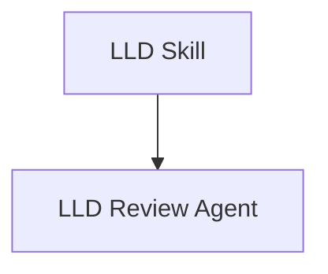
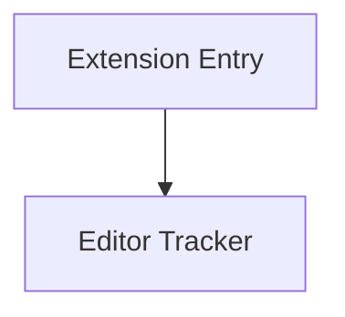
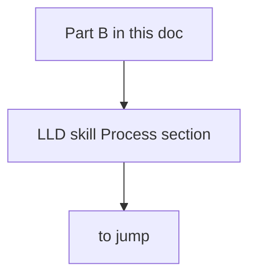

# Click-Through Probe

Open this file's preview and click the nodes. Three diagrams, three link shapes.

## Diagram A — links inside the plugin module
click
Relative links resolving within `plugins/edf/`.

## Diagram B — links crossing to the repository root

Relative links resolving to repo-root `extensions/edf-review/…`.

## Diagram C — fragment links

Two fragment flavours:

- `E` links to a heading in this same document (`## Part B` below) — opens the file at that section.
- `F` links to a heading in another file (`## Process` in the LLD skill) — opens that file at the section.

## Expected result

- A and B open their files in an editor tab (md links honor the workspace setting
  `markdown.preview.openMarkdownLinks: "inEditor"`, ts links open in the editor as always).
- C: `E` jumps to Part B in this document; `F` opens the LLD skill at `## Process`.
- Diagram link labels are underlined with a pointer cursor — the clickable affordance that plain
  SVG anchors lack.

## Part B fragment target

A landing section for same-document fragment links. Add more `##`/`###` headings here and extend
Diagram C to exercise additional fragment shapes (nested headings, multi-word slugs).

## to jump
