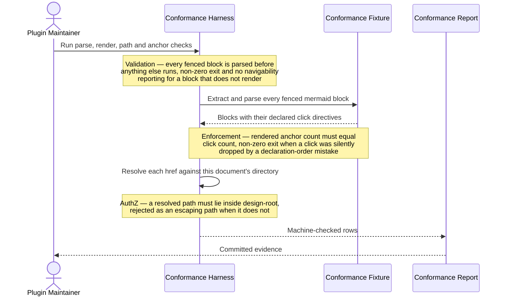
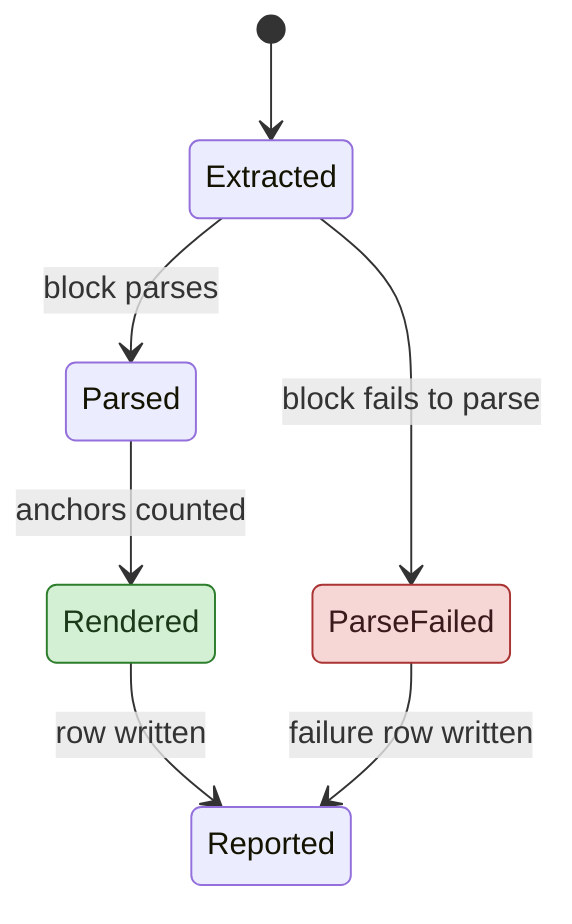
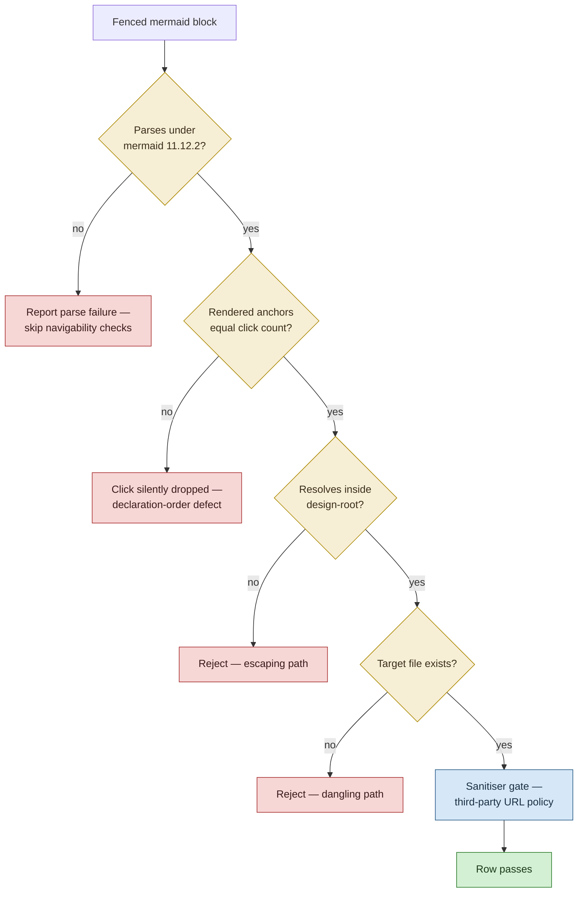
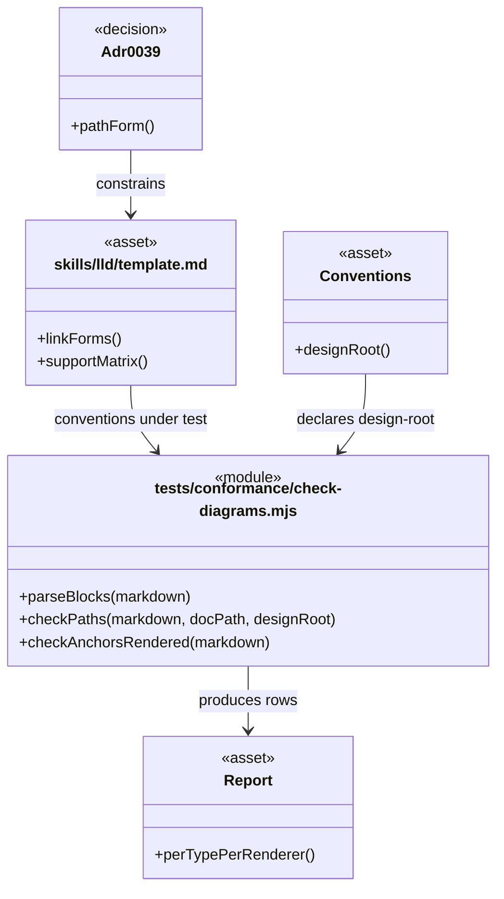
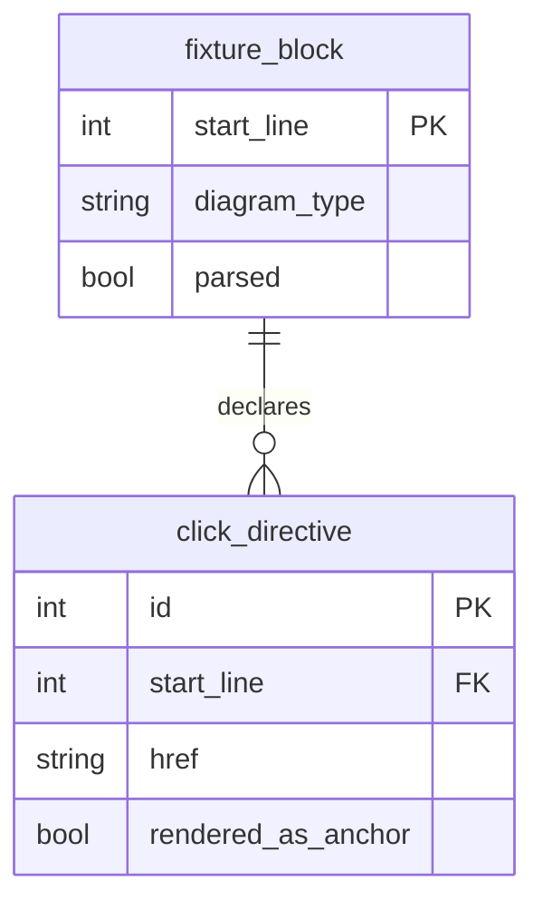

# Conformance Fixture — LLD Diagram Vocabulary

## Document Control

| Field | Value |
|-------|-------|
| Version | 1.0 |
| Status | Fixture — machine-checked artefact |
| Author | LS / Claude |
| Created | 2026-08-15 |
| Epic | [#28](https://github.com/mironyx/engineering-delivery-framework/issues/28) |
| Parent | [lld-v1-e1-1-template-vocabulary.md](lld-v1-e1-1-template-vocabulary.md) |
| Epic id | `v1-e1-1` |

---

## What this file is

This is **not** a design document. It is the fixture the renderer conformance harness runs
against, shaped like a real LLD so that the conventions in
[`template.md`](../../../skills/lld/template.md) are exercised the way a generated LLD would
exercise them.

It is deliberately exhaustive rather than realistic. It carries:

- one diagram of each of the five types the template names;
- both link forms — a document-relative path and a `#LLD-` anchor fragment;
- the two negative cases — an `erDiagram` with no `click`, and a `sequenceDiagram` with no
  `click`;
- a link at nested depth (five `..` segments, reaching the repository root) — the D1 case that
  the superseded ADR-0039 path form would have failed;
- all four palette roles, for the distinguishability observation;
- the `classDiagram` display-label workaround for identifiers containing `/`;
- a `stateDiagram-v2` `click` emitted **without** `_self`.

Run the harness against it with:

```sh
npm --prefix tests/conformance ci        # once — pins mermaid 11.12.2 and the sanitiser stack
node tests/conformance/check-diagrams.mjs plugins/edf/docs/design/v1/conformance-fixture.md
```

The measured results are recorded in
[renderer-conformance-report.md](renderer-conformance-report.md).

### The false-positive trap

The harness strips inline code spans and non-mermaid fenced blocks before extracting hrefs.
This file exercises that deliberately, because a prototype that skipped the step reported a
finding against its own migration notes.

The retired custom scheme was written `edf://path/to/file.ts`, and a migration note recording
the old form looked like this:

```text
click Service href "edf://src/lib/example/service.ts" "source"
```

Neither the inline span nor the fenced `text` block above is a link. A harness that reports
either one is crying wolf on documentation *about* the old form, and will be switched off.

---

# Part A — Human-Reviewable Design

## 1.1 Fixture flow

**Stories:** 1.6
**Layers:** Docs — verification fixture.

### Purpose

Exercise every diagram type and both link forms in a single file, so that one harness run
produces every row the conformance report needs.

### Behavioural Flows

#### Sequence diagram — negative case, carries no `click`

Per the support matrix, a `click` inside a `sequenceDiagram` is a fatal parse error, and the
`link` directive is omitted by convention. This diagram therefore carries neither. Its
participants are reached through the Structural Overview below.



#### State diagram — `click` without `_self`

`stateDiagram-v2` supports `click`, but supplying a `_self` target is a parse error. This
diagram omits it.



#### Decision flowchart — all four palette roles, both link forms

Every one of the four palette roles appears here, and this block declares each `classDef` it
uses, because a `classDef` never carries over from another block.



### Structural Overview

#### Code structure (`classDiagram`)

Two identifiers below contain `/` and use the display-label workaround. The nested-depth case
is here: `Conventions` links five `..` segments up to the repository root, which is the exact
shape the superseded ADR-0039 path form could not express.



#### Data structure (`erDiagram`) — negative case, carries no `click`

An `erDiagram` parses a `click` but generates no anchor, so none is emitted. Entities are
referred to in prose instead.



### Invariants

| # | Invariant | Verification |
|---|-----------|--------------|
| F1 | Every fenced mermaid block in this file parses under `mermaid@11.12.2` | Harness `parseBlocks`; exit 0 |
| F2 | Every block's rendered anchor count equals its `click` count | Harness `checkAnchorsRendered` |
| F3 | Every `click` href resolves inside `design-root` and names an existing file | Harness `checkPaths` |
| F4 | Every `#LLD-` fragment matches an `<a id="…">` in this file | Harness `checkAnchors` |
| F5 | Every palette role referenced by a `class` statement is declared by a `classDef` in the same block | Harness `checkAnchorsRendered`, palette half |

### Acceptance Criteria

- [x] One diagram of each of the five types
- [x] Both link forms present
- [x] `erDiagram` and `sequenceDiagram` negative cases present
- [x] A link with at least three `..` segments present
- [x] All four palette roles present

---

# Part B — Agent Implementation Detail

**Stable anchors (ADR-0026).** Epic id `v1-e1-1`.

<a id="LLD-v1-e1-1-fixture-harness"></a>

## 1.1 Harness — Implementation

### Layer: Verification tooling

The harness is [`tests/conformance/check-diagrams.mjs`](../../../../../tests/conformance/check-diagrams.mjs).
It parses and renders every fenced mermaid block in the files named on its command line, and
exits non-zero when any check fails.

<a id="LLD-v1-e1-1-fixture-report"></a>

## 1.2 Report — Implementation

### Layer: Docs

The committed evidence is [`renderer-conformance-report.md`](renderer-conformance-report.md).
It records one row per diagram type per renderer for both link forms, the two negative cases,
the palette-distinguishability observation, the pinned versions, the re-verification trigger,
the VS Code native-open finding, and the nested-path result.
