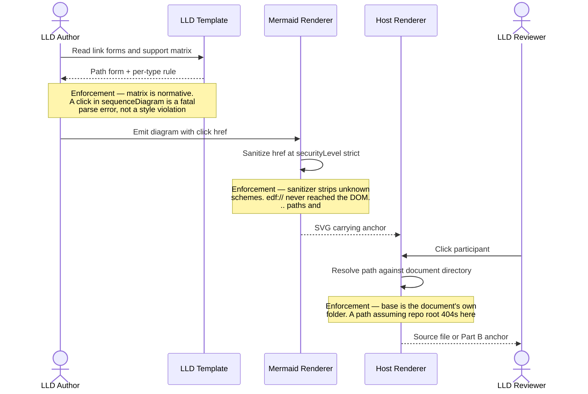
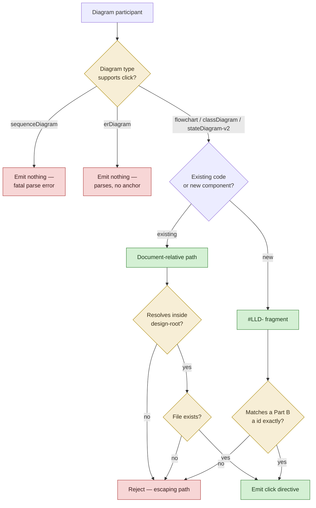
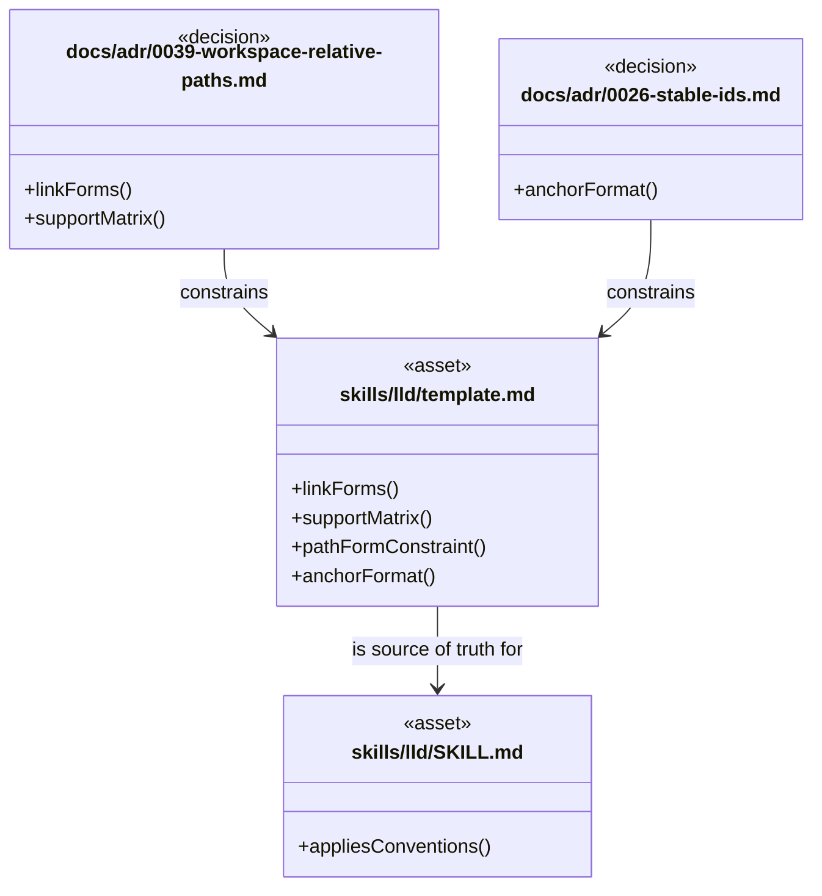
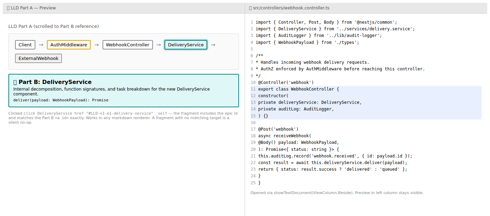
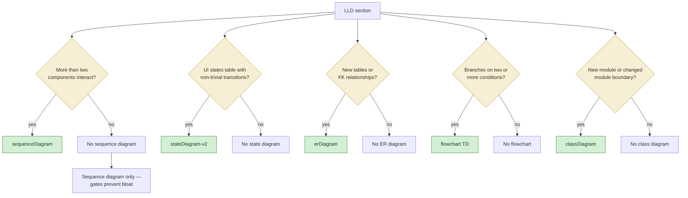
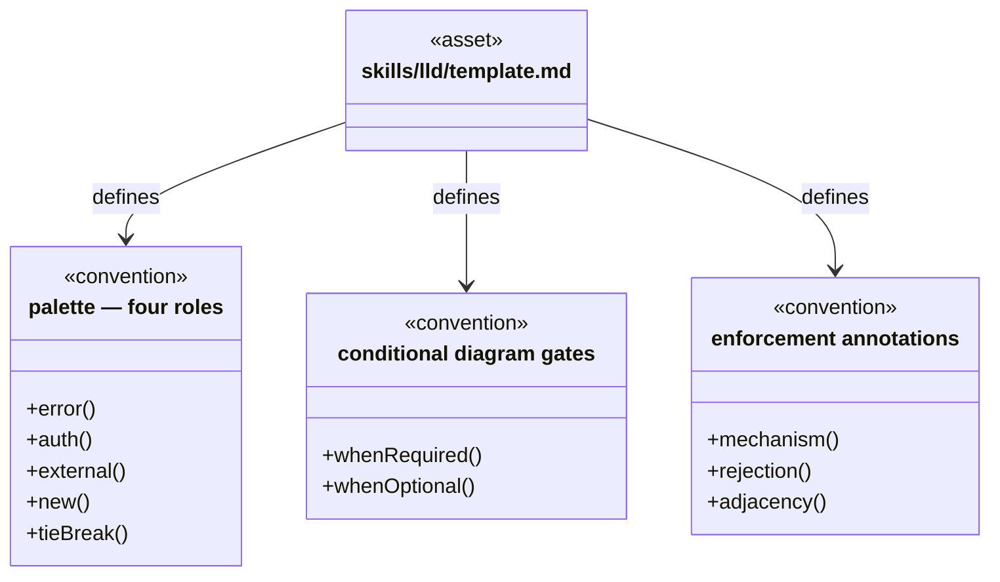
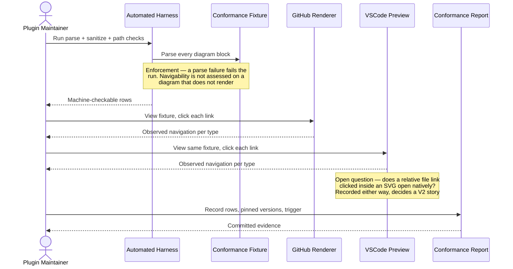
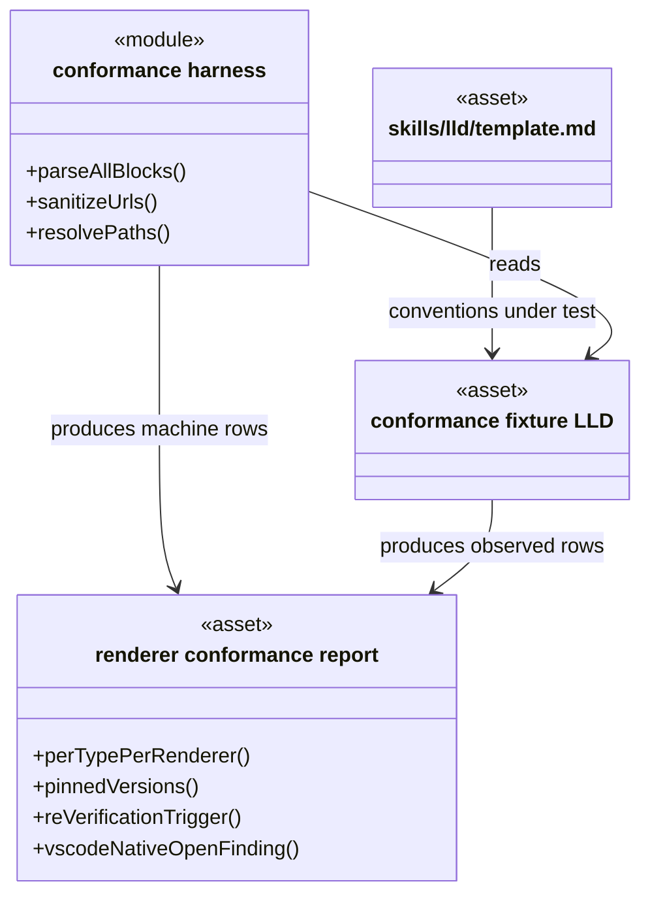
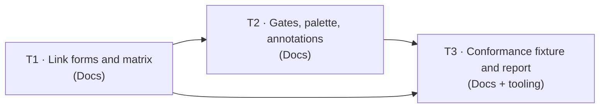

# Low-Level Design: V1 E1.1 — LLD Template & Diagram Vocabulary

## Document Control

| Field | Value |
|-------|-------|
| Version | 0.2 |
| Status | Revised |
| Author | LS / Claude |
| Created | 2026-08-13 |
| Revised | 2026-08-15 | Issue #45 (T1) |
| Epic | [#28](https://github.com/mironyx/engineering-delivery-framework/issues/28) |
| Parent | [v1-design.md](v1-design.md) (v1.1) |
| Requirements | [v1-requirements.md](../../requirements/v1-requirements.md) (v1.2) |
| Implementation plan | [2026-08-13-v1-implementation-plan.md](../../plans/2026-08-13-v1-implementation-plan.md) |
| Epic id | `v1-e1-1` |

---

## Decisions taken during LLD authoring

Three claims this epic was to encode normatively were **measured during LLD authoring**
rather than carried forward on trust. Two of them were wrong. They are recorded here
because each changes what T1 writes into `template.md`, and because the pattern —
a rule that reads sensibly and was never executed — is the exact failure this epic exists
to correct.

The measurement harness is specified in [§B.3](#LLD-v1-e1-1-conformance-evidence) and is a
T3 deliverable; it was run against `mermaid@11.12.2`, `dompurify@3`, and
`@braintree/sanitize-url@7`.

### D1 — ADR-0039's path form cannot resolve from a nested LLD (confirmed defect)

ADR-0039 mandates a "workspace-relative path … no leading slash and no `..` segments",
illustrated as `src/lib/auth/helper.ts`. A relative link in rendered markdown resolves
against **the containing document's directory**, in both GitHub and VSCode. There is no
configurable base — GitHub strips `<base href>` and VSCode's preview does not honour one.

From this LLD's own location the mandated form fails:

| Form | Resolves to | Result |
|---|---|---|
| `plugins/edf/skills/lld/template.md` (as ADR-0039 mandates) | `plugins/edf/docs/design/v1/plugins/edf/skills/lld/template.md` | **404** |
| `../../../skills/lld/template.md` (adopted) | `plugins/edf/skills/lld/template.md` | resolves |

The constraint only yields working links for a document sitting at the repository root,
which no LLD does. ADR-0039 never measured it — the ADR's measured findings concern the
sanitiser and the `click` matrix, not resolution.

**Adopted:** document-relative paths with `..` permitted. The leading slash stays banned —
it survives sanitisation and GitHub resolves it against the repo root, but VSCode's preview
is liable to read it as filesystem-absolute, and VSCode is already the sole unverified cell
in [v1-design.md §C2.8](v1-design.md#c28-host-markdown-renderer).

**Replacement safety rule.** ADR-0039 banned `..` to stop paths that resolve only on the
author's machine. That intent is preserved by a containment check rather than a syntactic
ban: a link must resolve **inside the project's declared `design-root`**. Verified
behaviour of the rule:

| Link from this LLD | Verdict |
|---|---|
| `../../../skills/lld/template.md` | inside `design-root` — accept |
| `../../../../../etc/passwd` (escaping) | outside — reject |

`design-root` is declared once per project in `kb/file-map.md`. For a single-module repo it
is the repository root; for a monorepo it may be a module root, which additionally catches
cross-module links a repo-root rule would wave through.

> **Implementation note (issue #45):** D1 listed its consequences outside this LLD as epics #28
> and #31 and the implementation plan — but **omitted `v1-design.md`**, which carried the
> superseded form in two places. §C2.1 restated it, and §C2.3 specified the self-critique
> gate's navigability check as "carries no leading slash or `..` segment" — a check that,
> implemented as written by E1.3, would have **rejected every valid link**. Both were amended
> by T1 (HLD 1.1 → 1.2). The E1.3 LLD already stated the corrected rule, so the HLD was the
> sole stale authority and contradicted its own child document. Recorded because the omission
> was in the consequence list itself: D1 correctly identified that the rule was wrong and still
> under-scoped where it had propagated.

> **`design-root` for this repository is the repository root**, not `plugins/edf/`. Every
> E1.1 and E1.3 task must edit `.claude-plugin/marketplace.json`, which sits at the repo
> root outside the plugin module, so a `plugins/edf/` root would reject a legitimate
> reference. This is recorded because the narrower choice looks more natural and is wrong
> here.

### D2 — the sequence-diagram `link` directive is not a parse error (correction)

The implementation plan directs this epic to encode "all three parse-error cases
(`sequenceDiagram` fatal on `click` **and** on the `link` directive …)". Measured against
mermaid 11.12.2, a `sequenceDiagram` carrying `link A: source @ <path>` **parses
successfully**.

ADR-0039 does not make this claim — it states `link` is "not used" as a *choice*, and
explicitly notes it "is not re-evaluated with a workspace-relative path in V1". The plan
converted a design choice into a parse fact.

**Adopted:** `template.md` states the omission of `link` as a **convention with a stated
rationale** (the Structural Overview already provides a click path to the same components,
so `link` would add redundant navigation), and **not** as a parse rule. There are **two**
parse-error cases, not three. Consequences outside this LLD:

- Epic #28's exit criterion "no sequence-diagram `link` directive remains anywhere in the
  file" stands as a convention check, but must not be described as a parse fix.
- Epic #31's Step 2.5 parse checks already omit `link` and need no change.
- The plan's "three parse-error cases" wording is corrected by T1.

### D3 — the remaining ADR-0039 matrix rows are confirmed

Re-measured independently; 9 of 10 cases matched. Both negative controls (`edf://` and
`javascript:`) were stripped by the sanitiser exactly as ADR-0039 reports, which is what
makes the one mismatch in D2 credible rather than a harness artefact.

| Case | Measured |
|---|---|
| `flowchart` `click … _self` with `..` path and with `#LLD-` fragment | parses |
| `classDiagram` display label `class EngineScoring["engine/scoring"]` | parses |
| `classDiagram` raw `/` in identifier | parse error |
| `stateDiagram-v2` `click` **without** `_self` | parses |
| `stateDiagram-v2` `click` **with** `_self` | parse error |
| `sequenceDiagram` + `click` | parse error (fatal) |
| `erDiagram` with no `click` | parses |
| `..` path and `#LLD-` fragment through the sanitiser | survive |
| `edf://` through the sanitiser | stripped |

### D4 — a semicolon inside `Note` text is a parse error (new finding)

Found by running the T3 harness against this LLD's own diagrams. A `;` in a
`sequenceDiagram` `Note` terminates the statement and fails the whole diagram. The first
draft of the enforcement-annotation examples in [§B.1.2](#LLD-v1-e1-1-gates-palette-annotations)
used `mechanism; rejection` and did not parse.

| Note text contains | Parses |
|---|---|
| `;` | **no** |
| `edf://`, `#LLD-`, `..`, `<br/>`, `,`, `—` | yes |

**Adopted:** the enforcement-annotation format separates mechanism from rejection with an
em dash and a comma. T2 states this as a rule, and the T3 harness catches violations because
it parses every block — no separate check is needed.

This is recorded as a decision rather than a footnote because it is the first defect the
harness caught in real content, which is the argument for T3 existing at all.

### D5 — a `click` before its node declaration is silently dropped (found during T1)

> **Implementation note (issue #45):** found while implementing T1, by *rendering* the matrix
> cases rather than only parsing them. It is recorded here with D1–D4 because T2 and T3 both
> depend on it, and because it is the same failure class the epic exists to remove — a rule
> that reads fine, parses fine, and produces nothing.

In `classDiagram` and `flowchart`, a `click` naming a node that has not yet been declared is
silently discarded: mermaid resolves the identifier against a table populated by the
declarations and does nothing when it is absent — no error, no warning, no anchor. Measured on
11.12.2 with `mermaid.render` under `securityLevel: 'strict'`, changing only the ordering:

| Diagram type | `click` after declarations | `click` before |
|---|---|---|
| `classDiagram` | 3 anchors | **0** |
| `flowchart` | 2 anchors | **0** |
| `stateDiagram-v2` | 1 anchor | 1 — order-insensitive (states are created lazily) |

**Both orderings parse in every case.** This is the finding's significance for this epic: a
parse-only check — which is exactly what [§B.1.3](#LLD-v1-e1-1-conformance-evidence) originally
specified — cannot see it. The diagram renders perfectly and is simply not navigable.

**Adopted:** every `click` is emitted after the declaration of the node it names, stated
normatively in `template.md` and recorded as ADR-0039 §Revision R4. Consequences:

- The pre-T1 `template.md` classDiagram example placed its `click` lines *first*, so the worked
  example every generated LLD is copied from produced zero working links. It went unnoticed
  because the hrefs were `edf://`, which the sanitiser stripped anyway — one defect masking
  the other. This is the concrete argument for T3 existing.
- **T3 must assert on rendered anchors, not only on `mermaid.parse`.** See the added
  `checkAnchorsRendered` in §B.1.3.
- T2 must obey the ordering when it adds `click` directives to the state and flowchart examples.

## Open questions

| # | Question | Status |
|---|---|---|
| OQ1 | ADR-0039 requires a dated revision recording D1 and D2. Revise in place, or supersede with an ADR-0040? | **Resolved 2026-08-14 — amend in place.** See below |
| OQ2 | Story 1.4 AC7 states the path form as "no leading slash and no `..` segments" and is contradicted by D1. | **Decided — T1 amends it.** Sign-off at T1's PR review |

### OQ1 resolution — amend ADR-0039 in place

T1 appends a dated `## Revision` section to ADR-0039 rather than writing a superseding
ADR-0040.

**Rationale.** Only the path-form constraint failed. The ADR's load-bearing content — the
rejection of `edf://`, the sanitiser finding, and the per-diagram-type `click` matrix — was
measured and is confirmed correct by D3. Splitting one decision across two documents would
make every reader join them up, while the ADR is already cited by the HLD, the plan, both
epic issues and the requirements. A dated revision keeps the superseded rule visible as
history in the document people already open.

**Constraint for T1:** do **not** edit the original Decision section's text. The record of
the wrong rule, and the fact that it was never measured, is the point of the revision.

### OQ2 resolution — amend Story 1.4 AC7

Entailed by OQ1 and by D1 itself: leaving AC7 as written would leave an approved requirement
contradicting both the ADR and the template it governs. T1 makes the amendment; the
post-Gate-2 requirements change is reviewed as part of T1's PR diff rather than as a separate
gate, so the human sees the exact wording before it lands.

---

# Part A — Human-Reviewable Design

### Diagram styling palette

Roles are defined in [`template.md`](../../../skills/lld/template.md) and are the single
source of truth; they are applied here, not restated. Exactly one class applies per
participant — `new` and `external` outrank `error` and `auth`.

### Diagram navigability convention — links

Per D1, every `click` href in this document is document-relative, may contain `..`, and
resolves inside `design-root`. Per the ADR-0039 matrix confirmed in D3, no `click` appears
in any `sequenceDiagram` or `erDiagram` below, and `stateDiagram-v2` clicks omit `_self`.

## 1.1 Link forms and support matrix

**Stories:** 1.4 (definition half — application half is E1.3's), 1.5 (closes fully in this
epic: anchor format defined here, renderer behaviour verified by [§1.3](#13-renderer-conformance-evidence))
**Layers:** Docs — plugin skill assets. No DB, BE, or FE layer.

### Purpose

Replace the retired `edf://` scheme in `template.md` with the two link forms V1 actually
uses, and state the per-diagram-type support matrix normatively so that a generated LLD
either navigates or fails a mechanical check — never renders a dead label silently.

### Behavioural Flows

#### Sequence diagram — how a link form becomes a working link



**Walkthrough.** The three enforcement points are the three places a link form has
historically failed: the matrix (which diagram types may carry a link at all), the
sanitiser (which schemes survive), and resolution (what the path is relative to). V1.0
passed the first two by luck and failed the third silently; `edf://` failed the second. Each
now carries a stated mechanism and a rejection behaviour.

#### Decision flowchart — selecting a link form



**When required:** met — the link form branches on diagram type, target kind, and two
independent validity checks.

### Structural Overview



Identifiers use the display-label workaround confirmed in D3 — a raw `/` in a
`classDiagram` identifier is a parse error.

### Visual Specifications

| Screen | Visual reference | States shown | REQ anchors | HLD component |
|---|---|---|---|---|
| Markdown preview navigation | [vis-markdown-preview-navigation.html](vis-markdown-preview-navigation.html) | Anchor state — Part B section scrolled into view | [REQ-…-lld-anchor-navigation-part-b](../../requirements/v1-requirements.md#REQ-lld-template-diagram-vocabulary-lld-anchor-navigation-part-b) | [C2.1](v1-design.md#c21-lld-template) |



Captured in T1 (issue #45) from
[vis-markdown-preview-navigation.html](vis-markdown-preview-navigation.html) in its `anchor`
state. The wireframe's example fragment was corrected to `#LLD-v1-e1-delivery-service` at the
same time — it previously read `#LLD-delivery-service`, omitting the epic id that this
section's anchor-form rule requires.

### Invariants

| # | Invariant | Verification |
|---|---|---|
| 1 | No `edf://` remains anywhere in `template.md` | `grep -c 'edf://' plugins/edf/skills/lld/template.md` returns 0 |
| 2 | No `click` directive appears inside a `sequenceDiagram` block in `template.md` | Block-scoped grep in the T3 harness; `mermaid.parse` on every fenced block exits 0 |
| 3 | No `_self` on any `stateDiagram-v2` `click` in `template.md` | Same harness; parse of each `stateDiagram-v2` block exits 0 |
| 4 | Every `click` href in `template.md` examples resolves inside `design-root` and exists, or is a documented placeholder | T3 harness path-resolution check, placeholders allowlisted by `<…>` marker |
| 5 | Every `#LLD-` fragment used as an example matches the documented ADR-0026 format | grep for `#LLD-` and assert `^#LLD-v[0-9]+-e[0-9-]+-[a-z0-9-]+$` |
| 6 | `plugin.json` and `marketplace.json` versions are equal | `test "$(jq -r .version plugins/edf/.claude-plugin/plugin.json)" = "$(jq -r '.plugins[0].version' .claude-plugin/marketplace.json)"` |
| 20 | Every `click` in a `template.md` example is emitted **after** the declaration of the node it names (D5) | `tests/test_lld_template_link_forms.py::test_classdiagram_example_emits_clicks_after_declarations`; T3 harness `checkAnchorsRendered` generalises it |
| 21 | No document in the repo states the superseded path form as a live rule (`..` banned) outside a dated history note | `grep -rn 'no \`\`..\`\` segments'` — hits must be inside a Change Log row, an `Amended`/`Revision` note, or the ADR's preserved Decision section |

### Acceptance Criteria

- [ ] All 10 `edf://` occurrences in `template.md` are replaced with document-relative paths
- [ ] The support matrix is stated normatively with **two** parse-error cases (`sequenceDiagram` + `click`; `stateDiagram-v2` + `_self`) and one no-anchor case (`erDiagram`)
- [ ] The sequence-diagram `link` directive is documented as an omitted **convention** with its rationale, explicitly not as a parse error (D2)
- [ ] The path-form constraint states: document-relative, `..` permitted, leading slash banned, must resolve inside `design-root` and point at an existing file
- [ ] `design-root` is defined, with a note that it is the repo root for single-module repos and may be a module root in a monorepo
- [ ] The `#LLD-` anchor form is stated as `LLD-<epic-id>-<section-slug>` including the epic id, with a no-target fragment being a silent no-op
- [ ] The `classDiagram` display-label workaround is stated for identifiers containing `/`
- [ ] ADR-0039 carries a dated revision section recording D1 and D2 (subject to OQ1)
- [ ] Story 1.4 AC7 is amended to match the adopted path form (subject to OQ2)
- [ ] `plugin.json` and `marketplace.json` bumped one patch, in sync

### BDD Specs

```ts
describe('template.md link forms', () => {
  it('contains no edf:// occurrence');
  it('states the path form as document-relative with .. permitted');
  it('bans a leading slash in a click href');
  it('requires a click href to resolve inside design-root');
  it('defines design-root and names the single-module default');
  it('states the #LLD- form as LLD-<epic-id>-<section-slug> including the epic id');
  it('states a fragment with no target is a silent no-op');
  it('states the classDiagram display-label workaround for identifiers containing /');
});

describe('template.md support matrix', () => {
  it('lists exactly two parse-error cases');
  it('marks sequenceDiagram click as a fatal parse error');
  it('marks stateDiagram-v2 _self as a parse error');
  it('marks erDiagram click as parsing but generating no anchor');
  it('documents the omission of the sequence link directive as a convention, not a parse error');
});
```

### HLD coverage assessment

- [C2.1 LLD Template](v1-design.md#c21-lld-template) — sufficient; this section adds the file-level detail
- [C4 Renderer-Native Navigable Diagram Surface](v1-design.md#c4-renderer-native-navigable-diagram-surface) — extended by D1; the HLD assumes ADR-0039's path form is workable

## 1.2 Diagram gates, palette and enforcement annotations

**Stories:** 1.1 (definition half), 1.2 (definition half), 1.3 (definition half)
**Layers:** Docs — plugin skill assets.

### Purpose

Make the four conditional diagram types selectable by a concrete content signal rather than
authorial taste, apply the palette to the template's worked examples with an explicit
tie-break, and give enforcement annotations a stated format and adjacency rule.

### Behavioural Flows

#### Decision flowchart — diagram type selection gates



Each gate names a **content signal** that is present or absent by inspection. The negative
path is shown deliberately: a feature with none of the signals produces the sequence diagram
alone, which is what stops the gates from becoming an argument for adding every type.

### Structural Overview



### Invariants

| # | Invariant | Verification |
|---|---|---|
| 7 | Each of the four conditional types states a "When required" gate naming a content signal **and** a "When optional" negative case | grep each type's section for both headings; assert non-empty |
| 8 | The palette table is marked canonical and carries exactly four roles with the specified hex values | grep for `#f7d6d6`, `#f7eed6`, `#d6e8f7`, `#d4f0d4`; assert one occurrence each in the table |
| 9 | The palette block is shown in a `text` fence, never a bare `mermaid` fence | assert the fence immediately preceding the standalone `classDef` block is ```` ```text ```` |
| 10 | The tie-break rule is stated and assigns exactly one class per participant | grep for the tie-break sentence; assert `new`/`external` precedence wording present |
| 11 | All four enforcement boundary types are demonstrated with mechanism **and** rejection behaviour | grep the sequence example for four `Note` blocks, each containing a `—` separating mechanism from rejection |
| 12 | Every fenced mermaid block in `template.md` parses | T3 harness runs `mermaid.parse` per block; exit 0 |
| 19 | No `;` appears inside any `Note` text in `template.md` (D4) | `grep -n 'Note over[^:]*:.*;' plugins/edf/skills/lld/template.md` returns nothing; also caught by Invariant 12 |

### Acceptance Criteria

- [ ] Each conditional type has a "When required" gate stating a concrete, checkable content signal
- [ ] Each conditional type has a "When optional" negative case
- [ ] The palette table is marked as the canonical source; inline `classDef` in examples is marked as syntax demonstration
- [ ] The role tie-break rule is stated: `new`/`external` outrank `error`/`auth`; exactly one class applies
- [ ] The standalone palette block sits in a `text` fence with the reason stated
- [ ] The state-diagram and flowchart worked examples carry palette classes and at least one `click` each, obeying the D1 path form and the D3 matrix
- [ ] Enforcement annotations demonstrate all four boundary types with mechanism and rejection behaviour
- [ ] The adjacency rule is stated — annotations sit beside the interaction, never in a legend
- [ ] The no-semicolon-in-`Note` rule is stated with its reason (D4), and no example violates it
- [ ] Every mermaid block in `template.md` parses under `mermaid@11.12.2`
- [ ] Versions bumped in sync

### BDD Specs

```ts
describe('template.md diagram gates', () => {
  it('states a content signal for the state gate');
  it('states a content signal for the ER gate');
  it('states a content signal for the flowchart gate');
  it('states a content signal for the classDiagram gate');
  it('states a when-optional negative case for each of the four types');
  it('states that a feature with no signal gets the sequence diagram alone');
});

describe('template.md palette', () => {
  it('marks the palette table canonical');
  it('places the standalone classDef block in a text fence');
  it('states the tie-break rule assigning exactly one class');
  it('applies palette classes in the state and flowchart examples');
});

describe('template.md enforcement annotations', () => {
  it('demonstrates an authZ Note with mechanism and rejection');
  it('demonstrates a validation Note with rule and rejection');
  it('demonstrates an external-call Note with the safeguard');
  it('demonstrates an error-propagation Note with code and recovery');
  it('states the adjacency rule');
  it('states that a semicolon in Note text is a parse error');
  it('uses no semicolon in any Note example');
});
```

### HLD coverage assessment

- [C1](v1-design.md#c1-enriched-diagram-vocabulary), [C2](v1-design.md#c2-standard-visual-palette), [C3](v1-design.md#c3-enforcement-point-annotations) — sufficient, referenced only

## 1.3 Renderer conformance evidence

**Stories:** 1.6
**Layers:** Docs — verification artefact.

### Purpose

Produce the committed evidence that makes the rest of the epic trustworthy: observed
behaviour per diagram type per renderer, recorded against pinned versions with a stated
re-verification trigger. V1.0's equivalent claims were asserted from recall and were wrong,
which is the entire reason this section exists.

### Behavioural Flows



**Walkthrough.** The harness settles everything mechanically checkable — parse, sanitiser
survival, path resolution — so human attention is spent only on the two things a script
cannot observe: whether GitHub and VSCode actually *navigate* on click. The negative cases
are included because "we emitted nothing and nothing broke" needs the same evidence as a
positive claim.

### Structural Overview



### Invariants

| # | Invariant | Verification |
|---|---|---|
| 13 | The report records a row per diagram type per renderer for both link forms, including the two negative cases | assert row count and presence of `erDiagram`/`sequenceDiagram` negative rows |
| 14 | The report records pinned Mermaid and VSCode versions | grep for a semver next to each name |
| 15 | The report states a re-verification trigger naming both pinned versions | grep for the trigger sentence |
| 16 | The VSCode native-open finding is recorded as `yes` or `no`, never absent or "unknown" | grep the finding row; assert value in {yes, no} |
| 17 | The harness exits non-zero if any fixture diagram fails to parse | run harness against a deliberately broken fixture; assert exit ≠ 0 |
| 18 | The fixture includes at least one link emitted from a nested document depth (≥ 3 `..`) | grep fixture for `../../../` |

### Acceptance Criteria

- [ ] The fixture contains one diagram per type, both link forms, and the two negative cases
- [ ] The fixture contains a nested-depth relative link exercising D1 (≥ 3 `..` segments)
- [ ] The harness automates parse, sanitiser and path-resolution checks and exits non-zero on failure
- [ ] The report records pass/fail per diagram type per renderer for both link forms
- [ ] The report records the palette-distinguishability observation for all four colours in each renderer
- [ ] The report records pinned Mermaid and VS Code versions and a re-verification trigger
- [ ] The report records the VSCode native-open finding either way
- [ ] The report records the D1 nested-path result — the row that would have caught the ADR-0039 defect

### BDD Specs

```ts
describe('conformance harness', () => {
  it('parses every fenced mermaid block in the fixture');
  it('exits non-zero when a fixture diagram fails to parse');
  it('reports a click href that resolves outside design-root');
  it('reports a click href pointing at a non-existent file');
  it('confirms .. paths and #LLD- fragments survive the sanitizer');
  it('confirms edf:// is stripped by the sanitizer');
});

describe('conformance report', () => {
  it('records a row per diagram type per renderer');
  it('records the erDiagram and sequenceDiagram negative cases');
  it('records pinned mermaid and vscode versions');
  it('records a re-verification trigger naming both versions');
  it('records the vscode native-open finding as yes or no');
  it('records the nested-depth relative link result');
});
```

### HLD coverage assessment

- [C5](v1-design.md#c5-cross-renderer-verification-evidence), [C2.6](v1-design.md#c26-renderer-conformance-report) — sufficient, referenced only

---

# Part B — Agent Implementation Detail

## External Surfaces

| Surface | Version / revision | Doc URL | Verified | New to repo |
|---------|--------------------|---------|----------|-------------|
| `mermaid` | `11.12.2` | https://mermaid.js.org/config/usage.html | Yes — parsed 10 cases during LLD authoring | Yes |
| `dompurify` | `^3` | https://github.com/cure53/DOMPurify | Yes — sanitiser gate exercised | Yes |
| `@braintree/sanitize-url` | `^7` | https://github.com/braintree/sanitize-url | Yes — sanitiser gate exercised | Yes |
| `jsdom` | latest `^26` | https://github.com/jsdom/jsdom | Yes — harness host | Yes |
| GitHub markdown renderer | undated, tracks GitHub | https://docs.github.com/en/get-started/writing-on-github/getting-started-with-writing-and-formatting-on-github/basic-writing-and-formatting-syntax | Yes — relative-link resolution confirmed | No |
| VS Code built-in *Mermaid Markdown Features* | VS Code `1.121`, bundles mermaid `11.12.2` | https://code.visualstudio.com/docs/languages/markdown | Unverified — click-through behaviour is what T3 measures | No |

> **Unverified — recall-based:** VS Code's preview behaviour when a *file* link is clicked
> inside a rendered Mermaid SVG. No V1 guarantee depends on it
> ([v1-design.md §C2.8](v1-design.md#c28-host-markdown-renderer)); T3 records it.

**Stable anchors (ADR-0026).** Epic id `v1-e1-1`.

<a id="LLD-v1-e1-1-link-forms"></a>

## 1.1 Link forms and support matrix — Implementation

### Layer: Docs

#### File structure

```
plugins/edf/skills/lld/template.md          — link forms, support matrix, path constraint, anchor format
plugins/edf/docs/adr/0039-workspace-relative-paths-for-diagram-navigability.md
                                            — dated revision recording D1 and D2
plugins/edf/docs/requirements/v1-requirements.md
                                            — Story 1.4 AC7 amendment (plus the glossary entry
                                              carrying the same rule, and AC1's example)
plugins/edf/docs/design/v1/v1-design.md     — §C2.1 and §C2.3 path-form amendment (added by
                                              issue #45; see the implementation note below)
plugins/edf/docs/plans/2026-08-13-v1-implementation-plan.md
                                            — "three parse-error cases" → two
plugins/edf/docs/design/v1/vis-markdown-preview-navigation.html
                                            — example anchor id corrected to carry the epic id
plugins/edf/.claude-plugin/plugin.json       — bump one patch
.claude-plugin/marketplace.json              — bump one patch (must match)
plugins/edf/docs/design/v1/vis-markdown-preview-navigation-anchor.png
                                            — captured screenshot
```

> **Version bumping — do not hard-code a target.** Read the current value from
> `plugin.json`, bump one patch, and set `marketplace.json` to the same value. This LLD
> originally named explicit versions; they went stale when unrelated PR #55 landed
> `0.10.30` mid-epic. Any number written here is a guess about merge order.

#### The 10 `edf://` sites to migrate

All in `plugins/edf/skills/lld/template.md`, at the lines below as of `0.10.29`. Each is
inside a fenced example, so none is prose to be deleted — each becomes a
document-relative path.

| Line | Context | Replacement form |
|---|---|---|
| 67 | `link API: source @ edf://…` in the navigability convention prose | Removed with the `link` convention change (D2) |
| 70 | `click Service href "edf://…" "source"` | `click Service href "../../../src/lib/example/service.ts" _self` |
| 74 | "**Existing source file** → `edf://` protocol" bullet | Rewritten to the document-relative form |
| 104 | Sequence-diagram prose referencing `edf://` | Rewritten per D2 |
| 110–112 | Three `link …: source @ edf://…` lines in the sequence example | Removed — the example carries no `link` (D2) |
| 206–208 | Three `click … href "edf://…" "source"` in the classDiagram example | `click … href "../../../src/lib/…" _self`, emitted **after** the `class` declarations (D5) |

> **Implementation note (issue #45):** the replacement forms for lines 70 and 206–208
> originally read `src/lib/…` — a repo-root path, which is the form D1 measured as
> non-resolving. The table contradicted the decision three sections above it. Corrected to the
> `../../../src/lib/…` form actually shipped. Worth recording because the error survived LLD
> authoring *and* review: the prose stated the rule correctly while the worked example beside
> it did not, which is the reading failure the epic's own worked examples are meant to prevent.

> **Constraint:** the template's examples are illustrative and their paths are *not*
> required to exist in a host project. Mark them with the existing `<…>` placeholder
> convention or keep them under a plausible `src/` prefix, and allowlist them in the T3
> harness path check (Invariant 4). Do not invent paths that look real but resolve nowhere —
> that is the failure mode this epic exists to remove.

#### Normative content to add

```
Path form
- Document-relative. The base is the directory of the file containing the link.
- `..` segments are permitted.
- A leading slash is not permitted.
- The resolved path must lie inside `design-root` and must name an existing file.

design-root
- Declared per project in kb/file-map.md.
- Single-module repository: the repository root.
- Monorepo: may be a module root, which also rejects cross-module links.

Support matrix (normative — two parse-error cases)
| Diagram type      | click support     | Rule                                          |
| flowchart         | yes               | click X href "<path-or-fragment>" _self       |
| classDiagram      | yes               | as above; identifier with / is a parse error — |
|                   |                   | use class Name["module/path"]                  |
| stateDiagram-v2   | yes, with caveat  | emit without _self — supplying one is a parse error |
| erDiagram         | parses, no anchor | emit nothing                                  |
| sequenceDiagram   | fatal parse error | emit nothing, in any form                     |

Sequence-diagram `link` directive — convention, not a parse rule
- `link A: label @ <url>` parses successfully (measured, mermaid 11.12.2).
- It is nonetheless not emitted: the section's Structural Overview already provides a
  click path to the same components, so `link` adds redundant navigation.

Anchor form
- `LLD-<epic-id>-<section-slug>`, including the epic id, per ADR-0026.
- The click fragment must match a Part B `<a id="…">` exactly (case-sensitive).
- A fragment with no matching target is a silent no-op — no scroll, no error.
```

#### ADR-0039 revision (subject to OQ1)

Append a dated `## Revision` section — shipped as `## Revision — 2026-08-14`, the day it was
written and OQ1 was decided, rather than the 2026-08-13 measurement date this LLD originally
named; the measurement date is stated inside the section instead. It must state: what the
path-form constraint
said; that it was never measured; the resolution arithmetic showing the failure; the adopted
form and containment rule; and the `link`-directive correction from D2. Do **not** edit the
Decision section's history in place — the record of the wrong rule is the point.

#### Error handling

Not applicable — no runtime. The failure modes are documentation defects, caught by the
Invariants above and the T3 harness.

<a id="LLD-v1-e1-1-gates-palette-annotations"></a>

## 1.2 Diagram gates, palette and enforcement annotations — Implementation

### Layer: Docs

#### File structure

```
plugins/edf/skills/lld/template.md   — gates, palette application, enforcement annotations
plugins/edf/.claude-plugin/plugin.json  — bump one patch
.claude-plugin/marketplace.json         — bump one patch (must match)
```

> **Constraint:** T2 must not touch the link forms, support matrix, path constraint, or
> anchor format — those are T1's and are frozen once T1 merges. T2 *consumes* them when
> adding `click` directives to the state and flowchart examples.

#### Gate conditions to state

| Type | When required — content signal | When optional |
|---|---|---|
| `stateDiagram-v2` | A UI states table exists **and** at least one transition is non-trivial (retry, optimistic update, polling) | Two-state read-only pages; sections with no UI |
| `erDiagram` | The section adds a table or an FK relationship | Column-type, index, or constraint changes that leave the entity graph unchanged |
| `flowchart TD` | The flow branches on two or more conditions | A single branch point; simple guard clauses |
| `classDiagram` | The section adds a module, changes a module boundary, or adds a dependency between existing modules | Changes inside one module that leave its public surface and dependencies unchanged |
| none of the above | — | Sequence diagram alone |

#### Palette block placement

```
The canonical palette lives in one table. The classDef syntax is shown once in a
```text fence — a standalone classDef block is not a valid diagram and will fail to
render if placed in a bare ```mermaid fence.
```

Tie-break sentence to state verbatim in intent: a participant matching more than one role
takes exactly one class; `new` and `external` outrank `error` and `auth`, because "what is
this" outranks "how does it fail" for a first-pass reviewer.

#### Enforcement annotation format

Each `Note` states **mechanism — rejection behaviour**, adjacent to the interaction:

```
Note over API: AuthZ — bearer token validated, 401 on invalid token
Note over Service: Validation — schema-checked, 400 with field errors on failure
Note over Fetcher: SSRF — URL checked against allowlist before fetch, 502 on reject
Note over Handler: Error propagation — wrapped as AppError, 500 with correlation id
```

> **Constraint (D4): a `;` inside `Note` text is a Mermaid parse error.** Separate mechanism
> from rejection behaviour with an em dash and a comma, never a semicolon. This was measured
> during LLD authoring after the first draft of these very examples used semicolons and
> failed to parse. `edf://`, `#LLD-`, `..` and `<br/>` in note text are all safe — the
> semicolon is a statement separator, so it terminates the note early.

The adjacency rule: an annotation sits beside the interaction it describes. A legend block
collecting annotations away from their interactions is a defect — it reintroduces the
cross-referencing this capability removes.

<a id="LLD-v1-e1-1-conformance-evidence"></a>

## 1.3 Renderer conformance evidence — Implementation

### Layer: Docs + verification tooling

#### File structure

```
plugins/edf/docs/design/v1/conformance-fixture.md    — the fixture LLD under test
plugins/edf/docs/design/v1/renderer-conformance-report.md — the committed evidence
tests/conformance/check-diagrams.mjs                  — automated harness
tests/conformance/package.json                        — pins mermaid 11.12.2, dompurify, sanitize-url, jsdom
```

> **Constraint:** T3 is read-only on `template.md`. If the harness finds a defect there,
> record it in the report and open a follow-up issue — do not fix it in T3, or the epic's
> two template tasks and its verification task become one unreviewable change.

#### Harness — function signatures

A working prototype of the three checks below was run during LLD authoring and produced the
D1–D3 results; T3 productionises it. Node ESM, run via `node tests/conformance/check-diagrams.mjs <file…>`.

```
parseBlocks(markdown: string): Promise<BlockResult[]>
  - Extract every ```mermaid fenced block with its start line.
  - await mermaid.parse(src) per block under securityLevel 'strict'.
  - BlockResult = { line, type, parsed: boolean, error?: string }

checkSanitizer(urls: string[]): SanitizerResult[]
  - Gate 1: sanitizeUrl(u) === u                      (@braintree/sanitize-url)
  - Gate 2: DOMPurify.sanitize(`<svg><a href="${u}">…`, { USE_PROFILES: { svg: true } })
            retains the href
  - SanitizerResult = { url, gate1: boolean, gate2: boolean, survives: boolean }

checkPaths(markdown: string, docPath: string, designRoot: string): PathResult[]
  - Extract every click href and every markdown link target.
  - Strip inline code spans and non-mermaid fenced blocks BEFORE extraction. A prototype
    that skipped this reported a false positive on a `click … href "edf://…"` string that
    was documentation *about* the old form, quoted inside a table cell. A checker that
    cries wolf on its own migration notes will be switched off.
  - Skip fragments (#…) — validated by checkAnchors instead.
  - Reject a leading slash.
  - resolved = path.resolve(dirname(docPath), href)
  - inside   = resolved.startsWith(designRoot + sep)
  - exists   = fs.existsSync(resolved)
  - PathResult = { href, resolved, inside, exists, ok: inside && exists }

checkAnchors(markdown: string): AnchorResult[]
  - Every #LLD- fragment must match an <a id="…"> in the same file, case-sensitive.
  - Every fragment must match /^#LLD-v\d+-e[\d-]+-[a-z0-9-]+$/

checkAnchorsRendered(markdown: string): RenderResult[]      // added by D5, issue #45
  - For every block containing a click directive: await mermaid.render(id, src) in jsdom
    under securityLevel 'strict', then count <a href> elements in the produced SVG.
  - Assert renderedAnchorCount === clickDirectiveCount for that block.
  - RenderResult = { line, type, clicks: number, anchors: number, ok: boolean }

main(): exits 1 if any block fails to parse, any path fails, any anchor is unmatched, or any
        block renders fewer anchors than it declares clicks.
```

> **Implementation note (issue #45):** `checkAnchorsRendered` was added after T1 measured D5.
> The original four checks were all parse- or text-based, and D5 is invisible to every one of
> them: a `click` emitted before its node declaration parses, renders, and yields no anchor.
> **Parse success is not evidence of navigability** — the harness must assert on the rendered
> SVG, which is also the only check that would have caught the pre-T1 `template.md` example
> shipping zero working links. Note this makes `mermaid.render` (not just `mermaid.parse`) a
> harness dependency, so jsdom is load-bearing rather than convenience.

> **Constraint:** parse checks gate the rest, per
> [v1-design.md §C2.3](v1-design.md#c23-self-critique-gate) — if any block fails to parse,
> report that and skip path/anchor reporting for the affected block rather than emitting
> navigability noise about a diagram that does not render.

#### Fixture requirements

One diagram per type, both link forms, plus:

- an `erDiagram` with **no** `click` — the negative case
- a `sequenceDiagram` with **no** `click` — the negative case
- a `classDiagram` using the display-label workaround
- a `stateDiagram-v2` `click` **without** `_self`
- **a link with ≥ 3 `..` segments** — the D1 case, the row that would have caught the
  ADR-0039 defect
- all four palette roles, for the distinguishability observation

#### Report shape

| Diagram type | Link form | GitHub | VSCode preview | Notes |
|---|---|---|---|---|

Plus: pinned versions block; re-verification trigger ("a change to either pinned version
invalidates this report"); palette-distinguishability observation per renderer; the VSCode
native-open finding as `yes`/`no`; and the nested-path row.

#### Error handling

Harness exits non-zero on any failed check. The report is a committed artefact, not a gate
in the generation pipeline — it is design-time evidence
([C2.6 non-responsibilities](v1-design.md#c26-renderer-conformance-report)).

---

## Cross-References

### Internal (within this epic)

- §1.1 depends on: —
- §1.2 depends on: [§1.1](#11-link-forms-and-support-matrix) — consumes the link forms when adding `click` to examples; both edit `template.md`
- §1.3 depends on: [§1.1](#11-link-forms-and-support-matrix), [§1.2](#12-diagram-gates-palette-and-enforcement-annotations) — verifies their output

### External

- Depended on by: `lld-v1-e1-3-skill-quality-gates.md` (Epic E1.3) — the skill's generation rules and self-critique checks reference this epic's conventions as their single source of truth, per Design Principle 6
- Independent of: `lld-v1-e1-2-review-feedback.md` (Epic E1.2) — shares no files

### Shared types

None — no runtime types. The shared artefact is `template.md` itself, which is why §1.1 and
§1.2 are serialised.

---

## Tasks

### Task 1: Link forms and support matrix in template.md

**Issue title:** v1-e1-1: ADR-0039 link forms and support matrix in LLD template
**Layer:** Docs
**Depends on:** —
**Stories:** 1.4 (definition half), 1.5 (definition half)
**HLD reference:** [C2.1](v1-design.md#c21-lld-template), [C4](v1-design.md#c4-renderer-native-navigable-diagram-surface)

**What:** Migrate all 10 `edf://` occurrences in `template.md` to document-relative paths,
and state the path form, `design-root` containment rule, support matrix, `link`-directive
convention, `#LLD-` anchor form, and `classDiagram` display-label workaround normatively.
Record the D1/D2 corrections in ADR-0039 and amend Story 1.4 AC7 and the plan to match.

**Acceptance criteria:** see [§1.1 Acceptance Criteria](#11-link-forms-and-support-matrix).

**BDD specs:** see [§1.1 BDD Specs](#11-link-forms-and-support-matrix).

**Files to create/modify:**
- `plugins/edf/skills/lld/template.md` — link forms, matrix, path constraint, anchor format
- `plugins/edf/docs/adr/0039-workspace-relative-paths-for-diagram-navigability.md` — dated revision (OQ1)
- `plugins/edf/docs/requirements/v1-requirements.md` — Story 1.4 AC7 (OQ2)
- `plugins/edf/docs/plans/2026-08-13-v1-implementation-plan.md` — "three parse-error cases" → two
- `plugins/edf/.claude-plugin/plugin.json` — bump one patch
- `.claude-plugin/marketplace.json` — bump one patch (must match plugin.json)
- `plugins/edf/docs/design/v1/vis-markdown-preview-navigation-anchor.png` — screenshot

### Task 2: Diagram gates, palette and enforcement annotations

**Issue title:** v1-e1-1: diagram type gates, palette application and enforcement annotations
**Layer:** Docs
**Depends on:** Task 1 (shared file `template.md`; consumes T1's link forms)
**Stories:** 1.1 (definition half), 1.2 (definition half), 1.3 (definition half)
**HLD reference:** [C1](v1-design.md#c1-enriched-diagram-vocabulary), [C2](v1-design.md#c2-standard-visual-palette), [C3](v1-design.md#c3-enforcement-point-annotations)

**What:** Harden the four conditional diagram-type gates to concrete content signals with
negative cases, apply the palette to the worked examples with the tie-break rule and the
`text`-fence placement, and add enforcement `Note` annotations covering all four boundary
types with the adjacency rule.

**Acceptance criteria:** see [§1.2 Acceptance Criteria](#12-diagram-gates-palette-and-enforcement-annotations).

**BDD specs:** see [§1.2 BDD Specs](#12-diagram-gates-palette-and-enforcement-annotations).

**Files to create/modify:**
- `plugins/edf/skills/lld/template.md` — gates, palette, annotations
- `plugins/edf/.claude-plugin/plugin.json` — bump one patch
- `.claude-plugin/marketplace.json` — bump one patch (must match plugin.json)

### Task 3: Renderer conformance fixture, harness and report

**Issue title:** v1-e1-1: renderer conformance fixture, harness and committed report
**Layer:** Docs + verification tooling
**Depends on:** Task 1, Task 2
**Stories:** 1.6
**HLD reference:** [C5](v1-design.md#c5-cross-renderer-verification-evidence), [C2.6](v1-design.md#c26-renderer-conformance-report)

**What:** Author the conformance fixture and the automated harness, then record the
committed report — per type per renderer, both link forms, negative cases, palette
distinguishability, pinned versions, re-verification trigger, the VSCode native-open
finding, and the nested-path row.

**Acceptance criteria:** see [§1.3 Acceptance Criteria](#13-renderer-conformance-evidence).

**BDD specs:** see [§1.3 BDD Specs](#13-renderer-conformance-evidence).

**Files to create/modify:**
- `plugins/edf/docs/design/v1/conformance-fixture.md` — create
- `plugins/edf/docs/design/v1/renderer-conformance-report.md` — create
- `tests/conformance/check-diagrams.mjs` — create
- `tests/conformance/package.json` — create; pins mermaid 11.12.2

> **Note:** no version bump — T3 adds documentation and test tooling, not skill/agent/hook
> behaviour. See the version-bump convention in `CLAUDE.md`.

---

## Execution Order

### Dependency DAG



### Execution Waves

| Wave | Tasks | Blocked by | Notes |
|------|-------|------------|-------|
| 1 | Task 1 | — | Parallel-safe with Epic E1.2's tasks — disjoint trees |
| 2 | Task 2 | Wave 1 (Task 1) | Shares `template.md` with T1 — cannot parallelise |
| 3 | Task 3 | Wave 2 (Task 2) | Read-only on `template.md`; verifies T1 + T2 |

All three tasks are serialised: T1 and T2 write the same file, and T3 verifies both. No
task in this epic may share a wave with an Epic E1.3 task, because both chains bump
`plugin.json` and `marketplace.json`.
