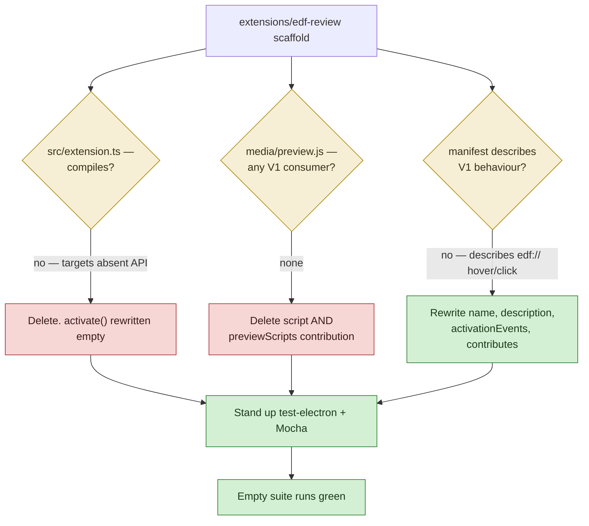
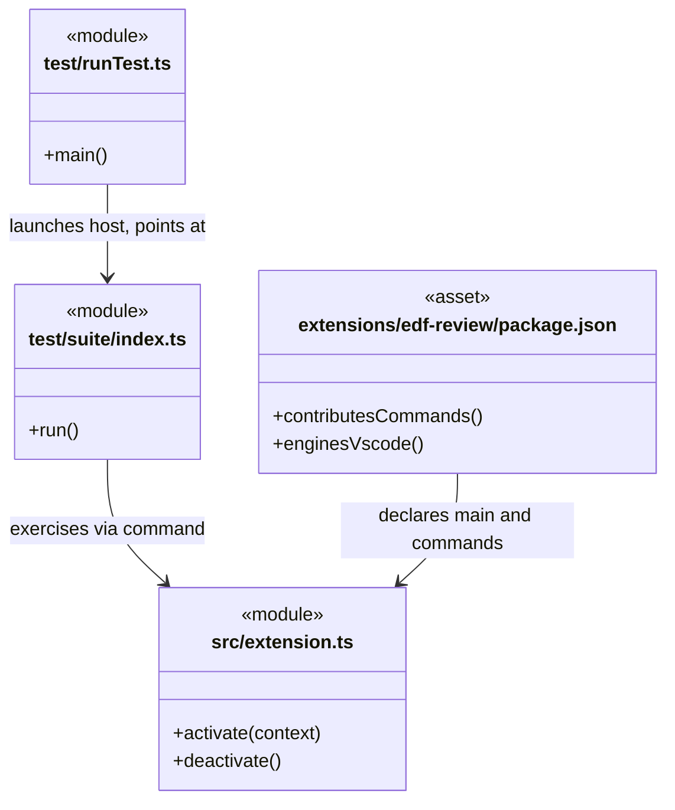
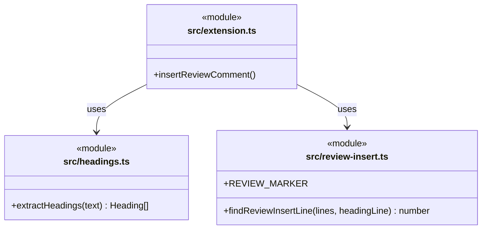
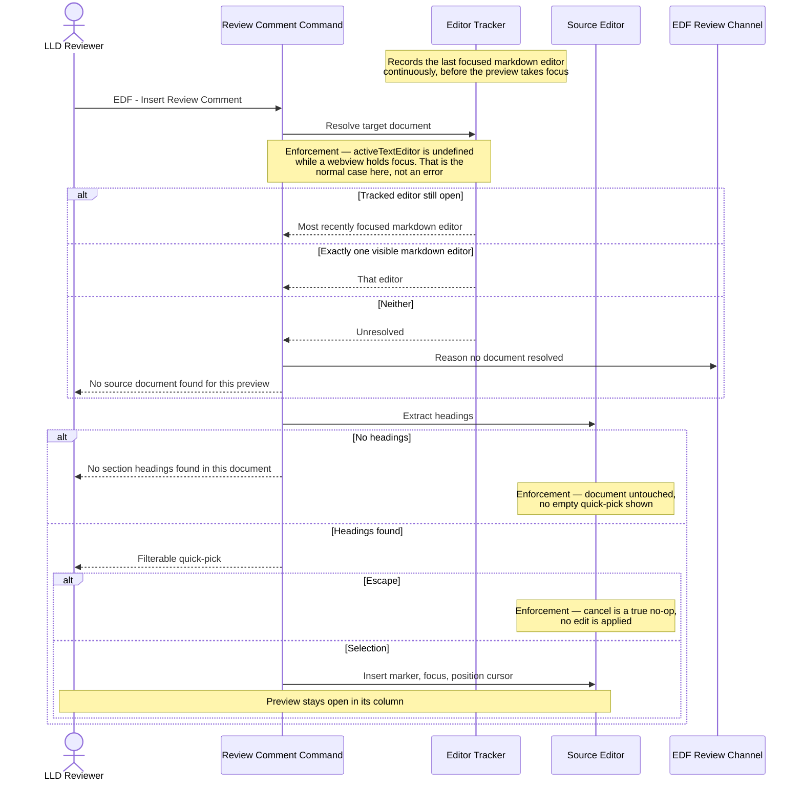
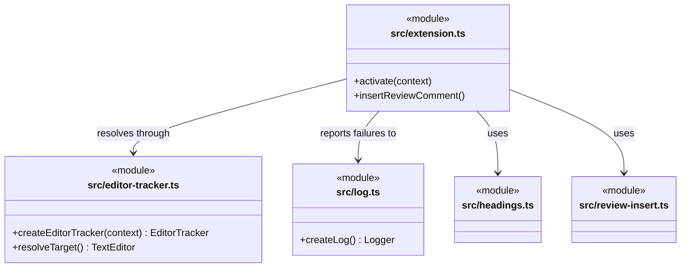
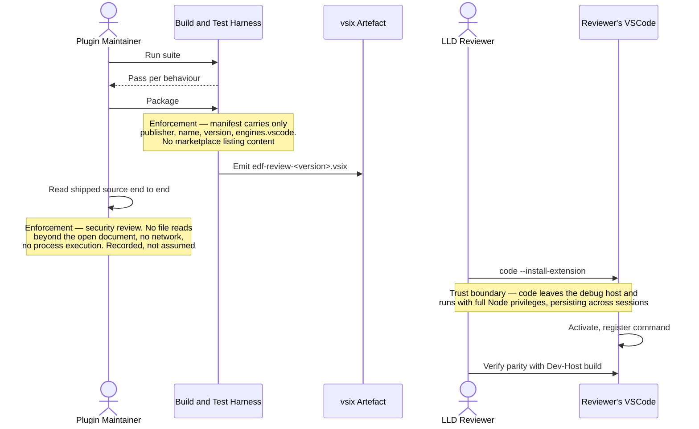
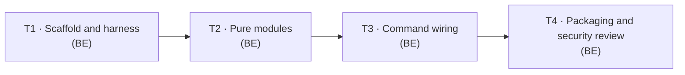

# Low-Level Design: V1 E1.2 — VSCode Extension: Review Feedback

## Document Control

| Field | Value |
|-------|-------|
| Version | 0.1 |
| Status | Draft |
| Author | LS / Claude |
| Created | 2026-08-13 |
| Epic | [#30](https://github.com/mironyx/engineering-delivery-framework/issues/30) |
| Parent | [v1-design.md](v1-design.md) (v1.1) |
| Requirements | [v1-requirements.md](../../requirements/v1-requirements.md) (v1.2) |
| Implementation plan | [2026-08-13-v1-implementation-plan.md](../../plans/2026-08-13-v1-implementation-plan.md) |
| Epic id | `v1-e1-2` |

---

## Resolved open questions

The HLD routed both scaffold questions to this LLD's first task
([v1-design.md §Open Questions](v1-design.md#open-questions)). Both are resolved here as
**delete**, matching the HLD's stated leaning.

### OQ1 — delete or quarantine `src/extension.ts`?

**Resolved: delete.** The file is 80 lines implementing `peek` and `open` handlers against
`vscode.window.onDidReceivePreviewMessage`. That API does not exist, so the file cannot
compile and the extension cannot activate today. Confirmed by reading the file: its only
export beyond `activate`/`deactivate` is two handlers reachable solely through the
non-existent event.

Deletion is the option that makes the epic's security exit criterion *checkable* — the
guarantee is "the surface is small enough to read", and dead code that reads files and opens
editors is exactly what a reviewer must otherwise reason about. The spike's knowledge is
preserved in [ADR-0038's rejection note](../../adr/0038-extension-architecture-security-model.md),
and the code itself remains in git history.

### OQ2 — does V1 ship a markdown preview script?

**Resolved: drop both the script and the manifest contribution.** `media/preview.js` is 170
lines of `edf://` hover/click machinery injected into *every* markdown preview the user
opens, via `contributes.markdown.previewScripts`. No V1 story consumes it, and its
unthrottled `MutationObserver` already violates a V2 performance budget that would be
inherited rather than fixed.

Dropping the contribution is the load-bearing half: retaining the file while removing the
contribution would stop the injection, but leaves a reader of the shipped `.vsix` unable to
tell by inspection that nothing is injected. Both go.

> **Consequence for `activationEvents`.** The manifest currently declares
> `onMarkdownPreview`, which existed to activate the extension when a preview opened so the
> script could talk to it. With the script gone, activation should follow the command —
> modern VS Code auto-generates `onCommand:` activation from `contributes.commands`, so the
> `activationEvents` array becomes empty. T1 removes it rather than leaving an event whose
> only rationale has been deleted.

---

# Part A — Human-Reviewable Design

### Diagram navigability convention — links

Per [ADR-0039 as revised by E1.1](lld-v1-e1-1-template-vocabulary.md#LLD-v1-e1-1-link-forms),
`click` hrefs below are document-relative, may contain `..`, and resolve inside
`design-root`. This LLD is a live demonstration of why `design-root` for this repository is
the **repository root** and not `plugins/edf/`: every source link below crosses from
`plugins/edf/docs/` into `extensions/`.

## 2.1 Scaffold disposition and test harness

**Stories:** 2.2 (test-framework half)
**Layers:** BE — extension host (Node/TypeScript). No DB or FE layer.

### Purpose

Reduce the extension to a compiling, testable shell: delete the spike code and the preview
script, rewrite the `edf://`-era manifest, and stand up the `@vscode/test-electron` + Mocha
harness that every later task's tests run under.

### Behavioural Flows

#### Decision flowchart — scaffold disposition



### Structural Overview



### Invariants

| # | Invariant | Verification |
|---|---|---|
| 1 | No reference to `onDidReceivePreviewMessage` remains | `grep -r onDidReceivePreviewMessage extensions/` returns nothing |
| 2 | No reference to `edf://` remains in the extension tree | `grep -r 'edf://' extensions/` returns nothing |
| 3 | `media/` does not exist and `markdown.previewScripts` is absent from the manifest | `test ! -d extensions/edf-review/media` and `jq -e '.contributes.markdown' package.json` fails |
| 4 | The extension compiles | `npm run compile` exits 0 |
| 5 | The test harness runs and reports, even with zero specs | `npm test` exits 0 |
| 6 | The manifest declares no contribution other than `commands` | `jq -r '.contributes \| keys[]' package.json` outputs only `commands` |

### Acceptance Criteria

- [ ] `src/extension.ts` is reduced to an `activate`/`deactivate` pair with no handlers
- [ ] `media/preview.js` is deleted and the directory removed
- [ ] `contributes.markdown.previewScripts` is removed from the manifest
- [ ] `activationEvents` is emptied, with activation left to the generated `onCommand:`
- [ ] `displayName` and `description` no longer describe `edf://` hover/click behaviour
- [ ] `@vscode/test-electron` + Mocha harness runs green on an empty suite
- [ ] `npm run compile` exits 0

### BDD Specs

```ts
describe('extension scaffold', () => {
  it('activates without error in a test host');
  it('exposes no command other than those declared in the manifest');
  it('contributes no markdown preview script');
});

describe('test harness', () => {
  it('launches a VSCode test host and reports results');
  it('exits non-zero when a spec fails');
});
```

### HLD coverage assessment

- [C2.7](v1-design.md#c27-extension-build-and-test-harness) — sufficient; this section adds file-level detail
- [v1-design.md §Open Questions](v1-design.md#open-questions) — resolved above

## 2.2 Heading extraction and insertion point

**Stories:** 2.1 (ACs 2, 7, 9)
**Layers:** BE — pure modules, no VSCode API.

### Purpose

Two pure, unit-testable functions that carry the command's only real logic: which headings
exist and where a new marker belongs. Keeping them free of the VSCode API is what allows
them to be tested without a host.

### Structural Overview



**When required:** met — this section introduces two new modules and a dependency edge from
the command into both.

### Invariants

| # | Invariant | Verification |
|---|---|---|
| 7 | `headings.ts` and `review-insert.ts` import nothing from `vscode` | `grep -L "from 'vscode'"` on both files; unit tests run without a host |
| 8 | `extractHeadings` returns only `##` and `###` levels | unit test asserts `#`, `####`, `#####` excluded |
| 9 | Line numbers returned are 0-based and match the source array index | unit test asserts `lines[h.line]` starts with the heading's hashes |
| 10 | `REVIEW_MARKER` is exactly `> **[Review]:** ` including the trailing space | unit test asserts string equality and length |
| 11 | A marker run is only consumed while lines start with the marker | unit test with a blank line and a prose line interrupting the run |

### Acceptance Criteria

- [ ] `extractHeadings` returns `{ line, text, level }` for every `##`/`###` heading
- [ ] `#`, `####` and deeper are excluded; ATX-close (`## Title ##`) is handled; text is trimmed
- [ ] Headings inside fenced code blocks are **not** returned
- [ ] `findReviewInsertLine` returns the heading line when no marker follows
- [ ] It returns the last marker line when one or more consecutive markers follow
- [ ] A blank or prose line terminates the marker run
- [ ] Both modules are covered by passing Mocha specs

### BDD Specs

```ts
describe('extractHeadings', () => {
  it('extracts ## and ### headings with 0-based line numbers');
  it('ignores a single # title');
  it('ignores #### and deeper headings');
  it('strips leading hashes and trims heading text');
  it('handles ATX-close headings');
  it('ignores headings inside fenced code blocks');
  it('returns an empty array for a document with no headings');
});

describe('findReviewInsertLine', () => {
  it('returns the heading line when no marker follows');
  it('returns the single marker line when one follows');
  it('returns the last marker when several are consecutive');
  it('stops the run at a blank line');
  it('stops the run at a prose line');
  it('handles a heading as the last line of the document');
});
```

### HLD coverage assessment

- [C2.4](v1-design.md#c24-review-comment-command) — sufficient; decomposition added here

## 2.3 Command wiring and target resolution

**Stories:** 2.1 (ACs 1, 3, 4, 5, 6, 8)
**Layers:** BE — extension host.

### Purpose

Register the command and solve its one genuinely hard problem: identifying which document
the reviewer meant, when VSCode reports no active editor because a webview holds focus.

### Behavioural Flows



**Walkthrough.** The three-way resolution is the section's substance. The obvious
implementation — read `activeTextEditor` — returns `undefined` in exactly the situation the
feature exists to serve. The tracker therefore records the last focused markdown editor
*continuously*, and the fallback chain ends in an explicit, logged failure rather than a
silent no-op. The two cancel paths (Escape, no headings) are specified to leave the document
byte-identical, which is what makes them testable.

### Structural Overview



### Visual Specifications

| Screen | Visual reference | States shown | REQ anchors | HLD component |
|---|---|---|---|---|
| Review comment insertion | [vis-review-comment-insertion.html](vis-review-comment-insertion.html) | Quick-pick open, inserted | [REQ-…-quick-pick-insert-review-comment](../../requirements/v1-requirements.md#REQ-vscode-extension-review-feedback-quick-pick-insert-review-comment) | [C2.4](v1-design.md#c24-review-comment-command) |

> **Screenshot capture is a T3 deliverable.** Capture `vis-review-comment-insertion-quickpick.png`
> and `vis-review-comment-insertion-inserted.png` from the wireframe and embed them here.
> Per ADR-0035 every state in the table needs a visual; both states above are declared in
> the wireframe and neither has been captured yet.

### Invariants

| # | Invariant | Verification |
|---|---|---|
| 12 | Resolution never throws — every path returns an editor or reports a failure | integration test with no editor open asserts the message, not an exception |
| 13 | Every resolution failure produces exactly one `EDF Review` log entry | integration test asserts channel content after a failed invocation |
| 14 | Escape leaves the document byte-identical | integration test compares `document.getText()` before and after |
| 15 | An empty-heading document produces a message and no edit | integration test asserts message shown and text unchanged |
| 16 | Insertion applies as a single edit | assert `document.version` increases by exactly 1 |
| 17 | The cursor lands immediately after the marker text | assert `selection.active.character === REVIEW_MARKER.length` |
| 18 | The extension reads no file other than the resolved open document | grep the tree for `workspace.fs`, `readFile`, `fetch`, `child_process`; assert none |

### Acceptance Criteria

- [ ] "EDF: Insert Review Comment" appears in the command palette
- [ ] Target resolves via the tracked most-recently-focused markdown editor
- [ ] Falls back to a single visible markdown editor
- [ ] Shows "No source document found for this preview" when neither resolves, and logs why
- [ ] Quick-pick lists `##`/`###` headings with line numbers, filtering case-insensitively
- [ ] Enter inserts `> **[Review]:** ` after the heading, or after existing markers
- [ ] The editor gains focus with the cursor immediately after the marker text
- [ ] Escape dismisses with the document untouched
- [ ] An empty-heading document shows "No section headings found in this document"
- [ ] The command works on any markdown document, not only LLDs

### BDD Specs

```ts
describe('insertReviewComment — target resolution', () => {
  it('uses the most recently focused markdown editor when a webview holds focus');
  it('falls back to the single visible markdown editor');
  it('shows the no-source-document message when neither resolves');
  it('logs the reason to the EDF Review channel when resolution fails');
});

describe('insertReviewComment — quick-pick', () => {
  it('lists ## and ### headings with line numbers');
  it('filters the list case-insensitively');
  it('shows the no-headings message for a document without headings');
  it('leaves the document untouched when dismissed with Escape');
});

describe('insertReviewComment — insertion', () => {
  it('inserts the marker on a new line after the selected heading');
  it('inserts after existing consecutive review markers, preserving order');
  it('applies the insertion as a single edit');
  it('focuses the editor with the cursor after the marker text');
});
```

### HLD coverage assessment

- [C6](v1-design.md#c6-in-flow-review-feedback), [C2.4](v1-design.md#c24-review-comment-command), [Flow 3](v1-design.md#flow-3-review-comment-insertion-with-target-resolution-trust-boundary) — sufficient, referenced only

## 2.4 Packaging, install verification and security review

**Stories:** 2.2 (packaging half)
**Layers:** BE — build and distribution.

### Purpose

Turn the tested extension into a `.vsix` a reviewer installs into their everyday editor, and
record the security review that the packaging step makes necessary.

### Behavioural Flows



### Invariants

| # | Invariant | Verification |
|---|---|---|
| 19 | `vsce package` emits a `.vsix` with no errors | run it; assert exit 0 and file exists |
| 20 | The manifest carries no marketplace listing content | `jq -e '.icon // .galleryBanner // .categories'` fails |
| 21 | The `.vsix` contains no `media/` entry and no test sources | `unzip -l` the artefact; assert absent |
| 22 | The security review is a committed document naming each checked property | file exists and lists the four properties with a verdict each |

### Acceptance Criteria

- [ ] `vsce package` emits `edf-review-<version>.vsix` with no errors
- [ ] The manifest declares only `publisher`, `name`, `version`, `engines.vscode` beyond `contributes.commands`
- [ ] `code --install-extension` installs it, and the command appears in a normal window
- [ ] Behaviour matches the Dev-Host build — no packaging-only regressions
- [ ] `.vscodeignore` excludes tests, sources, and config from the artefact
- [ ] The security review is committed, recording: no file reads beyond the open document, no network calls, no process execution, no preview script injection

### BDD Specs

```ts
describe('packaging', () => {
  it('emits a vsix with no packaging errors');
  it('excludes test sources and config from the artefact');
  it('declares no marketplace listing metadata');
});

describe('installed extension', () => {
  it('activates in a normal window');
  it('registers the command in the palette');
  it('inserts a marker identically to the dev-host build');
});
```

### HLD coverage assessment

- [C7](v1-design.md#c7-verified-installable-extension-build), [Flow 5](v1-design.md#flow-5-build-package-and-install-distribution-boundary) — sufficient, referenced only

---

# Part B — Agent Implementation Detail

## External Surfaces

| Surface | Version / revision | Doc URL | Verified | New to repo |
|---------|--------------------|---------|----------|-------------|
| `@vscode/test-electron` | `^3.1.0` | https://github.com/microsoft/vscode-test | Yes — version confirmed on npm | Yes |
| `@vscode/vsce` | `^3.9.2` | https://github.com/microsoft/vscode-vsce | Yes — version confirmed on npm | Yes |
| `mocha` | `^11.8.0` | https://mochajs.org/ | Yes — version confirmed on npm | Yes |
| `@types/mocha` | `^10.0.10` | https://www.npmjs.com/package/@types/mocha | Yes | Yes |
| `@types/vscode` | `^1.88.0` | https://code.visualstudio.com/api/references/vscode-api | Yes — matched to `engines.vscode` | No (already a devDep) |
| `typescript` | `^5.9.3` | https://www.typescriptlang.org/ | Yes — 5.9.3 is the latest 5.x | No (already a devDep, `^5.3.0`) |
| VS Code extension API | `engines.vscode ^1.88.0` | https://code.visualstudio.com/api/references/vscode-api | Yes for the APIs listed below | No |

> **On TypeScript.** npm `latest` is `7.0.2` (the native port). This design pins the `5.9`
> line deliberately: the extension toolchain here — `@types/vscode`, `vsce`, the
> `test-electron` runner — has not been exercised against TS 7 in this repo, and adopting a
> compiler generation is a decision that should not ride along inside a review-comment
> feature. Raise it separately if wanted.

> **API surfaces relied upon**, all long-stable and present in `@types/vscode ^1.88.0`:
> `commands.registerCommand`, `window.showQuickPick`, `window.showInformationMessage`,
> `window.onDidChangeActiveTextEditor`, `window.activeTextEditor`,
> `window.visibleTextEditors`, `window.showTextDocument`, `window.createOutputChannel`,
> `TextEditor.edit`, `Selection`, `Position`.
>
> **Not used, and their absence is the design:** `window.onDidReceivePreviewMessage` (does
> not exist — see ADR-0038), `workspace.fs.*`, `child_process`, any network API. Invariant 18
> asserts this by grep.

**Stable anchors (ADR-0026).** Epic id `v1-e1-2`.

<a id="LLD-v1-e1-2-scaffold-harness"></a>

## 2.1 Scaffold disposition and test harness — Implementation

### Layer: Backend (extension host)

#### File structure

```
extensions/edf-review/
  package.json          — rewritten manifest (see below)
  tsconfig.json         — add "test" to include; keep strict
  .vscodeignore         — exclude src, test, tsconfig, node_modules
  src/extension.ts      — reduced to activate/deactivate
  test/runTest.ts       — create; launches the VSCode test host
  test/suite/index.ts   — create; Mocha bootstrap
  media/                — DELETED (directory and preview.js)
```

#### Manifest changes

| Field | From | To |
|---|---|---|
| `displayName` | "EDF Review — Navigable LLD Diagrams" | "EDF Review" |
| `description` | "Makes edf:// links in LLD diagrams interactive: hover shows code, click opens source files side-by-side…" | "Insert `[Review]` markers into markdown documents from a command-palette quick-pick." |
| `version` | `0.1.0` | `0.2.0` |
| `activationEvents` | `["onMarkdownPreview"]` | `[]` (see OQ2 consequence) |
| `contributes` | `markdown.previewScripts` | `commands` only |
| `scripts` | `compile`, `watch` | add `test`, `package`, `pretest` |
| `devDependencies` | `@types/vscode`, `typescript` | add `@vscode/test-electron`, `@vscode/vsce`, `mocha`, `@types/mocha` |

```jsonc
"contributes": {
  "commands": [
    {
      "command": "edf-review.insertReviewComment",
      "title": "Insert Review Comment",
      "category": "EDF"
    }
  ]
}
```

> **Constraint:** `title` is "Insert Review Comment" with `category` "EDF" — VS Code renders
> this as "EDF: Insert Review Comment" in the palette. Do not put the prefix in `title` as
> well, or the palette shows "EDF: EDF: Insert Review Comment".

#### Function signatures

```ts
// src/extension.ts
export function activate(context: vscode.ExtensionContext): void
export function deactivate(): void

// test/runTest.ts
async function main(): Promise<void>
  // runTests({ extensionDevelopmentPath, extensionTestsPath })

// test/suite/index.ts
export function run(): Promise<void>
  // new Mocha({ ui: 'tdd' | 'bdd', color: true }); glob '**/*.test.js'; resolve/reject on failures
```

> **Constraint:** `test/suite/index.ts` must **reject** its promise when `failures > 0`.
> A bootstrap that resolves unconditionally reports a green run for a red suite, which is
> worse than having no harness — it is the defect Invariant 5's negative case exists to catch.

#### Error handling

Compile errors are the gate. There is no runtime error surface in this task — `activate` does
nothing yet.

<a id="LLD-v1-e1-2-pure-modules"></a>

## 2.2 Heading extraction and insertion point — Implementation

### Layer: Backend (pure modules)

#### File structure

```
extensions/edf-review/src/headings.ts            — create
extensions/edf-review/src/review-insert.ts       — create
extensions/edf-review/test/suite/headings.test.ts       — create
extensions/edf-review/test/suite/review-insert.test.ts  — create
```

#### Internal types

```ts
export interface Heading {
  line: number;   // 0-based index into the document's line array
  text: string;   // hashes stripped, ATX-close stripped, trimmed
  level: 2 | 3;   // ## or ###
}
```

#### Function signatures

```ts
// src/headings.ts
export function extractHeadings(text: string): Heading[]
  // Splits on /\r?\n/. Tracks fenced-code state on ``` and ~~~ so headings inside
  // fences are skipped. Matches /^(#{2,3})\s+(.*?)(?:\s+#+)?\s*$/ outside fences.

// src/review-insert.ts
export const REVIEW_MARKER = '> **[Review]:** ';   // trailing space is significant
export function findReviewInsertLine(lines: string[], headingLine: number): number
  // Walks forward from headingLine + 1 while lines[i].startsWith(REVIEW_MARKER.trimEnd()).
  // Returns the last such index, or headingLine when the run is empty.
```

> **Constraint:** neither module may import `vscode`. They are pure string functions, which
> is what lets their specs run without a host and keeps the host-dependent surface confined
> to §2.3. Invariant 7 checks this by grep.

> **Constraint:** the fenced-code guard is not optional. An LLD's Part B routinely contains
> ` ```markdown ` blocks demonstrating heading syntax; without the guard the quick-pick
> offers headings that are examples, and inserting under one corrupts a code block.

#### Error handling

Neither function throws. A malformed document yields fewer headings, never an exception;
`findReviewInsertLine` with an out-of-range `headingLine` returns `headingLine` unchanged.

<a id="LLD-v1-e1-2-command-wiring"></a>

## 2.3 Command wiring and target resolution — Implementation

### Layer: Backend (extension host)

#### File structure

```
extensions/edf-review/src/extension.ts        — command registration and handler
extensions/edf-review/src/editor-tracker.ts   — create
extensions/edf-review/src/log.ts              — create
extensions/edf-review/test/suite/command.test.ts        — create (integration)
extensions/edf-review/test/suite/resolution.test.ts     — create (integration)
```

#### Internal types

```ts
export interface EditorTracker {
  /** Most recently focused markdown editor, or undefined if none was ever focused. */
  last(): vscode.TextEditor | undefined;
}

export type Resolution =
  | { kind: 'tracked';  editor: vscode.TextEditor }
  | { kind: 'visible';  editor: vscode.TextEditor }
  | { kind: 'none';     reason: string };
```

#### Function signatures

```ts
// src/editor-tracker.ts
export function createEditorTracker(context: vscode.ExtensionContext): EditorTracker
  // Subscribes to window.onDidChangeActiveTextEditor; stores the editor when
  // editor?.document.languageId === 'markdown'. Push the disposable onto context.subscriptions.

export function resolveTarget(tracker: EditorTracker): Resolution
  // 1. tracker.last() — if set AND its document is still open, return { kind: 'tracked' }.
  // 2. window.visibleTextEditors filtered to languageId 'markdown' — if exactly one,
  //    return { kind: 'visible' }.
  // 3. return { kind: 'none', reason } where reason names which step failed.

// src/log.ts
export function createLog(context: vscode.ExtensionContext): (message: string) => void
  // window.createOutputChannel('EDF Review'); returns an appendLine wrapper.

// src/extension.ts
export function activate(context: vscode.ExtensionContext): void
async function insertReviewComment(
  tracker: EditorTracker,
  log: (m: string) => void
): Promise<void>
```

#### Internal decomposition — `insertReviewComment`

```
Command handler (src/extension.ts, orchestration only):
- const res = resolveTarget(tracker)
- if res.kind === 'none' → log(res.reason); showInformationMessage(NO_DOCUMENT_MSG); return
- const headings = extractHeadings(res.editor.document.getText())
- if headings.length === 0 → showInformationMessage(NO_HEADINGS_MSG); return
- const picked = await window.showQuickPick(toItems(headings), { placeHolder, matchOnDetail: false })
- if (!picked) return                      // Escape — true no-op, no edit applied
- await applyMarker(res.editor, picked.line)

  Private helpers (each ≤ 20 lines):
  - toItems(headings: Heading[]): QuickPickItem & { line: number }[]
      label = heading.text, description = `line ${heading.line + 1}`   // 1-based for display
  - applyMarker(editor: vscode.TextEditor, headingLine: number): Promise<void>
      const lines = editor.document.getText().split(/\r?\n/)
      const at = findReviewInsertLine(lines, headingLine)
      await editor.edit(b => b.insert(new vscode.Position(at + 1, 0), REVIEW_MARKER + '\n'))
      const pos = new vscode.Position(at + 1, REVIEW_MARKER.length)
      editor.selection = new vscode.Selection(pos, pos)
      await window.showTextDocument(editor.document, editor.viewColumn, false)

Message constants (module level, so specs assert against the same string):
- NO_DOCUMENT_MSG  = 'No source document found for this preview'
- NO_HEADINGS_MSG  = 'No section headings found in this document'
```

> **Constraint:** exactly one `editor.edit` call. Invariant 16 asserts `document.version`
> increases by 1 — two edits would also produce correct text while making the undo stack
> two steps deep, which is a worse reviewer experience and is invisible to a text assertion.

> **Constraint:** the quick-pick shows **1-based** line numbers (`heading.line + 1`) because
> that is what the editor's gutter shows, while `Heading.line` stays 0-based because that is
> what indexes the array. Mixing these is the most likely off-by-one in this task.

> **Constraint:** `showQuickPick` returning `undefined` is the Escape path and must return
> before any edit. Do not pre-apply an edit and undo it on cancel.

#### Error handling

| Case | Behaviour |
|---|---|
| No tracked and no single visible markdown editor | `NO_DOCUMENT_MSG` to the user, reason to `EDF Review` |
| Tracked editor's document has since closed | Falls through to the visible-editor step |
| Document has no `##`/`###` headings | `NO_HEADINGS_MSG`, no edit |
| Quick-pick dismissed | Silent return, no edit, no log entry |
| `editor.edit` returns `false` | Log the failure; show a message. Do not retry |

<a id="LLD-v1-e1-2-packaging-security"></a>

## 2.4 Packaging, install verification and security review — Implementation

### Layer: Backend (build and distribution)

#### File structure

```
extensions/edf-review/.vscodeignore                  — exclude src/, test/, tsconfig.json, *.map
extensions/edf-review/README.md                      — create; minimal, install instructions only
plugins/edf/docs/design/v1/extension-security-review.md — create; the recorded review
```

#### `.vscodeignore` contents

```
.vscode/**
src/**
test/**
out/**/*.map
tsconfig.json
.vscodeignore
node_modules/**
```

> **Constraint:** `out/**` must **not** be excluded — it holds the compiled `main` entry
> point. Excluding it produces a `.vsix` that installs and then fails to activate, which is
> precisely the packaging-only regression Story 2.2 AC4 exists to catch. Verify by
> `unzip -l` before install, not after.

#### Scripts

```jsonc
"scripts": {
  "compile":  "tsc -p ./",
  "watch":    "tsc -watch -p ./",
  "pretest":  "npm run compile",
  "test":     "node ./out/test/runTest.js",
  "package":  "vsce package"
}
```

#### Security review document — required shape

One row per property, each with the evidence that established it, not a bare assertion:

| Property | Evidence | Verdict |
|---|---|---|
| No file reads beyond the open document | `grep -r 'workspace.fs\|readFile' extensions/edf-review/src` → no hits | |
| No network calls | `grep -r 'fetch\|https\?\.\|axios' …/src` → no hits | |
| No process execution | `grep -r 'child_process\|exec\|spawn' …/src` → no hits | |
| No preview script injection | `jq '.contributes' package.json` → `commands` only; `media/` absent | |
| Shipped artefact matches reviewed source | `unzip -l` file list recorded in the review | |

> **Constraint:** the review covers **what ships**, not what is in `src/`. Record the
> `.vsix` file listing in the document — the grep evidence is only meaningful if the shipped
> artefact contains the files that were grepped.

#### Error handling

`vsce package` failures are build failures. Install verification is manual and its outcome is
recorded in the security review document.

---

## Cross-References

### Internal (within this epic)

- §2.1 depends on: —
- §2.2 depends on: [§2.1](#21-scaffold-disposition-and-test-harness) — needs the Mocha harness to run its specs
- §2.3 depends on: [§2.2](#22-heading-extraction-and-insertion-point) — imports both pure modules
- §2.4 depends on: [§2.3](#23-command-wiring-and-target-resolution) — packages and reviews the finished command

### External

- Independent of Epics E1.1 and E1.3. Per [v1-design.md §C2.4](v1-design.md#c24-review-comment-command) the command scans heading structure only and does not depend on the template's link format. It touches neither `plugin.json` nor `marketplace.json`, so it shares no file with either epic and may run start-to-finish in parallel.

### Shared types

`Heading` (§2.2) is consumed by §2.3. `EditorTracker` and `Resolution` are internal to §2.3.

---

## Tasks

### Task 1: Scaffold disposition and test harness

**Issue title:** v1-e1-2: delete spike scaffold, rewrite manifest, stand up test harness
**Layer:** BE
**Depends on:** —
**Stories:** 2.2 (test-framework half)
**HLD reference:** [C2.7](v1-design.md#c27-extension-build-and-test-harness), [Open Questions](v1-design.md#open-questions)

**What:** Resolve OQ1 and OQ2 by deletion — remove the spike `extension.ts` body and
`media/preview.js`, drop the `markdown.previewScripts` contribution and the now-orphaned
`activationEvents`, rewrite the `edf://`-era manifest metadata, and stand up
`@vscode/test-electron` + Mocha so later tasks have somewhere to put specs.

**Acceptance criteria:** see [§2.1](#21-scaffold-disposition-and-test-harness).

**BDD specs:** see [§2.1 BDD Specs](#21-scaffold-disposition-and-test-harness).

**Files to create/modify:**
- `extensions/edf-review/package.json` — manifest rewrite
- `extensions/edf-review/src/extension.ts` — reduce to activate/deactivate
- `extensions/edf-review/media/preview.js` — delete
- `extensions/edf-review/tsconfig.json` — include `test`
- `extensions/edf-review/test/runTest.ts` — create
- `extensions/edf-review/test/suite/index.ts` — create

### Task 2: Heading extraction and insertion-point modules

**Issue title:** v1-e1-2: heading extraction and review insertion-point pure modules
**Layer:** BE
**Depends on:** Task 1
**Stories:** 2.1 (ACs 2, 7, 9)
**HLD reference:** [C2.4](v1-design.md#c24-review-comment-command)

**What:** Two pure modules — `extractHeadings` (with a fenced-code guard) and
`findReviewInsertLine` plus `REVIEW_MARKER` — with Mocha specs. Neither imports `vscode`.

**Acceptance criteria:** see [§2.2](#22-heading-extraction-and-insertion-point).

**BDD specs:** see [§2.2 BDD Specs](#22-heading-extraction-and-insertion-point).

**Files to create/modify:**
- `extensions/edf-review/src/headings.ts` — create
- `extensions/edf-review/src/review-insert.ts` — create
- `extensions/edf-review/test/suite/headings.test.ts` — create
- `extensions/edf-review/test/suite/review-insert.test.ts` — create

### Task 3: Command wiring and target resolution

**Issue title:** v1-e1-2: Insert Review Comment command, target resolution and output channel
**Layer:** BE
**Depends on:** Task 2
**Stories:** 2.1 (ACs 1, 3, 4, 5, 6, 8)
**HLD reference:** [C6](v1-design.md#c6-in-flow-review-feedback), [Flow 3](v1-design.md#flow-3-review-comment-insertion-with-target-resolution-trust-boundary)

**What:** Register `edf-review.insertReviewComment`; add the editor tracker and three-way
target resolution, the `EDF Review` output channel, the quick-pick, single-edit insertion,
cursor placement and focus. Integration specs under the test host. Capture the two
wireframe screenshots per ADR-0035.

**Acceptance criteria:** see [§2.3](#23-command-wiring-and-target-resolution).

**BDD specs:** see [§2.3 BDD Specs](#23-command-wiring-and-target-resolution).

**Files to create/modify:**
- `extensions/edf-review/src/extension.ts` — command registration and handler
- `extensions/edf-review/src/editor-tracker.ts` — create
- `extensions/edf-review/src/log.ts` — create
- `extensions/edf-review/test/suite/command.test.ts` — create
- `extensions/edf-review/test/suite/resolution.test.ts` — create
- `plugins/edf/docs/design/v1/vis-review-comment-insertion-quickpick.png` — capture
- `plugins/edf/docs/design/v1/vis-review-comment-insertion-inserted.png` — capture

### Task 4: Packaging, install verification and security review

**Issue title:** v1-e1-2: vsix packaging, install verification and recorded security review
**Layer:** BE
**Depends on:** Task 3
**Stories:** 2.2 (packaging half)
**HLD reference:** [C7](v1-design.md#c7-verified-installable-extension-build), [Flow 5](v1-design.md#flow-5-build-package-and-install-distribution-boundary)

**What:** Add `.vscodeignore` and the packaging script, emit the `.vsix`, install it in a
normal window and verify parity with the Dev-Host build, then commit the security review
recording the four guaranteed properties against the shipped artefact.

**Acceptance criteria:** see [§2.4](#24-packaging-install-verification-and-security-review).

**BDD specs:** see [§2.4 BDD Specs](#24-packaging-install-verification-and-security-review).

**Files to create/modify:**
- `extensions/edf-review/.vscodeignore` — update
- `extensions/edf-review/README.md` — create
- `extensions/edf-review/package.json` — packaging scripts
- `plugins/edf/docs/design/v1/extension-security-review.md` — create

---

## Execution Order

### Dependency DAG



### Execution Waves

| Wave | Tasks | Blocked by | Notes |
|------|-------|------------|-------|
| 1 | Task 1 | — | Parallel-safe with Epic E1.1's Task 1 — disjoint trees |
| 2 | Task 2 | Wave 1 | Needs the Mocha harness |
| 3 | Task 3 | Wave 2 | Imports both pure modules; edits `extension.ts` |
| 4 | Task 4 | Wave 3 | Packages the finished command |

The chain is fully sequential — each task consumes the previous one's surface. This epic
touches neither `plugin.json` nor `marketplace.json`, so any of its tasks may share a wave
with any task from E1.1 or E1.3.
