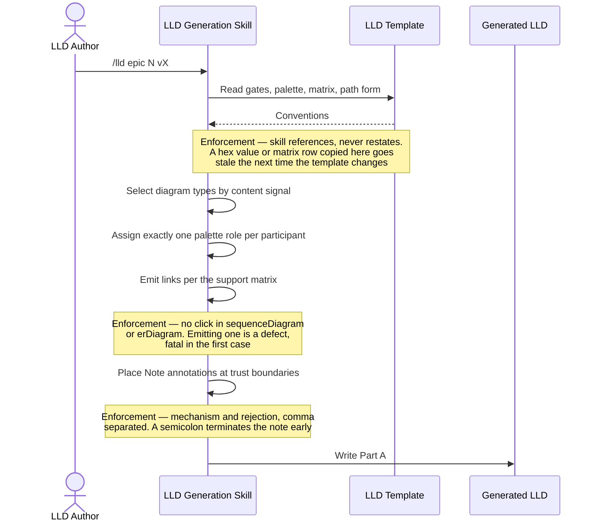
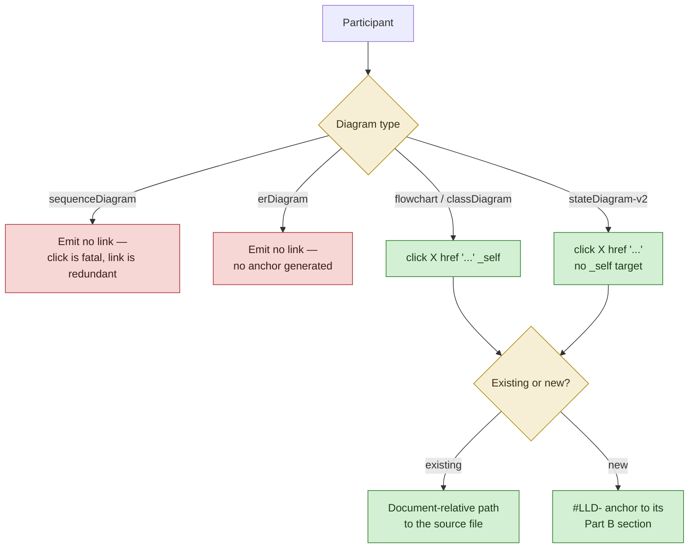
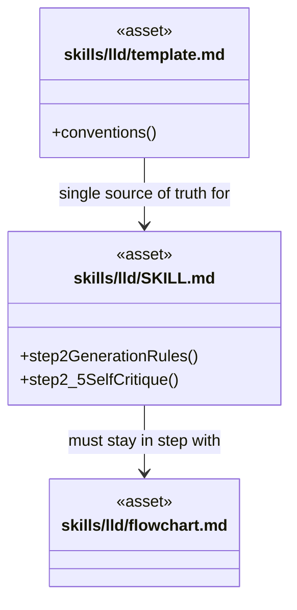
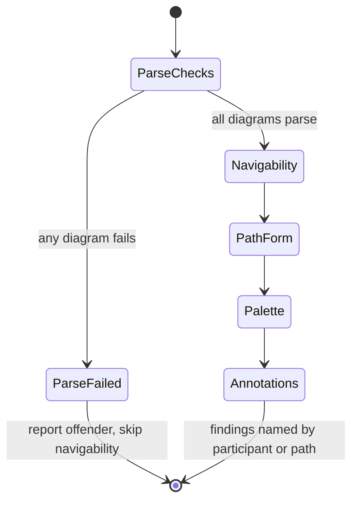
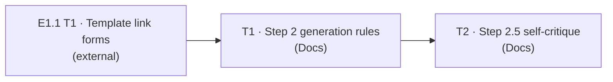

# Low-Level Design: V1 E1.3 — Skill Instructions & Quality Gates

## Document Control

| Field | Value |
|-------|-------|
| Version | 0.1 |
| Status | Draft |
| Author | LS / Claude |
| Created | 2026-08-13 |
| Epic | [#31](https://github.com/mironyx/engineering-delivery-framework/issues/31) |
| Parent | [v1-design.md](v1-design.md) (v1.1) |
| Requirements | [v1-requirements.md](../../requirements/v1-requirements.md) (v1.2) |
| Implementation plan | [2026-08-13-v1-implementation-plan.md](../../plans/2026-08-13-v1-implementation-plan.md) |
| Epic id | `v1-e1-3` |

---

## Dependency on E1.1 — read first

This epic writes the rules that apply E1.1's conventions. Per Design Principle 6 the two must
stay co-versioned, so **every rule here references
[`template.md`](../../../skills/lld/template.md) as the single source of truth and must not
restate its content** — no hex values, no gate prose, no matrix rows duplicated outside a
syntax-demonstration snippet.

Three corrections established by E1.1's LLD change what this epic writes. They are summarised
here because writing the generation rules from the plan alone would encode two claims that
are false:

| From E1.1 | Effect on this epic |
|---|---|
| **D1** — path form is document-relative with `..` permitted, constrained by `design-root` containment rather than a syntactic ban | T1's link-emission rule and T2's path-form check both change. A check for "no `..`" would reject every correct link |
| **D2** — the sequence-diagram `link` directive **parses**; its omission is a convention, not a parse error | T2 must **not** add a parse check for `link`. The existing Step 2.5 checks already omit it and stay as they are |
| **D4** — a `;` inside `Note` text is a parse error | T1's annotation rule states the separator; T2's parse checks gain this case |

> **Constraint:** if E1.1's Task 1 has not merged, T1 here cannot start. The rules would
> encode a path form that E1.1 then changes, which is precisely the co-versioning failure
> Design Principle 6 exists to prevent.

---

# Part A — Human-Reviewable Design

### Diagram navigability convention — links

Per [ADR-0039 as revised by E1.1](lld-v1-e1-1-template-vocabulary.md#LLD-v1-e1-1-link-forms).

## 3.1 Step 2 generation rules

**Stories:** 3.1; application half of 1.1, 1.2, 1.3, 1.4
**Layers:** Docs — plugin skill instructions. No DB, BE, or FE layer.

### Purpose

Rewrite `SKILL.md` Step 2's diagram generation rules so the template's conventions are
applied mechanically rather than remembered, with a worked example per concern. Removes the
four `edf://` references that currently instruct the skill to emit links Mermaid strips.

### Behavioural Flows



**Walkthrough.** Each step corresponds to one generation concern and one worked example. The
enforcement notes mark the three places the skill can silently produce a broken document:
restating template content that then drifts, emitting a link the renderer rejects, and
writing an annotation that fails to parse.

#### Decision flowchart — link emission



### Structural Overview



### Invariants

| # | Invariant | Verification |
|---|---|---|
| 1 | No `edf://` remains in `SKILL.md` | `grep -c 'edf://' plugins/edf/skills/lld/SKILL.md` returns 0 |
| 2 | No instruction to emit a `link` directive in a `sequenceDiagram` remains | `grep -n 'link <actor>\|link API:' SKILL.md` returns nothing |
| 3 | Every template feature has a corresponding generation rule | checklist in the PR body maps each template section to a rule; reviewer signs off |
| 4 | No palette hex value appears in `SKILL.md` outside a syntax-demonstration snippet | `grep -n '#f7d6d6\|#f7eed6\|#d6e8f7\|#d4f0d4' SKILL.md` — each hit must sit inside a fenced example |
| 5 | Each of the four concerns has at least one worked example | grep for the four example headings; assert present |
| 6 | The link-emission rule states `design-root` containment, not a `..` ban | `grep -n 'design-root' SKILL.md` returns ≥ 1; `grep -n 'no \.\. segments' SKILL.md` returns 0 |
| 7 | `plugin.json` and `marketplace.json` versions are equal | `test "$(jq -r .version …plugin.json)" = "$(jq -r '.plugins[0].version' …marketplace.json)"` |

### Acceptance Criteria

- [ ] All four `edf://` references in Step 2 are replaced with the document-relative form
- [ ] Diagram-type selection rules name each type's content signal, referencing the template's gates without restating them
- [ ] The palette rule states one class per participant and points at the template's canonical table for values
- [ ] The link-emission rule implements the full support matrix, including both no-emit cases
- [ ] The link-emission rule states the D1 path form and `design-root` containment
- [ ] The `classDiagram` display-label workaround is stated for identifiers containing `/`
- [ ] The annotation rule states mechanism-and-rejection with the D4 no-semicolon constraint
- [ ] Each of the four concerns carries a worked example: type selection with its gate, palette assignment, link generation (both forms, per supporting type), annotation placement with mechanism text
- [ ] A co-versioning rule is present: every template feature has a generation rule
- [ ] `flowchart.md` is updated if step ordering or branching changed
- [ ] Versions bumped in sync

### BDD Specs

```ts
describe('SKILL.md Step 2 generation rules', () => {
  it('contains no edf:// reference');
  it('instructs no link directive in a sequenceDiagram');
  it('states a content signal per conditional diagram type');
  it('references the template for palette values rather than restating hexes');
  it('states exactly one palette class per participant');
  it('states the no-emit rule for sequenceDiagram and erDiagram');
  it('states the stateDiagram-v2 no-_self rule');
  it('states the document-relative path form with design-root containment');
  it('states the classDiagram display-label workaround');
  it('states mechanism-and-rejection annotation format without a semicolon');
  it('provides a worked example for each of the four concerns');
  it('states the co-versioning rule');
});
```

### HLD coverage assessment

- [C8](v1-design.md#c8-self-documenting-generation-rules), [C2.2](v1-design.md#c22-lld-generation-skill) — sufficient, referenced only

## 3.2 Step 2.5 self-critique checks

**Stories:** 3.2
**Layers:** Docs — plugin skill instructions.

### Purpose

Replace the single appended "Diagram navigability" checklist item with parse checks that
gate navigability checks, placed at the same prominence as the security and error-path items
so an author does not scroll past them.

### Behavioural Flows



**When required:** met — the gate has non-trivial transitions, and the ordering constraint
(parse before navigability) is the section's whole point. Note the `click` directives omit
`_self`, per the support matrix.

**Walkthrough.** The ordering is not a preference. A diagram that fails to parse renders as
nothing, so reporting dead labels on it points the author at the wrong defect — this is
[C2.3's stated ordering constraint](v1-design.md#c23-self-critique-gate). The gate reports
the parse failure and stops assessing that diagram.

### Invariants

| # | Invariant | Verification |
|---|---|---|
| 8 | Parse checks are documented as running before navigability checks | grep the section; assert the parse item precedes the navigability item textually |
| 9 | Parse checks cover exactly the measured cases: `click` in `sequenceDiagram`, `_self` on `stateDiagram-v2`, `/` in a `classDiagram` identifier, `;` in `Note` text | grep for four check bullets |
| 10 | No parse check exists for the sequence `link` directive (D2 — it parses) | `grep -n 'link.*parse error' SKILL.md` returns nothing |
| 11 | Path form and file existence are separate checks | two distinct bullets present |
| 12 | The palette check verifies a `text` fence, not a bare `mermaid` fence | grep for the fence-type wording |
| 13 | Failure-message guidance requires naming the participant, path, interaction or type | grep for the specificity requirement |
| 14 | The diagram checks are not the last items in the checklist | assert at least two checklist items follow them |

### Acceptance Criteria

- [ ] The single "Diagram navigability" item is replaced by distinct parse, navigability, path, palette and annotation checks
- [ ] Parse checks run first and gate the rest, with the ordering stated
- [ ] Parse checks cover the four measured cases and **not** the `link` directive
- [ ] Navigability checks are scoped to `flowchart`, `classDiagram`, `stateDiagram-v2`
- [ ] Path-form and file-existence are separate checks; path form uses `design-root` containment
- [ ] Every `#LLD-` fragment is checked against a real Part B anchor
- [ ] The palette check verifies presence, `text`-fence placement, and consistent application
- [ ] Every trust-boundary-crossing interaction is verified to carry a `Note`
- [ ] Failure messages name the specific offender, never "diagram could be improved"
- [ ] The checks sit among the existing items (near security and error paths), not appended at the end
- [ ] `flowchart.md` updated if the gate's branching changed
- [ ] Versions bumped in sync

### BDD Specs

```ts
describe('SKILL.md Step 2.5 diagram checks', () => {
  it('places parse checks before navigability checks');
  it('checks for click in a sequenceDiagram');
  it('checks for _self on a stateDiagram-v2 click');
  it('checks for a slash in a classDiagram identifier');
  it('checks for a semicolon in Note text');
  it('does not check the sequence link directive as a parse error');
  it('scopes navigability checks to the three link-supporting types');
  it('checks path form and file existence separately');
  it('checks every #LLD- fragment against a Part B anchor');
  it('checks the palette block sits in a text fence');
  it('checks every trust-boundary interaction carries a Note');
  it('requires failure messages to name the specific offender');
  it('is followed by at least two other checklist items');
});
```

### HLD coverage assessment

- [C2.3](v1-design.md#c23-self-critique-gate) — sufficient; ordering constraint restated as the section's rationale, not duplicated

---

# Part B — Agent Implementation Detail

## External Surfaces

| Surface | Version / revision | Doc URL | Verified | New to repo |
|---------|--------------------|---------|----------|-------------|
| `mermaid` | `11.12.2` | https://mermaid.js.org/config/usage.html | Yes — the matrix these rules encode was measured during E1.1's LLD authoring | No — pinned by E1.1 |

No other external surface. This epic edits markdown instructions; it has no runtime and adds
no dependency.

**Stable anchors (ADR-0026).** Epic id `v1-e1-3`.

<a id="LLD-v1-e1-3-generation-rules"></a>

## 3.1 Step 2 generation rules — Implementation

### Layer: Docs

#### File structure

```
plugins/edf/skills/lld/SKILL.md        — Step 2 "Diagram generation rules" block
plugins/edf/skills/lld/flowchart.md    — update if step ordering or branching changed
plugins/edf/.claude-plugin/plugin.json — version bump
.claude-plugin/marketplace.json        — version bump (must match)
```

> **Version numbering.** Bump one patch from whatever `plugin.json` holds when this task
> starts. E1.1's three tasks land first and take `0.10.30` and `0.10.31`, so this task is
> expected to be `0.10.32` — but read the file rather than assuming, since E1.1's T3 does not
> bump.

#### The 4 `edf://` sites to migrate

All in the Step 2 "Diagram generation rules" block of `plugins/edf/skills/lld/SKILL.md`, at
the lines below as of `0.10.29`. The fifth occurrence (line 226) belongs to Step 2.5 and is
T2's.

| Line | Current text | Change |
|---|---|---|
| 167 | "…module path in the tooltip/`edf://` URL instead" | Rewrite — tooltip only; no URL scheme |
| 168 | "sequenceDiagram `link` ids … which may be `edf://` or…" | Delete — no `link` directive is emitted (D2) |
| 170 | "Existing source file → `edf://<repo-relative-path>`" | Replace with the D1 document-relative form |
| 188 | "`edf://` links must be bare paths without trailing punctuation" | Rewrite for the relative-path form |

#### Rules to state (referencing, never restating)

```
1. Diagram-type selection
   - Apply the template's "When required" gates. Do not restate the gate conditions;
     name the template section and the content signal to look for.
   - A section with no triggering signal gets the sequence diagram alone.

2. Palette application
   - Assign exactly one class per participant.
   - Tie-break: new and external outrank error and auth.
   - Values come from the template's canonical palette table. Never inline a hex
     value outside a syntax-demonstration snippet.

3. Link emission (per the template's support matrix)
   - flowchart, classDiagram      -> click X href "<target>" _self
   - stateDiagram-v2              -> click X href "<target>"        (no _self)
   - erDiagram, sequenceDiagram   -> emit nothing
   - Existing code -> document-relative path, .. permitted, must resolve inside
     design-root and name a file that exists.
   - New component -> #LLD-<epic-id>-<section-slug> matching a Part B anchor exactly.
   - classDiagram identifier containing / -> display label, class Name["a/b"].

4. Annotation placement
   - One Note per trust boundary crossed, adjacent to the interaction.
   - Format: mechanism — rejection behaviour, comma separated.
   - A semicolon in Note text is a parse error (E1.1 D4). Never use one.
```

#### Worked examples — required shape

One per concern, each minimal and each demonstrating the rule rather than restating it:

| Concern | Example must show |
|---|---|
| Type selection | A feature characteristic, the gate it trips, and the resulting diagram type |
| Palette | A participant matching two roles, and the single class the tie-break selects |
| Link emission | Both forms, on a supporting type, plus one no-emit case with the reason |
| Annotation | A `Note` with mechanism and rejection, comma separated |

> **Constraint (prompt economy):** these examples are verbatim LLM prompt text loaded on
> every `/lld` run. Keep each to the minimum that demonstrates the rule. Do not include
> dates, attribution, or rationale for rejected alternatives — that belongs in this LLD and
> in ADR-0039, not in the skill. Every line here is paid for on every invocation.

> **Constraint:** do not copy the template's palette table, gate prose, or matrix rows into
> `SKILL.md`. Invariant 4 checks the hex values by grep; the others are a review judgement.
> The failure this prevents is silent: a duplicated matrix stays correct until the template
> changes, and nothing then flags the copy.

#### Error handling

Not applicable — no runtime. Defects surface as non-conformant generated LLDs, which the
Step 2.5 gate (§3.2) is what catches.

<a id="LLD-v1-e1-3-self-critique"></a>

## 3.2 Step 2.5 self-critique checks — Implementation

### Layer: Docs

#### File structure

```
plugins/edf/skills/lld/SKILL.md        — Step 2.5 checklist
plugins/edf/skills/lld/flowchart.md    — update if the gate's branching changed
plugins/edf/.claude-plugin/plugin.json — version bump
.claude-plugin/marketplace.json        — version bump (must match)
```

#### Placement

The checklist currently ends with **Diagram navigability** as its final item, after
*Performance at design time* and *Visual specs populated*. That placement is what Story 3.2
AC6 and the epic's exit criteria object to — a check the author scrolls past is a check that
did not run.

Insert the new items **immediately after "Attack surface / STRIDE-lite" and before
"Error paths"**, so the diagram checks sit inside the security-and-correctness cluster rather
than in the trailing housekeeping group. Delete the old trailing item — do not leave both, or
authors will follow whichever they reach first.

#### Checks to state

```
- Diagram parse checks (run FIRST — these gate every check below).
  * No click directive in any sequenceDiagram — fatal, takes the whole diagram down.
  * No _self target on a stateDiagram-v2 click.
  * No / inside a classDiagram identifier — use a display label.
  * No ; inside Note text — it terminates the note and fails the diagram.
  If any diagram fails to parse, report the offending block and STOP assessing that
  diagram. Navigability findings on an unrenderable diagram point at the wrong defect.

- Diagram navigability (only after every diagram parses).
  * Scope: flowchart, classDiagram, stateDiagram-v2. The other two types carry no links
    by design — their participants are reached through the Structural Overview.
  * Every participant in a scoped diagram carries a link.
  * Path form: document-relative, .. permitted, no leading slash, resolves inside
    design-root.                                     [separate check]
  * File existence: the resolved path names a file that exists.  [separate check]
  * Every #LLD- fragment matches a Part B <a id> exactly, case-sensitive.

- Diagram palette and annotations.
  * Palette block present, in a text fence — a bare mermaid fence holding only classDef
    is not a valid diagram.
  * Every participant matching a defined role carries its class; exactly one class each.
  * Every interaction crossing a trust boundary (authZ, validation, external service,
    error propagation) carries a Note stating the mechanism.

Report format: name the specific participant, path, interaction or diagram type at fault.
"Diagram could be improved" is not a finding.
```

> **Constraint (D2):** do **not** add a parse check for the sequence-diagram `link`
> directive. It parses successfully on mermaid 11.12.2 — measured, see
> [E1.1 D2](lld-v1-e1-1-template-vocabulary.md#LLD-v1-e1-1-link-forms). Its omission is a
> convention enforced by the generation rules in §3.1, not a parse defect. A check here
> would report a non-error and train authors to ignore the parse section.

> **Constraint:** path form and file existence stay two checks, per
> [C2.3](v1-design.md#c23-self-critique-gate). An escaping path resolves fine on the
> author's machine, so a combined check passes locally and fails for every other reader —
> the exact failure D1 corrected.

#### Error handling

Not applicable — no runtime. The gate's own failure mode is a false negative, which
Invariants 8–14 constrain by asserting the checks exist, are ordered, and are placed where
they will be read.

---

## Cross-References

### Internal (within this epic)

- §3.1 depends on: —
- §3.2 depends on: [§3.1](#31-step-2-generation-rules) — shares `SKILL.md`; the gate checks what §3.1's rules emit

### External

- **Depends on** [`lld-v1-e1-1-template-vocabulary.md`](lld-v1-e1-1-template-vocabulary.md) — specifically its Task 1, which fixes the link forms, support matrix and path form these rules apply. Design Principle 6 makes this co-versioning, not just sequencing.
- Independent of [`lld-v1-e1-2-review-feedback.md`](lld-v1-e1-2-review-feedback.md) — shares no file.

### Shared types

None — no runtime types.

---

## Tasks

### Task 1: Step 2 generation rules with worked examples

**Issue title:** v1-e1-3: Step 2 diagram generation rules with worked examples in lld SKILL.md
**Layer:** Docs
**Depends on:** E1.1 Task 1 (external — the template's link forms must be settled)
**Stories:** 3.1; application half of 1.1–1.4
**HLD reference:** [C8](v1-design.md#c8-self-documenting-generation-rules), [C2.2](v1-design.md#c22-lld-generation-skill)

**What:** Rewrite Step 2's diagram generation rules — type selection, palette with tie-break,
link emission per the full support matrix including the D1 path form, the display-label
workaround, and D4-compliant annotation placement — each with a worked example, and add the
co-versioning rule. Removes the four Step 2 `edf://` references.

**Acceptance criteria:** see [§3.1](#31-step-2-generation-rules).

**BDD specs:** see [§3.1 BDD Specs](#31-step-2-generation-rules).

**Files to create/modify:**
- `plugins/edf/skills/lld/SKILL.md` — Step 2 generation rules
- `plugins/edf/skills/lld/flowchart.md` — if ordering or branching changed
- `plugins/edf/.claude-plugin/plugin.json` — version bump
- `.claude-plugin/marketplace.json` — version bump (must match)

### Task 2: Step 2.5 parse and navigability checks

**Issue title:** v1-e1-3: Step 2.5 parse-then-navigability self-critique checks
**Layer:** Docs
**Depends on:** Task 1
**Stories:** 3.2
**HLD reference:** [C2.3](v1-design.md#c23-self-critique-gate)

**What:** Replace the trailing "Diagram navigability" checklist item with parse checks that
gate navigability, path-form and file-existence as separate checks, palette fence-type and
annotation coverage — repositioned into the security-and-correctness cluster, with
failure-message specificity required. Removes the fifth `edf://` reference.

**Acceptance criteria:** see [§3.2](#32-step-25-self-critique-checks).

**BDD specs:** see [§3.2 BDD Specs](#32-step-25-self-critique-checks).

**Files to create/modify:**
- `plugins/edf/skills/lld/SKILL.md` — Step 2.5 checklist
- `plugins/edf/skills/lld/flowchart.md` — if the gate's branching changed
- `plugins/edf/.claude-plugin/plugin.json` — version bump
- `.claude-plugin/marketplace.json` — version bump (must match)

---

## Execution Order

### Dependency DAG



### Execution Waves

| Wave | Tasks | Blocked by | Notes |
|------|-------|------------|-------|
| 1 | Task 1 | E1.1 Task 1 (and, in practice, all of E1.1) | Cannot share a wave with any E1.1 task — both bump `plugin.json` and `marketplace.json` |
| 2 | Task 2 | Wave 1 | Shares `SKILL.md` with Task 1 |

Both tasks may share a wave with any Epic E1.2 task — E1.2 touches neither `SKILL.md` nor the
two version files.
