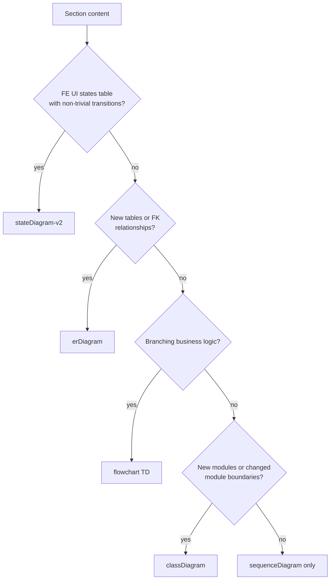
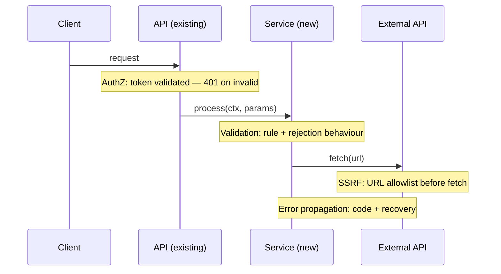
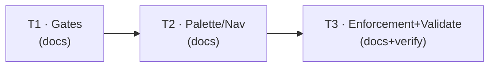

# Low-Level Design: V1 E1 — LLD Template & Diagram Vocabulary

## Document Control

| Field | Value |
|-------|-------|
| Version | 0.1 |
| Status | Draft |
| Author | LS / Claude |
| Created | 2026-08-09 |
| Parent | [v1-design.md](v1-design.md) |
| Requirements | [v1-requirements.md §Epic 1](../../requirements/v1-requirements.md#epic-1-lld-template--diagram-vocabulary-priority-high) |
| Epic issue | [#28](https://github.com/mironyx/engineering-delivery-framework/issues/28) |

---

## Open Questions

1. **classDef hex duplication vs Story 1.2 AC5.** The palette table in
   `template.md` is the canonical single source for hex values (Story 1.2 AC5),
   but the classDiagram worked example re-declares `classDef external
   fill:#d6e8f7,...` inline to demonstrate syntax. A worked example must show
   real syntax, so the hex necessarily appears twice. Resolution proposed in
   §1.2 Part B: keep the example's inline `classDef` (it is syntax
   demonstration, not a definition of record), and add a note under the palette
   table stating the table is canonical and examples illustrate syntax only.
   Flagging rather than deciding silently.

2. **State-diagram navigability on UI states.** A `stateDiagram-v2` participant
   is a UI state (Loading, Empty, Success, Error) — not itself a file. The
   navigability link for a state targets the component that owns the state
   machine (e.g. `src/components/order/OrderView.tsx`). Proposed in
   §1.2 Part B with a placeholder path; the tooltip is `"source"`. The
   template example uses the existing placeholder convention
   (`src/components/...`). No consumer depends on the exact placeholder.

---

# Part A — Human-Reviewable Design

## 1.1 Diagram Type Gates (Story 1.1)

### Purpose

The template defines four conditional diagram types beyond the sequence diagram —
`stateDiagram-v2`, `erDiagram`, `flowchart TD`, `classDiagram` — each with a
"When required" / "When optional" gate that decides inclusion deterministically.
Story 1.1 requires the gates to be concrete, checkable rules: the same feature
characteristics must always produce the same diagram types, and a feature with
none of the triggering characteristics gets the standard sequence diagram only.

### Behavioural Flows

The selection decision is a decision flow evaluated by `/lld` Step 2. It is not
itself a user-visible interaction — the diagram shows the rule set:



**When required:** A gate is triggered only by the specific content signal it names
(FE UI-states table, new entities, branching logic, new module boundaries). The
gates are mutually exclusive by design — a section may trigger more than one, and
the template documents the union (a section can carry both a state diagram and an
erDiagram).

**When optional:** Content signals absent → no conditional diagram type is added;
the section contains the standard sequence diagram only.

### Structural Overview

The gates live in `plugins/edf/skills/lld/template.md`, one "When required" /
"When optional" pair per diagram type, directly under each type's worked example.
`/lld` SKILL.md Step 2 rule 1 references these gates as the selection authority
(co-versioning, Design Principle 6). No standalone "gate" file exists — the
template is the single definition.

### Invariants

| # | Invariant | Verification |
|---|-----------|-------------|
| 1 | Every diagram type in the template has a "When required" condition stated as a concrete, checkable content signal (not "if it seems useful") | grep `When required` in `template.md`; eyeball each condition for a named content signal |
| 2 | The `## 1.1` flowchart above reflects the template's gate conditions — each conditional branch names the same content signal as its corresponding template gate | Manual cross-check of the flowchart branch labels against template gate text |

### Acceptance Criteria

- [ ] Each of the 4 conditional diagram types has a "When required" gate naming a
      concrete content signal, and a "When optional" gate naming the negative case.
- [ ] A feature with none of the triggering signals is documented to produce the
      standard sequence diagram only.
- [ ] The `## 1.1` decision flowchart reflects the template gate conditions — each
      conditional branch names the same content signal as its template gate.

### BDD Specs

```
describe('lld template diagram type gates', () => {
  it('stateDiagram-v2 gate requires an FE UI-states table with non-trivial transitions');
  it('erDiagram gate requires new tables or FK relationships');
  it('flowchart TD gate requires branching business logic');
  it('classDiagram gate requires new modules or changed module boundaries');
  it('no triggering signal → standard sequence diagram only');
});
```

### HLD coverage assessment

- [C1 — Enriched Diagram Vocabulary](v1-design.md#c1-enriched-diagram-vocabulary) —
  sufficient, referenced only. The gates ARE the deterministic selection C1
  describes.

## 1.2 Palette & Navigability on Every Example (Stories 1.2, 1.4)

### Purpose

The template's four-role `classDef` palette (error `#f7d6d6`, auth `#f7eed6`,
external `#d6e8f7`, new `#d4f0d4`) must be applied consistently across every
diagram type, and every diagram participant must be navigable via the mechanism
its diagram type supports (`link` on sequence, `click` on flowchart /
classDiagram / stateDiagram, prose for erDiagram). Today the state-diagram and
decision-flowchart examples in the template carry **no** navigability links and
**no** palette demonstration — an author copying them would produce dead labels.
This section adds both, so every worked example models the full convention.

### Behavioural Flows

The navigability decision is per-participant and type-aware. For a state-diagram
participant (a UI state), the link targets the component owning the state machine;
for a flowchart node, the link targets the function/middleware implementing the
step. The per-type directive cheat-sheet (illustrative syntax — not a rendered
diagram):

```text
# sequenceDiagram participant → link directive
link ExampleView: source @ src/components/order/OrderView.tsx
# flowchart TD node → click directive
click AuthZ href "src/app/middleware/auth.ts" "source"
# classDiagram node → click directive
click EngineScoring href "src/lib/engine/scoring.ts" "source"
# stateDiagram-v2 node → click directive (bare form — no href keyword)
click Loading "src/components/order/OrderView.tsx" "source"
```

**When required:** Every worked example that renders a state or flowchart diagram
must demonstrate both (a) the `classDef` + `class` palette application and (b) a
`click <node> href "<url>" "<tooltip>"` navigability link on at least one
participant. The sequence and classDiagram examples already satisfy this and are
the reference pattern.

**When optional:** erDiagram examples intentionally omit links (the type supports
no interaction) and are exempt from palette application — refer to entities in
prose instead.

### Structural Overview

All palette and navigability conventions are defined in
`plugins/edf/skills/lld/template.md`:

- **Palette table** (`### Diagram styling palette`) — canonical hex values in one
  place (Story 1.2 AC5). The classDiagram example's inline `classDef` is syntax
  demonstration; a note under the table makes this explicit.
- **Navigability convention** (`### Diagram navigability convention — links`) —
  the per-type mechanism table. Already type-aware.
- **Worked examples** — sequence (has `link`), classDiagram (has `click` +
  `classDef`), state (gap: add), flowchart (gap: add), erDiagram (exempt).

### Invariants

| # | Invariant | Verification |
|---|-----------|-------------|
| 1 | The palette hex values appear canonically in the palette table; any inline `classDef` in a worked example is marked as syntax demonstration | grep the four hex values in `template.md`; confirm the palette table lists them and inline examples carry the demonstration note |
| 2 | Every state and flowchart worked example has ≥1 `click <node> href "..." "<tooltip>"` line, and ≥1 of those uses a `#LLD-` anchor (new-component case) | grep `click ` in `template.md` — state + flowchart blocks each contain at least one, including a `#LLD-` target |
| 3 | No `click` directive appears in a `sequenceDiagram` or `erDiagram` block (unsupported types) | grep `click ` against the block scopes in `template.md` |
| 4 | erDiagram blocks contain no navigability links | grep the erDiagram block for `click`/`href` — zero hits |

### Acceptance Criteria

- [ ] State-diagram example demonstrates `classDef` + `class` palette application
      and a `click <state> "..." "source"` navigability link (bare form).
- [ ] Decision-flowchart example demonstrates palette application and a
      `click <node> href "..." "source"` navigability link.
- [ ] The palette table is documented as the single canonical source; the
      classDiagram example's inline `classDef` carries a note marking it as
      syntax demonstration.
- [ ] No `click` appears in sequence or erDiagram blocks (type-correct per the
      verified navigability table).

### BDD Specs

```
describe('lld template palette and navigability examples', () => {
  it('state example has classDef + class palette and a click link');
  it('flowchart example has classDef + class palette and a click link');
  it('palette table is marked canonical; inline classDef marked as syntax demo');
  it('no click directive in sequenceDiagram or erDiagram blocks');
  it('classDef blocks are defined inside the first diagram of each type that uses them — never a standalone block');
  it('the four palette colours render distinctly in mermaid-cli');
  it('new-component click uses a #LLD- anchor on state and flowchart examples');
  it('navigability example paths are workspace-relative with no .. segments');
});
```

### HLD coverage assessment

- [C2 — Standard Visual Palette](v1-design.md#c2-standard-visual-palette) —
  sufficient, referenced only.
- [C4 — Navigable Diagram Surface](v1-design.md#c4-navigable-diagram-surface) —
  sufficient, referenced only.

## 1.3 Enforcement-Point Annotations & Syntax Validation (Story 1.3 + cross-cutting)

### Purpose

Story 1.3 requires enforcement points (authZ, validation, SSRF, error propagation)
to be annotated with `Note` blocks on sequence diagrams at every
trust-boundary-crossing interaction, with the enforcement mechanism stated. The
sequence worked example demonstrates authZ, validation, and SSRF Notes, but not
yet all four boundary types with mechanism + rejection behaviour; this section
hardens the template's annotation rules so all four are demonstrated and
mechanically checkable, and validates every diagram in the template parses
(Story 1.1 AC5 — "renders without syntax errors").

### Behavioural Flows

Enforcement-point annotation is a per-interaction decision on sequence diagrams.
The template must state the four boundary types and require a `Note` at each:



**When required:** Every interaction that crosses a trust boundary — authZ
enforcement, input validation, external service call, error propagation — carries a
`Note` annotation naming the mechanism and the rejection behaviour. An interaction
crossing multiple boundaries carries one `Note` per concern.

**When optional:** Intra-component calls that cross no trust boundary.

### Structural Overview

The annotation rules live in the template's sequence-diagram section
(`**Enforcement point annotations.**` bullet list under "Sequence diagram
(primary)"). The four boundary types are already listed; the hardening adds an
explicit "each boundary type must state the enforcement mechanism AND the
rejection behaviour" rule and a worked multi-boundary example. Syntax validation
is an external verification step run against every diagram block.

### Invariants

| # | Invariant | Verification |
|---|-----------|-------------|
| 1 | The template's enforcement-point rules name all four boundary types (authZ, validation, SSRF/external, error propagation) and require mechanism + rejection behaviour | grep `Enforcement point annotations` in `template.md`; confirm 4 bullets |
| 2 | Every mermaid fenced block in `template.md` parses without errors in mermaid-cli | `npx --no-install @mermaid-js/mermaid-cli` against each extracted block — exit 0 for all |

### Acceptance Criteria

- [ ] The sequence worked example demonstrates at least one `Note` per boundary
      type (authZ, validation, SSRF, error propagation) with mechanism + rejection.
- [ ] Every mermaid fenced block in `template.md` parses in mermaid-cli (the
      current 5 blocks, plus any added in §1.1/§1.2).

### BDD Specs

```
describe('lld template enforcement annotations and syntax', () => {
  it('template names all four enforcement boundary types');
  it('template requires mechanism + rejection behaviour per boundary');
  it('sequence example demonstrates a Note per boundary type');
  it('every template diagram block parses in mermaid-cli');
  it('Note annotations render without syntax errors and the note text is visible');
});
```

### HLD coverage assessment

- [C3 — Enforcement-Point Annotations](v1-design.md#c3-enforcement-point-annotations) —
  sufficient, referenced only.

---

# Part B — Agent Implementation Detail

> The implementing agent (`/feature`) reads both parts. This epic touches a single
> artefact — `plugins/edf/skills/lld/template.md` — with markdown-only changes. No
> code, no test suite changes (the plugin's pytest suite does not cover the
> template). Version bump: skill file change requires
> `plugins/edf/.claude-plugin/plugin.json` + `.claude-plugin/marketplace.json`
> 0.10.28 → 0.10.29 (repo convention, see CLAUDE.md).
>
> Numbering: Part A sections use `## N.k`; Part B task sections use `## B.N`. This
> follows ADR-0026's as-implemented `B.N` precedent — each number appears once, so
> a Part B `B.2` refers unambiguously to the task section (not to §1.2).

## Reused helpers — DO NOT re-implement

`kb/architecture.md` is empty (template placeholders — no catalogued helpers exist
in this plugin monorepo for the template/skill domain). No helper reuse applies to
this epic. This is the expected state for a plugin-self-modification epic; no
`kb/ additions` block is warranted.

<a id="LLD-v1-e1-diagram-type-gates"></a>

## B.1 — Task T1.1: Verify & harden diagram type gates

### [Layer: None — template documentation]

See [v1-design.md §C1](v1-design.md#c1-enriched-diagram-vocabulary) for the
capability; the gates are the mechanism.

#### File structure

```
plugins/edf/skills/lld/template.md   — the only file modified
```

#### Change

Verify each of the 4 conditional diagram types (`stateDiagram-v2`, `erDiagram`,
`flowchart TD`, `classDiagram`) has a "When required" gate naming a concrete
content signal and a "When optional" gate naming the negative case. The gates
currently exist and are largely concrete; tighten any that are vague (e.g.
"seems useful") into a named content signal. Do **not** change gate semantics —
only precision. The decision flowchart in Part A §1.1 must match the gate text.

#### Function signatures

None — no code functions. The "signature" of this task is the gate-condition
text in `template.md`, verified by the invariants in Part A §1.1.

#### Error handling

N/A — documentation change. If a gate is ambiguous, tighten the wording; do not
weaken an existing condition to make it vaguer.

<a id="LLD-v1-e1-palette-navigability"></a>

## B.2 — Task T1.2: Palette & navigability on state/flowchart examples

### [Layer: None — template documentation]

See [v1-design.md §C2](v1-design.md#c2-standard-visual-palette) and
[§C4](v1-design.md#c4-navigable-diagram-surface) for the conventions.

#### File structure

```
plugins/edf/skills/lld/template.md   — state + flowchart worked examples
```

#### Change

1. **State diagram example** — add a `classDef` + `class` palette application and
   `click` navigability links (a workspace-relative path for an existing component, a
   `#LLD-` anchor for a new component per Story 1.4 AC4). Placeholder paths per
   template convention. stateDiagram uses the bare click form (no `href` keyword):
   ```mermaid
   stateDiagram-v2
       classDef error fill:#f7d6d6,stroke:#8b1a1a,color:#3b0a0a
       classDef new fill:#d4f0d4,stroke:#2d7d2d,color:#1a3a1a
       [*] --> Loading
       Loading --> Empty : no data
       Loading --> Success : data loaded
       Loading --> Error : fetch failed
       Error --> Loading : retry
       Success --> Loading : refresh
       click Loading "src/components/example/ExampleView.tsx" "source"
       click Error "#LLD-example-order-state-machine" "spec"
       class Error error
       class Loading,Empty,Success new
   ```
2. **Decision flowchart example** — add palette + `click` on decision nodes
   (one workspace-relative path, one `#LLD-`):
   ```mermaid
   flowchart TD
       classDef auth fill:#f7eed6,stroke:#8a6d2d,color:#3b2f0a
       classDef error fill:#f7d6d6,stroke:#8b1a1a,color:#3b0a0a
       A[Incoming request] --> B{AuthZ check}
       B -->|allowed| C[Process request]
       B -->|denied| D[403 Forbidden]
       C --> E{Rate limit}
       E -->|within limit| F[Execute]
       E -->|exceeded| G[429 Too Many Requests]
       click A href "src/app/api/example/route.ts" "source"
       click C href "#LLD-example-request-pipeline" "spec"
       class B auth
       class D,G error
   ```
3. **Palette single-source note** — under the `### Diagram styling palette` table,
   add: "This table is the canonical source for the four hex values. Inline
   `classDef` lines in worked examples below demonstrate syntax only and must stay
   in sync with this table." Leave the classDiagram example's existing inline
   `classDef external` unchanged (it is the syntax demonstration).
4. Keep the sequence `link` and classDiagram `click` examples as-is — they are the
   reference pattern and already correct.

#### Function signatures

None. The "signature" is the worked-example markdown, verified by the Part A §1.2
invariants (≥1 `click` per state/flowchart block, no `click` in sequence/erDiagram
blocks, palette hex present).

#### Error handling

N/A — markdown only. Do not add a `click` to an erDiagram or sequenceDiagram block
(unsupported — verified Mermaid reality).

<a id="LLD-v1-e1-enforcement-annotations-validation"></a>

## B.3 — Task T1.3: Enforcement annotations + mermaid-cli validation

### [Layer: None — template documentation + verification]

See [v1-design.md §C3](v1-design.md#c3-enforcement-point-annotations) for the
annotation convention.

#### File structure

```
plugins/edf/skills/lld/template.md         — enforcement rules + worked example
.tmp_validate_mermaid.sh                   — scratch validator (shell → node + mermaid-cli; not committed)
```

#### Change

1. **Enforcement rules hardening** — in the sequence-diagram section's
   `**Enforcement point annotations.**` bullet list, add to the intro line: "each
   boundary type must state the enforcement mechanism AND the rejection behaviour."
   The four bullets (authZ, validation, SSRF, error propagation) already exist.
2. **Multi-boundary example** — if the existing sequence worked example does not
   already show an interaction crossing two boundaries with two `Note`s, add one
   (an external call requiring authZ, or an external call with SSRF + timeout).
   The current example has `Note over API` (authZ), `Note over Service`
   (validation + rate limit), `Note over NewService` (SSRF + timeout) — confirm it
   covers all four boundary types; add an error-propagation `Note` if absent.
3. **Mermaid syntax validation** — extract every mermaid fenced block in
   `template.md` (byte-exact, including the blocks added in B.1/B.2) and run each
   through mermaid-cli. Pin: `@mermaid-js/mermaid-cli` 11.16.0 (mermaid 11.x) — the
   version verified against the corrected syntax during the v1 requirements
   reconciliation, commit `eebf21a` (all template diagrams validated then). The CLI
   renders each block headlessly and exits non-zero on a parse error. Use
   `npx --no-install @mermaid-js/mermaid-cli` when mermaid-cli is already
   provisioned locally (as it was for `eebf21a`); otherwise
   `npx -y @mermaid-js/mermaid-cli` provisions it once. All blocks must parse
   (exit 0). Fix any that fail. This is the Story 1.1 AC5 deliverable.

#### Function signatures

None — the validation is a one-shot shell script (extract blocks → run each through
`node` + mermaid-cli) executed during implementation, not committed.

#### Error handling

If a diagram fails to parse, the failure signature identifies the block and the
Mermaid error line. Fix the syntax in `template.md`; do not weaken the diagram.

---

## Cross-References

### Internal (within this epic)

- B.1 (gates) → B.3 (validation validates the gate-triggered diagrams) — soft
  coupling; B.3 runs last.
- B.2 (palette/navigability) → B.3 (validation must pass on the new examples).

### External

- **Epic 2 (#29)** consumes the template's navigability convention (the `link` /
  `click` syntax this epic's examples model). No file shared — E2 touches
  `extensions/edf-review/`.
- **Epic 4 (#31)** references the template as the palette/gate/annotation source
  of truth (co-versioning). No file shared — E4 touches
  `plugins/edf/skills/lld/SKILL.md`.
- **ADR-0026** — `#LLD-` anchor format governs navigability links to Part B.

### Shared types

None — markdown-only epic.

---

## Tasks

### Task 1: Harden diagram type gates

**Issue title:** v1-e1: harden diagram type gates in lld template
**Layer:** None (docs)
**Depends on:** —
**Stories:** 1.1
**HLD reference:** [v1-design.md §C1](v1-design.md#c1-enriched-diagram-vocabulary)

**What:** Verify/tighten the "When required"/"When optional" gates for all 4
conditional diagram types in `plugins/edf/skills/lld/template.md` so each names a
concrete, checkable content signal. Update the Part A §1.1 decision flowchart to
match. Bump plugin version 0.10.28 → 0.10.29.

**Acceptance criteria:**
- [ ] Every diagram type has a "When required" gate naming a concrete content signal
- [ ] Every diagram type has a "When optional" negative case
- [ ] The §1.1 decision flowchart reflects the template gate conditions (each branch names the same content signal)
- [ ] `plugin.json` + `marketplace.json` version 0.10.29 in sync

**BDD specs:**
```
describe('template diagram type gates', () => {
  it('state gate requires FE UI-states table with non-trivial transitions');
  it('er gate requires new tables or FK relationships');
  it('flowchart gate requires branching logic');
  it('classDiagram gate requires new modules or changed boundaries');
  it('no signal → sequence diagram only');
});
```

**Files to create/modify:**
- `plugins/edf/skills/lld/template.md` — gate conditions + §1.1 flow alignment
- `plugins/edf/.claude-plugin/plugin.json` — version 0.10.29
- `.claude-plugin/marketplace.json` — version 0.10.29

### Task 2: Add palette & navigability to state/flowchart examples

**Issue title:** v1-e1: palette and navigability on state/flowchart template examples
**Layer:** None (docs)
**Depends on:** Task 1 (same file — sequential)
**Stories:** 1.2, 1.4
**HLD reference:** [v1-design.md §C2](v1-design.md#c2-standard-visual-palette), [§C4](v1-design.md#c4-navigable-diagram-surface)

**What:** Add `classDef` + `class` palette application and `click <node> href "..." "source"` navigability links to the state-diagram and decision-flowchart worked examples in `template.md`. Add the "palette table is canonical" note under the palette table.

**Acceptance criteria:**
- [ ] State example has palette + ≥1 `click` link
- [ ] Flowchart example has palette + ≥1 `click` link
- [ ] Palette table marked canonical; inline `classDef` marked as syntax demonstration
- [ ] No `click` in sequence or erDiagram blocks

**BDD specs:**
```
describe('template palette/navigability examples', () => {
  it('state example has classDef+class and a click link');
  it('flowchart example has classDef+class and a click link');
  it('palette table is canonical; inline classDef is syntax demo');
  it('no click in sequence/erDiagram blocks');
  it('new-component click uses a #LLD- anchor on state and flowchart examples');
  it('navigability example paths are workspace-relative with no .. segments');
});
```

**Files to create/modify:**
- `plugins/edf/skills/lld/template.md` — state + flowchart examples, palette note

### Task 3: Enforcement annotations + mermaid-cli validation

**Issue title:** v1-e1: enforcement annotations and mermaid syntax validation
**Layer:** None (docs + verification)
**Depends on:** Task 2 (validates its new examples)
**Stories:** 1.3, 1.1 (AC5)
**HLD reference:** [v1-design.md §C3](v1-design.md#c3-enforcement-point-annotations)

**What:** Harden the template's enforcement-point annotation rules (mechanism +
rejection per boundary, all four boundary types demonstrated in the sequence
example). Validate every mermaid block in `template.md` parses in mermaid-cli.

**Acceptance criteria:**
- [ ] Enforcement rules name all four boundary types and require mechanism + rejection
- [ ] Sequence example demonstrates a `Note` per boundary type
- [ ] Every mermaid block in `template.md` parses in mermaid-cli (exit 0)

**BDD specs:**
```
describe('template enforcement + syntax', () => {
  it('names all four boundary types');
  it('requires mechanism + rejection behaviour');
  it('sequence example shows a Note per boundary');
  it('all template diagrams parse in mermaid-cli');
});
```

**Files to create/modify:**
- `plugins/edf/skills/lld/template.md` — enforcement rules, multi-boundary example
- `.tmp_validate_mermaid.sh` — scratch validator (shell → node + mermaid-cli; remove before commit)

---

## Execution Order

### Dependency DAG



### Execution Waves

| Wave | Tasks | Blocked by | Notes |
|------|-------|------------|-------|
| 1 | Task 1 | — | First edit to `template.md` |
| 2 | Task 2 | Wave 1 (Task 1) | Same file — sequential |
| 3 | Task 3 | Wave 2 (Task 2) | Validates all blocks after edits |
