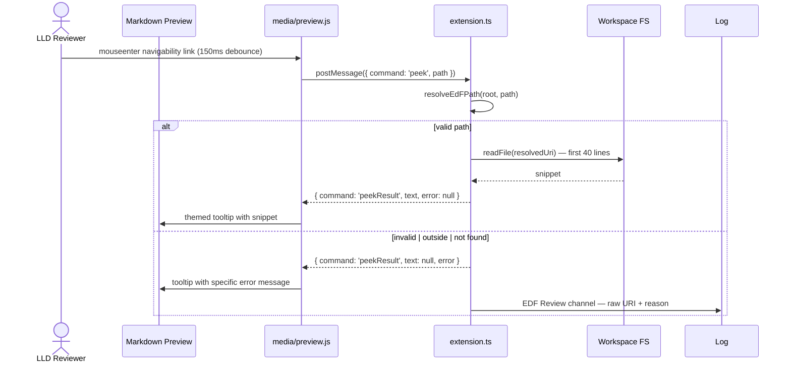
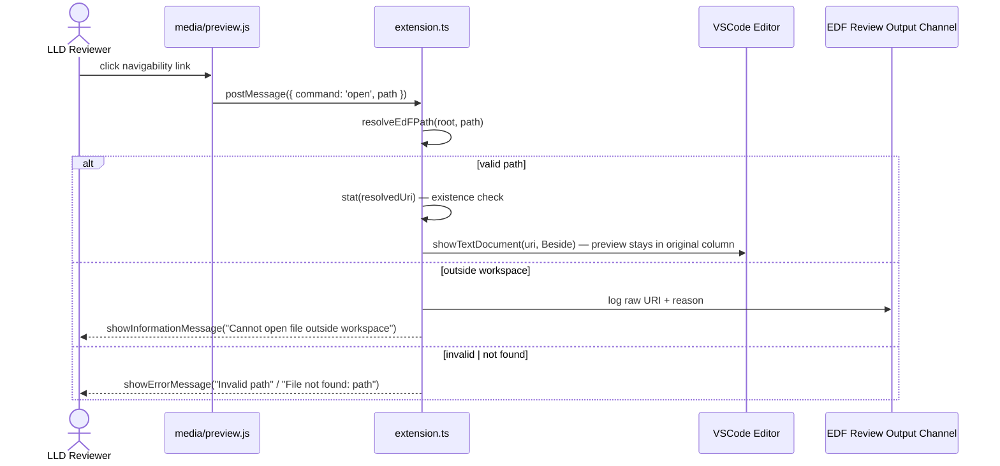
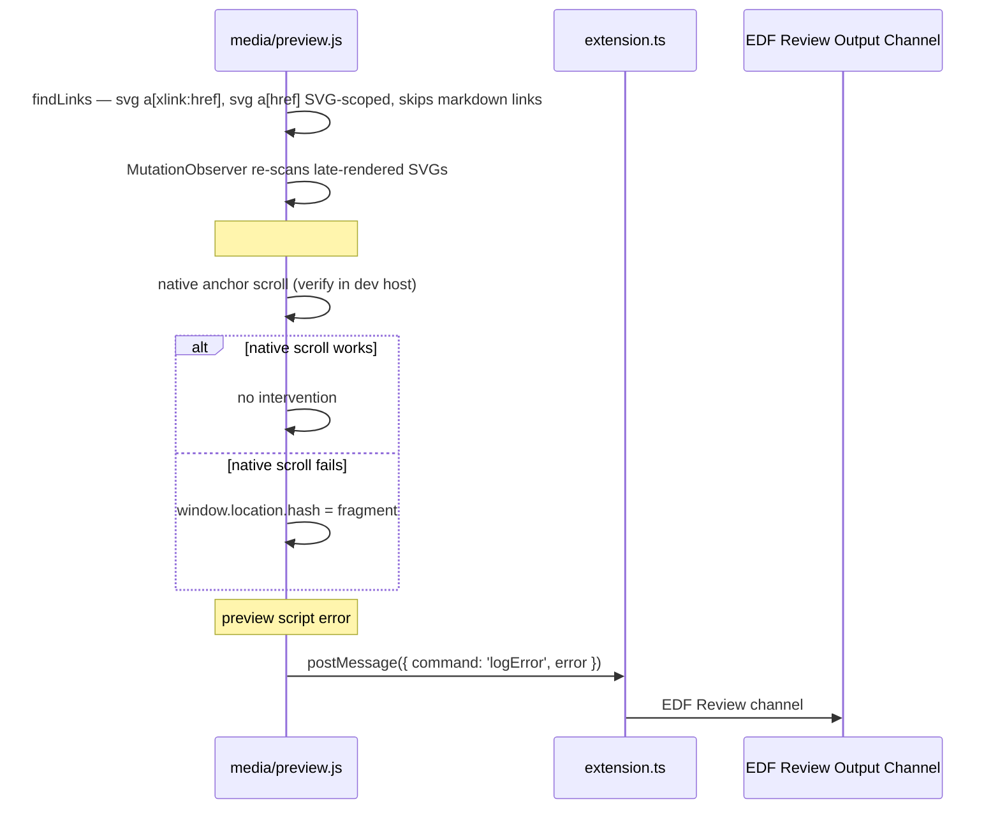
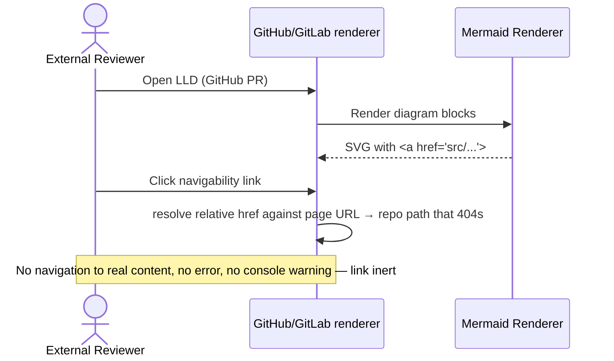
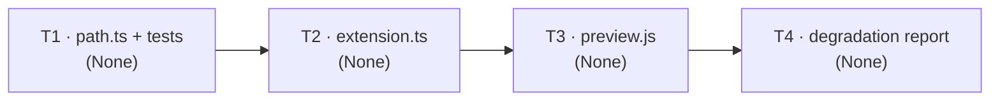

# Low-Level Design: V1 E2 — VSCode Extension Diagram Navigation

## Document Control

| Field | Value |
|-------|-------|
| Version | 0.1 |
| Status | Draft |
| Author | LS / Claude |
| Created | 2026-08-09 |
| Parent | [v1-design.md](v1-design.md) |
| Requirements | [v1-requirements.md §Epic 2](../../requirements/v1-requirements.md#epic-2-vscode-extension--diagram-navigation-priority-high) |
| Epic issue | [#29](https://github.com/mironyx/engineering-delivery-framework/issues/29) |

---

## Open Questions

1. **Native `#LLD-` anchor scroll in the preview webview (Story 2.3).** The HLD
   (C2.4, Flow 6) flags that native scroll-to-fragment for SVG `<a>` clicks may
   not work in VSCode's markdown preview webview; the fallback is a click listener
   that sets `window.location.hash`. The LLD specifies: implement native-first,
   verify in the Extension Development Host, add the `window.location.hash`
   fallback only if native scroll fails. This mirrors requirements Open Question 2
   (postMessage mechanism for hover) which was already resolved in ADR-0038.

2. **`onDidReceivePreviewMessage` panel parameter.** The extension host receives
   the preview `WebviewPanel` as the second argument to
   `onDidReceivePreviewMessage` (VSCode 1.82+). The scaffold already relies on
   this. If the API surface differs on the pinned VSCode version (^1.88.0), the
   peek response channel needs a `WebviewPanel` lookup fallback. Verify during
   implementation; the scaffold's current usage is the assumed mechanism.

---

# Part A — Human-Reviewable Design

## 2.1 Path Validation & Hover Peek (Stories 2.1, 2.2 — security)

### Purpose

Every navigability-link path (a workspace-relative source path, per ADR-0038 —
no `edf://` scheme) is resolved and validated against the workspace root before
any file read or editor open. The validation is a pure module — no VSCode or DOM
dependency — so it is unit-testable in isolation and is the single filesystem
boundary (ADR-0038). Hovering a navigability link shows the first ~40 lines of the
referenced file in a themed tooltip; a bad path (file not found, outside
workspace, invalid) shows a specific error message instead of reading anything.

### Behavioural Flows

The hover→peek flow is a two-hop postMessage round-trip between the preview
script and the extension host:



**When required:** Every navigability link read. There is no "optional" path — all
reads go through validation.

### Structural Overview

The validation module (`src/path.ts`) is imported by the extension host
(`src/extension.ts`), which owns the `onDidReceivePreviewMessage` handler. The
preview script (`media/preview.js`) is the only consumer of the peek response. The
`EDF Review` output channel is the observability surface. Extension version: the
scaffold is v0.1.0; this epic bumps to v0.2.0.

### Invariants

| # | Invariant | Verification |
|---|-----------|-------------|
| 1 | No navigability-link path is read or opened without passing `resolveEdFPath` containment (lexical + realpath) | Unit tests for `resolveEdFPath`; grep that `readFile`/`showTextDocument` call sites use the resolved path |
| 2 | A path with `..`/`.`/colon segments, or resolving outside the root, is rejected as `outside` before any read | Unit tests: `../`-escape, `C:\`-drive segment, symlink-escape cases |
| 3 | A malformed/empty path is rejected as `invalid` | Unit tests: empty, whitespace, leading slash, `://` scheme |
| 4 | Symlink containment: a workspace symlink pointing outside the root does not bypass the check (defence in depth beyond the lexical AC) | Unit test with a real symlink fixture; realpath comparison |
| 5 | Every rejection/failure is logged to the `EDF Review` output channel with the raw URI + reason | Manual dev-host check; grep `outputChannel.appendLine` in `extension.ts` |

### Acceptance Criteria

- [ ] `resolveEdFPath(root, path)` returns `{ ok: true, absolutePath }` only for
      paths within the root, and `{ ok: false, error: 'invalid' | 'outside' }`
      otherwise.
- [ ] Hover shows the first 40 lines of a valid file, or a specific error message
      ("File not found", "Path outside workspace", "Invalid path") for bad paths.
- [ ] A symlink inside the workspace pointing outside the root is rejected.
- [ ] All rejections are logged to the `EDF Review` output channel.

### BDD Specs

```
describe('resolveEdFPath', () => {
  it('resolves a valid workspace-relative path');
  it('rejects empty and whitespace paths as invalid');
  it('rejects leading-slash and URL-scheme paths as invalid');
  it('rejects .. / . / drive-letter segments as outside');
  it('rejects resolution escaping the root as outside');
  it('accepts the root itself');
  it('rejects a symlink inside the root pointing outside');
});
```

### HLD coverage assessment

- [C5 — Preview-Integrated Source Navigation](v1-design.md#c5-preview-integrated-source-navigation) —
  sufficient, referenced only.
- [ADR-0038 Security boundary](../../adr/0038-extension-architecture-security-model.md) —
  the workspace-containment model is implemented by this section's module.

## 2.2 Click-to-Open & Error Handling (Story 2.2)

### Purpose

Clicking a navigability link opens the referenced file in the adjacent VSCode column
(`ViewColumn.Beside`) while the markdown preview stays visible. Missing files show
a VSCode error message and open no tab; out-of-workspace paths are rejected, logged,
and shown an information message.

### Behavioural Flows



**When required:** Every click on a navigability link. No optional path.

### Structural Overview

`handleOpen` in `src/extension.ts` performs validation, existence check
(`vscode.workspace.fs.stat`), and `showTextDocument`. It reuses `resolveEdFPath`
from §2.1 — the same single validation path as peek.

### Invariants

| # | Invariant | Verification |
|---|-----------|-------------|
| 1 | `showTextDocument` is called with `viewColumn: ViewColumn.Beside` | Code review + dev-host click test |
| 2 | The preview panel is not closed or replaced by the open | Dev-host click test — preview visible after open |
| 3 | A missing file opens no editor tab and shows "File not found: <path>" | Dev-host test with a dangling link |
| 4 | An outside-workspace path opens no tab, logs to `EDF Review`, shows the information message | Dev-host test with a `../`-escape link |

### Acceptance Criteria

- [ ] Click opens the file in the adjacent column; preview stays visible.
- [ ] Missing file → error message, no tab opened.
- [ ] Out-of-workspace path → no tab, output-channel log, information message.

### BDD Specs

```
describe('handleOpen', () => {
  it('opens a valid file in ViewColumn.Beside');
  it('shows File not found and opens no tab for a missing file');
  it('rejects an outside-workspace path with log + information message');
  it('invalid path shows an error message and opens no tab');
});
```

### HLD coverage assessment

- [C2.4 — EDF Review Extension](v1-design.md#c24-edf-review-extension) —
  sufficient; this section implements its open/error responsibilities.

## 2.3 Preview Script Hardening & `#LLD-` Navigation (Stories 2.1, 2.3)

### Purpose

The injected preview script (`media/preview.js`) owns the hover debounce, tooltip
rendering, link discovery, and `#LLD-` anchor navigation. The scaffold already has
the 150ms hover debounce, `querySelectorAll('a[xlink\\:href], a[href]')` discovery,
and MutationObserver. With the `edf://` scheme gone (ADR-0038 amendment), discovery
must be **scoped to SVG anchors** — `querySelectorAll('svg a[xlink\\:href], svg a[href]')`
— so only the anchors Mermaid renders inside diagram SVGs are intercepted, and a
reviewer's ordinary markdown links are left untouched. This section hardens the
script: SVG-scope discovery, render peek **error** messages in the tooltip
(currently only success text is shown), relay preview-script errors to the host via
`logError` (currently absent), and verify/complete `#LLD-` anchor navigation.

### Behavioural Flows



**When required:** Every preview render (discovery + MutationObserver), every hover
(debounce → peek), every click (open / anchor), every uncaught script error.

### Structural Overview

`media/preview.js` is a plain IIFE (no module system — it runs in the webview). It
uses `acquireVsCodeApi()` for postMessage. The peek-response listener must handle
the `error` field (scaffold's `peekResult` only carries `text`). A top-level
`try/catch` around the message listener and handler registration relays uncaught
errors via `logError`.

### Invariants

| # | Invariant | Verification |
|---|-----------|-------------|
| 1 | Preview script stays under 5 KB minified (ADR-0038 budget) | Measure `media/preview.js` minified size after changes |
| 2 | MutationObserver callback completes in < 1ms per invocation | Dev-host profile; no synchronous heavy work in the callback |
| 3 | Peek errors render in the tooltip ("File not found", "Path outside workspace", "Invalid path") | Dev-host hover test with each bad-path fixture |
| 4 | Uncaught preview-script errors relay to the host via `logError` | Inject a deliberate throw; confirm the `EDF Review` channel line |
| 5 | `#LLD-` anchors navigate natively or via the `window.location.hash` fallback; broken anchors are a silent no-op | Dev-host click test; broken-anchor fixture |

### Acceptance Criteria

- [ ] Peek errors render in the tooltip with the specific reason.
- [ ] Preview-script errors relay to the host and appear in the `EDF Review` channel.
- [ ] `#LLD-` clicks navigate to the Part B anchor (native or fallback); broken anchors are a silent no-op.
- [ ] Script stays under 5 KB minified; MutationObserver callback stays fast.

### BDD Specs

```
describe('preview script', () => {
  it('shows a peek-error tooltip when peekResult carries an error');
  it('relays uncaught errors via postMessage logError');
  it('discovers links via svg a[xlink:href], svg a[href]');
  it('re-scans late-rendered SVGs via MutationObserver');
  it('#LLD- broken anchor is a silent no-op');
});
```

### HLD coverage assessment

- [C2.4](v1-design.md#c24-edf-review-extension) — the preview-script responsibilities
  (single-path discovery, error relay, anchor fallback) are implemented here.
- [Flow 2](v1-design.md#flow-2-preview-navigation-primary-happy-path) — the
  happy-path interaction this section's script implements.

## 2.4 Graceful Degradation Verification (Story 2.4)

### Purpose

Navigability links must be inert, harmless links in GitHub, GitLab, and other
non-VSCode renderers — no navigation to real content, no error, no console warning
on click (the relative href resolves against the page URL to a 404, or is stripped
by the renderer). This is primarily a **verification and documentation** story
(Story 2.4 Notes): produce a verification report confirming degradation across
renderers, plus any template adjustments needed. No extension code changes are
expected.

### Behavioural Flows



**When required:** Once per release of the template's navigability convention, or
when a renderer's Mermaid handling is suspected to have changed.

### Structural Overview

The deliverable is a verification report committed to the repo (e.g.
`plugins/edf/docs/verification/v1-edf-graceful-degradation.md`) documenting:
renderer + version tested, click behaviour observed, console state, and pass/fail.
The template's navigability section already documents the "harmless dead link"
behaviour (Story 2.4 AC4); the report confirms it empirically.

### Invariants

| # | Invariant | Verification |
|---|-----------|-------------|
| 1 | Clicking a navigability link in GitHub produces no navigation to real content, no error, no console warning (404 at worst) | Live test in a fresh browser profile against GitHub |
| 2 | Clicking a navigability link in GitLab produces no navigation to real content, no error, no console warning (404 at worst) | Live test against GitLab |
| 3 | The verification report records renderer versions and observed behaviour | Read the committed report |

### Acceptance Criteria

- [ ] A verification report exists covering GitHub, GitLab, and at least one other
      renderer, recording versions and click behaviour.
- [ ] No renderer shows a broken-link style, error page, or console exception.
- [ ] Any template adjustment needed is captured as a follow-up issue (expected: none).

### BDD Specs

```
describe('graceful degradation', () => {
  it('navigability links are inert in GitHub (no nav/error/warning)');
  it('navigability links are inert in GitLab');
  it('verification report records renderer versions and results');
});
```

### HLD coverage assessment

- [C8 — Graceful Degradation](v1-design.md#c8-graceful-degradation) — sufficient;
  this section verifies the property, not the code.

---

# Part B — Agent Implementation Detail

> The implementing agent (`/feature`) reads both parts. This epic modifies
> `extensions/edf-review/`. The scaffold (v0.1.0) already implements unvalidated
> peek/open; the work is to **harden, validate, test, and verify** it against the
> ACs above. Extension version bumps 0.1.0 → 0.2.0 in
> `extensions/edf-review/package.json` (its own version line — independent of the
> plugin's 0.10.x version, which E1 bumps).

## Reused helpers — DO NOT re-implement

`kb/architecture.md` is empty (template placeholders). No catalogued VSCode helpers
exist. The extension uses only the VSCode API (`vscode.workspace.fs`,
`vscode.window`, `vscode.commands`, `onDidReceivePreviewMessage`) and Node's
`path`/`fs` stdlib. No helper reuse applies.

## Tooling & version pins

- **TypeScript** ^5.3.0 (existing devDep) — strict, CommonJS, target ES2022.
- **@types/vscode** ^1.88.0 (existing devDep) — matches `engines.vscode`.
- **@types/node** ^18.0.0 (add) — for `path`/`fs` typing in `src/path.ts`.
- **vitest** ^1.6.0 (add) — unit test runner for the pure modules (`src/path.ts`).
  Node 18+ runs vitest 1.x. Add `"test": "vitest run"` to `scripts`.
- **mermaid / mermaid-cli** — not a dependency of this epic; template validation is
  E1's scope. Extension E2E is manual via the Extension Development Host.

<a id="LLD-v1-e2-path-validation"></a>

## B.1 — Task T2.1: Path validation module + unit tests

### [Layer: None — extension pure module]

See [v1-design.md §C2.4](v1-design.md#c24-edf-review-extension) and
[ADR-0038 §Security boundary](../../adr/0038-extension-architecture-security-model.md).

#### File structure

```
extensions/edf-review/src/path.ts        — create (pure module, no VSCode import)
extensions/edf-review/test/path.test.ts  — create (vitest)
extensions/edf-review/package.json       — add devDeps @types/node + vitest, add test script
extensions/edf-review/tsconfig.json      — add "types": ["node"] to compilerOptions
```

#### Internal types

```typescript
export type ResolveError = 'invalid' | 'outside';

export type ResolveResult =
  | { ok: true; absolutePath: string }
  | { ok: false; error: ResolveError };
```

#### Function signatures

```typescript
/**
 * Validate a navigability-link workspace-relative path and resolve it against the
 * root. Pure module — no VSCode/DOM dependency (unit-testable).
 */
export function resolveEdFPath(rootFsPath: string, rawPath: string): ResolveResult;
```

**Behaviour (rules):**

1. `trim()` the raw path. Empty → `{ ok: false, error: 'invalid' }`.
2. Leading `/`, `\`, or a `://` scheme → `invalid`.
3. Split on `/`/`\`; any `.`, `..`, or `:`-containing segment → `outside`.
4. `path.resolve(rootFsPath, ...segments)`; if the result is not lexically within
   the root (`path.relative` starts with `..` or is absolute) → `outside`.
5. **Symlink hardening (defence in depth):** try `fs.realpathSync` on the resolved
   path and the root; if the resolved path's realpath is not within the root's
   realpath → `outside`. If `realpathSync` throws (path does not exist), fall back
   to the lexical result — the subsequent read/stat reports not-found.
6. Otherwise `{ ok: true, absolutePath }`.

**Private helpers:**

- `isWithin(root: string, candidate: string): boolean` — lexical containment
  (`path.relative` check).
- `realpathOrNull(p: string): string | null` — `fs.realpathSync` wrapped in
  try/catch, returning null on ENOENT/other.

#### Internal decomposition

`resolveEdFPath` is a single pure function with two small private helpers. No
injected dependencies — Node `path`/`fs` imports only. Do not introduce an HTTP
or FS injection seam (none needed; `fs.realpathSync` is deterministic).

#### Error handling

Rejection reasons are explicit (`invalid` vs `outside`) and surfaced by callers as
specific tooltip/error messages. `realpathSync` ENOENT is swallowed (falls through
to the lexical result) — a missing file is a "File not found" at read time, not a
path-validity failure.

#### BDD specs (vitest)

```
describe('resolveEdFPath', () => {
  it('resolves a valid workspace-relative path', () => {
    expect(resolveEdFPath('/ws', 'src/lib/a.ts')).toEqual({ ok: true, absolutePath: '/ws/src/lib/a.ts' });
  });
  it('rejects empty and whitespace paths as invalid');
  it('rejects leading-slash and URL-scheme paths as invalid');
  it('rejects .. and . segments as outside');
  it('rejects drive-letter segments as outside');
  it('rejects a path that resolves outside the root as outside');
  it('accepts the root itself');
  it('rejects a symlink inside the root pointing outside');
});
```

> The symlink case requires a real on-disk symlink fixture (e.g. under
> `test/fixtures/`). Create it in the test's `beforeAll` and clean up in
> `afterAll`. On Windows, creating a symlink needs developer mode or admin — if
> unavailable, skip the case with a `describe.skipIf` guard and note it.

#### Test seam note

No HTTP-injection seams. `fs.realpathSync` and `path.resolve` are stdlib
deterministic functions — test against real paths, not mocks.

<a id="LLD-v1-e2-extension-host"></a>

## B.2 — Task T2.2: Extension host hardening

### [Layer: None — extension host]

See [ADR-0038 §Message contract](../../adr/0038-extension-architecture-security-model.md).

#### File structure

```
extensions/edf-review/src/extension.ts  — modify
extensions/edf-review/package.json      — bump version 0.1.0 → 0.2.0
```

#### Function signatures

```typescript
export function activate(context: vscode.ExtensionContext): void;

function workspaceRoot(): vscode.Uri | undefined;   // folders[0].uri, else undefined

async function handlePeek(rawPath: string, panel: vscode.WebviewPanel): Promise<void>;
async function handleOpen(rawPath: string): Promise<void>;
```

**`handlePeek`:**

1. No workspace root → `postMessage({ command: 'peekResult', text: null, error: null })`.
2. `resolveEdFPath(root.fsPath, rawPath)`:
   - `invalid` → log + `postMessage({ command: 'peekResult', text: null, error: 'Invalid path: <raw>' })`.
   - `outside` → log + `postMessage({ ..., error: 'Path outside workspace: <raw>' })`.
3. Valid → `vscode.workspace.fs.readFile(Uri.file(absolutePath))`, decode UTF-8,
   slice first 40 lines, append `… (N more lines)` tail.
   - Success → `postMessage({ command: 'peekResult', text, error: null })`.
   - Catch → log + `postMessage({ ..., error: 'File not found: <raw>' })`.

**`handleOpen`:**

1. No root → return.
2. `resolveEdFPath`:
   - `invalid` → log + `showErrorMessage('Invalid path: <raw>')`.
   - `outside` → log + `showInformationMessage('Cannot open file outside workspace')`.
3. Valid → `stat(Uri.file(absolutePath))` (existence), then
   `showTextDocument(uri, { viewColumn: ViewColumn.Beside, preserveFocus: false })`.
   - Catch → log + `showErrorMessage('File not found: <raw>')`.

**Output channel.** In `activate`: `outputChannel =
vscode.window.createOutputChannel('EDF Review')`. Every rejection/failure logs the
raw URI + reason via a small `log(message)` helper. Add the `logError` case to the
message switch (relays preview-script errors). Keep the silent-catch → visible
message behaviour for genuine unexpected errors.

#### Internal decomposition

`handlePeek` and `handleOpen` each stay ≤ ~30 lines, delegating path validation to
`resolveEdFPath` (§B.1). No service layer — the extension host is thin by design
(Design Principle 5).

#### Error handling

All failure paths produce a user-visible message (tooltip for peek, status/info for
open) AND an output-channel log. No path bypasses `resolveEdFPath`.

<a id="LLD-v1-e2-preview-script"></a>

## B.3 — Task T2.3: Preview script hardening

### [Layer: None — preview webview script]

See [v1-design.md §C2.4](v1-design.md#c24-edf-review-extension) and
[Flow 2](v1-design.md#flow-2-preview-navigation-primary-happy-path).

#### File structure

```
extensions/edf-review/media/preview.js   — modify (plain IIFE, webview context)
```

#### Change

1. **SVG-scoped discovery.** Change `findLinks` to query
   `document.querySelectorAll('svg a[xlink\\:href], svg a[href]')` — anchors inside
   rendered Mermaid SVGs only — so ordinary markdown links (outside SVG) are never
   intercepted. For each matched anchor, take its `xlink:href`/`href`; intercept it
   only when the value is a workspace-relative path (no URL scheme) or a `#LLD-`
   fragment. Ignore absolute URLs (`http:`, `mailto:`, `//…`). This is the 
   mechanism change that makes Option A (relative paths) safe.
2. **Peek-error rendering.** The `message` listener's `peekResult` handler must
   handle the `error` field: if `msg.error` is present, show the tooltip with the
   error text (styled identically to success content). The scaffold currently
   only acts on `msg.text`.
3. **`logError` relay.** Wrap the message listener and handler-attachment logic in
   `try/catch`; on catch, `vscode.postMessage({ command: 'logError', error: String(err) })`.
   The host's `logError` case (B.2) writes it to the `EDF Review` channel.
4. **`#LLD-` anchor fallback.** The scaffold already lets `#LLD-` clicks fall
   through to native browser anchor navigation. Verify in the dev host that the
   preview webview scrolls to the Part B `<a id>`; if not, add a `click` listener
   for `#LLD-` links that sets `window.location.hash = href`. Broken anchors are a
   silent no-op (native behaviour; the fallback must not throw).
5. **Size check.** Keep the script under 5 KB minified (ADR-0038). The additions
   are a few lines; re-measure after changes.

#### Internal decomposition

The IIFE keeps its current structure: `createTooltip`, `showTooltip`, `hideTooltip`,
`findLinks`, `attachHandlers`, `scan`, MutationObserver, message listener. Add a
small `relayError(err)` helper. No module imports (webview context — plain script).

#### Error handling

Uncaught errors never crash the preview webview — they are relayed via `logError`.
Broken `#LLD-` anchors no-op silently.

<a id="LLD-v1-e2-graceful-degradation"></a>

## B.4 — Task T2.4: Graceful-degradation verification report

### [Layer: None — verification + documentation]

See [v1-design.md §C8](v1-design.md#c8-graceful-degradation).

#### File structure

```
plugins/edf/docs/verification/v1-edf-graceful-degradation.md   — create (report)
```

#### Change

Produce the verification report (Story 2.4 deliverable):

1. Create a sample LLD markdown with navigability links in a sequence diagram
   (`link API: source @ src/...`) and a flowchart/classDiagram
   (`click Node href "src/..." "source"`).
2. Render it in **GitHub** (a PR or gist), **GitLab** (a snippet or project),
   and **one other renderer** (e.g. a raw browser open of the SVG, or Bitbucket).
3. For each: record renderer + version, click behaviour (navigation to 404? error?
   console warning? stripped link?), and a pass/fail verdict.
4. Commit the report. If any renderer misbehaves, open a follow-up issue; the
   expected outcome is that no template change is needed (the relative-href 404 or
   strip is inherent).

#### Function signatures

None — documentation + manual verification.

#### Error handling

If a renderer shows broken behaviour, record it in the report and open a follow-up
issue rather than silently adjusting the template.

---

## Cross-References

### Internal (within this epic)

- B.1 (path validation) → B.2 (host imports `resolveEdFPath`) — hard dependency.
- B.2 (host) → B.3 (preview `logError`/`peekResult` contract) — message-contract
  coupling; B.3 must match B.2's response shape.
- B.4 (verification) depends on the template navigability links (E1) — the sample
  LLD uses the E1-completed convention.

### External

- **Epic 1 (#28)** produces the navigability links this extension intercepts. No
  shared file.
- **Epic 3 (#30)** depends on E2's host infrastructure (command registration,
  `package.json`), and shares `extensions/edf-review/package.json` → sequential.
- **ADR-0038** — the message contract and security model this epic implements.
- **ADR-0026** — `#LLD-` anchor format used by B.3's anchor fallback.

### Shared types

- `ResolveResult` / `ResolveError` (from `src/path.ts`) are consumed by
  `src/extension.ts` — the only shared type across sections.

---

## Tasks

### Task 1: Path validation module + unit tests

**Issue title:** v1-e2: path validation module for navigability links + unit tests
**Layer:** None
**Depends on:** —
**Stories:** 2.1, 2.2 (security ACs), Cross-cutting Security
**HLD reference:** [v1-design.md §C2.4](v1-design.md#c24-edf-review-extension), [ADR-0038](../../adr/0038-extension-architecture-security-model.md)

**What:** Create `extensions/edf-review/src/path.ts` — a pure `resolveEdFPath`
module with lexical + realpath workspace containment. Add vitest setup and unit
tests.

**Acceptance criteria:**
- [ ] `resolveEdFPath` returns `{ ok: true, absolutePath }` only for in-root paths
- [ ] Empty/malformed paths → `invalid`; `..`/`.`/colon/escape paths → `outside`
- [ ] Symlink-inside-root-pointing-outside → `outside`
- [ ] `package.json` has vitest + @types/node devDeps and a `test` script
- [ ] `npx vitest run` passes (path.test.ts green)

**BDD specs:**
```
describe('resolveEdFPath', () => {
  it('resolves a valid workspace-relative path');
  it('rejects empty and whitespace paths as invalid');
  it('rejects leading-slash and URL-scheme paths as invalid');
  it('rejects .. / . / drive-letter segments as outside');
  it('rejects resolution escaping the root as outside');
  it('accepts the root itself');
  it('rejects a symlink inside the root pointing outside');
});
```

**Files to create/modify:**
- `extensions/edf-review/src/path.ts` — create (pure module)
- `extensions/edf-review/test/path.test.ts` — create (vitest)
- `extensions/edf-review/package.json` — devDeps + test script
- `extensions/edf-review/tsconfig.json` — `"types": ["node"]`

### Task 2: Extension host hardening

**Issue title:** v1-e2: harden extension host (validation, output channel, errors)
**Layer:** None
**Depends on:** Task 1 (imports `resolveEdFPath`)
**Stories:** 2.1, 2.2, Observability
**HLD reference:** [v1-design.md §C2.4](v1-design.md#c24-edf-review-extension), [ADR-0038](../../adr/0038-extension-architecture-security-model.md)

**What:** Rewire `src/extension.ts` peek/open through `resolveEdFPath`, add the
`EDF Review` output channel, specific error messages, and the `logError` case. Bump
extension version 0.1.0 → 0.2.0.

**Acceptance criteria:**
- [ ] Every peek/open validates via `resolveEdFPath` before any read/stat/open
- [ ] Peek posts specific error reasons in `peekResult`
- [ ] Open shows "File not found"/"Invalid path" or "Cannot open file outside workspace"
- [ ] All failures logged to `EDF Review` output channel with raw URI + reason
- [ ] `logError` case relays preview-script errors to the channel
- [ ] `extensions/edf-review/package.json` version 0.2.0
- [ ] `npm run compile` passes

**BDD specs:**
```
describe('extension host', () => {
  it('peek returns first 40 lines for a valid path');
  it('peek returns Invalid path / Path outside workspace / File not found error');
  it('open uses ViewColumn.Beside and keeps preview visible');
  it('open rejects outside-workspace paths with log + information message');
  it('logError relay writes to the EDF Review channel');
});
```

**Files to create/modify:**
- `extensions/edf-review/src/extension.ts` — validation, output channel, errors, logError
- `extensions/edf-review/package.json` — version 0.2.0

### Task 3: Preview script hardening

**Issue title:** v1-e2: harden preview script (error tooltips, logError, LLD- anchors)
**Layer:** None
**Depends on:** Task 2 (message contract)
**Stories:** 2.1, 2.3, Observability
**HLD reference:** [v1-design.md §C2.4](v1-design.md#c24-edf-review-extension), [Flow 2](v1-design.md#flow-2-preview-navigation-primary-happy-path)

**What:** Update `media/preview.js` to render peek errors in the tooltip, relay
uncaught errors via `logError`, and verify/complete `#LLD-` anchor navigation.
Verify in the Extension Development Host.

**Acceptance criteria:**
- [ ] Peek-error tooltips render "File not found"/"Path outside workspace"/"Invalid path"
- [ ] Uncaught script errors relay to the host (visible in `EDF Review` channel)
- [ ] `#LLD-` clicks navigate to Part B anchors (native or `window.location.hash` fallback); broken anchors no-op silently
- [ ] Script under 5 KB minified; MutationObserver callback fast
- [ ] Dev-host manual check of hover/click passes

**BDD specs:**
```
describe('preview script', () => {
  it('shows peek-error tooltip when peekResult carries an error');
  it('relays uncaught errors via logError');
  it('discovers svg a[xlink:href], svg a[href] links');
  it('#LLD- broken anchor is a silent no-op');
});
```

**Files to create/modify:**
- `extensions/edf-review/media/preview.js` — error tooltips, logError relay, anchor fallback

### Task 4: Graceful-degradation verification report

**Issue title:** v1-e2: graceful-degradation verification report (Story 2.4)
**Layer:** None
**Depends on:** Task 3 (and E1 template links)
**Stories:** 2.4
**HLD reference:** [v1-design.md §C8](v1-design.md#c8-graceful-degradation)

**What:** Verify navigability links are inert in GitHub, GitLab, and one other
renderer; commit the verification report.

**Acceptance criteria:**
- [ ] Report covers GitHub, GitLab, and one other renderer with versions
- [ ] No renderer shows navigation, error, or console warning on click
- [ ] Any needed template adjustment captured as a follow-up issue (expected: none)

**BDD specs:**
```
describe('graceful degradation', () => {
  it('navigability links are inert in GitHub');
  it('navigability links are inert in GitLab');
  it('report records renderer versions and results');
});
```

**Files to create/modify:**
- `plugins/edf/docs/verification/v1-edf-graceful-degradation.md` — create (report)

---

## Execution Order

### Dependency DAG



### Execution Waves

| Wave | Tasks | Blocked by | Notes |
|------|-------|------------|-------|
| 1 | Task 1 | — | Pure module + tests; no dependencies |
| 2 | Task 2 | Wave 1 (Task 1) | Imports path.ts |
| 3 | Task 3 | Wave 2 (Task 2) | Message contract from host |
| 4 | Task 4 | Wave 3 (Task 3) | Verifies against final links |
