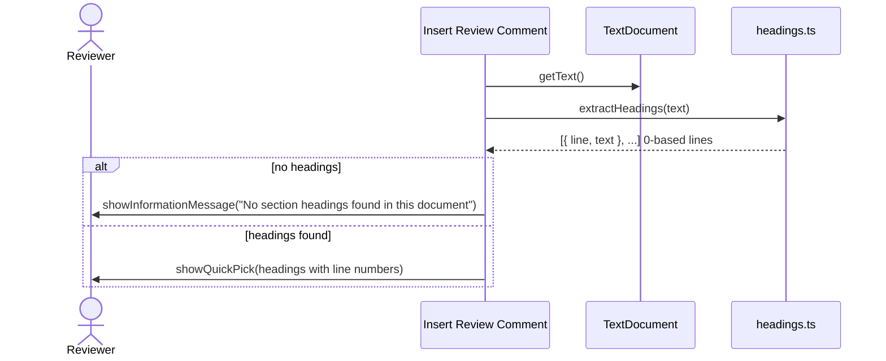
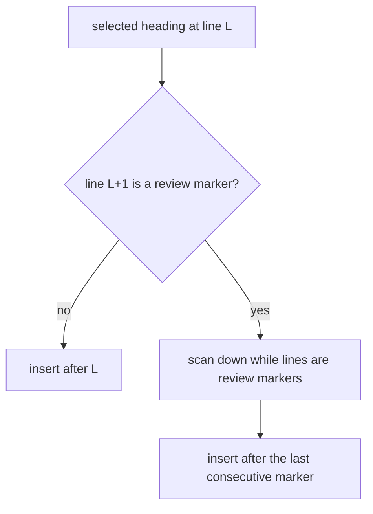
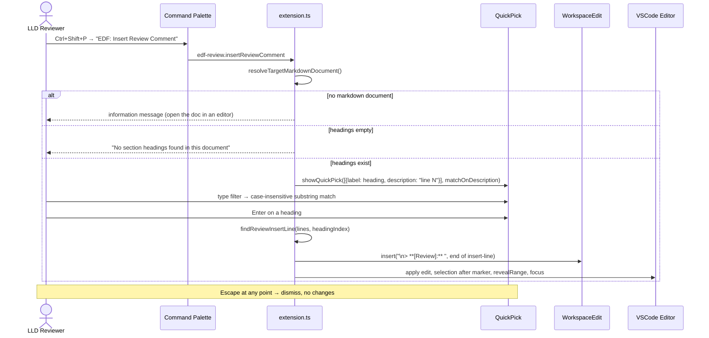
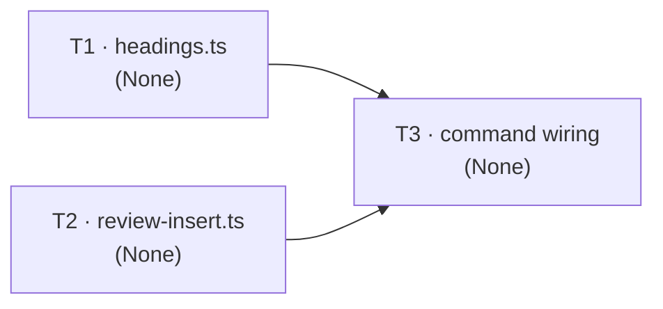

# Low-Level Design: V1 E3 — VSCode Extension Review Feedback

## Document Control

| Field | Value |
|-------|-------|
| Version | 0.1 |
| Status | Draft |
| Author | LS / Claude |
| Created | 2026-08-09 |
| Parent | [v1-design.md](v1-design.md) |
| Requirements | [v1-requirements.md §Epic 3](../../requirements/v1-requirements.md#epic-3-vscode-extension--review-feedback-priority-medium) |
| Epic issue | [#30](https://github.com/mironyx/engineering-delivery-framework/issues/30) |

---

## Open Questions

1. **Preview → source document API (Story 3.1 AC1).** The command must work when
   invoked while the markdown *preview* is open. VSCode's stable API does not expose
   a "document backing this preview panel" accessor (the `WebviewPanel` from
   `onDidReceivePreviewMessage` does not carry the source URI publicly). Resolution
   order specified below: active markdown editor → first visible markdown editor →
   document backing the preview (implementation-time spike). If the preview→document
   API cannot be confirmed, the fallback is: no markdown editor found → information
   message "Open the markdown document in an editor first." This mirrors E2's Open
   Question 2 (same preview-panel API surface).

2. **Insertion cursor math (Story 3.1 AC4).** The cursor must land immediately
   after the inserted `> **[Review]:** ` text. The design inserts `\n> **[Review]:** `
   at the end of the insertion line, so the marker's text occupies exactly one new
   line; the cursor position is deterministic (`insertLine + 1`, column = marker
   length). Specified in §3.3; verified in the dev host.

---

# Part A — Human-Reviewable Design

## 3.1 Headings Extraction (Story 3.1 — ACs 1, 6, 7)

### Purpose

A pure module extracts `##` and `###` headings from the target markdown document
with their line numbers, so the quick-pick can offer the LLD's Part A section
headings as insertion targets. The extraction is a pure function — no VSCode
dependency — unit-testable in isolation, exactly like E2's `src/path.ts`.

### Behavioural Flows



**When required:** Every invocation of `EDF: Insert Review Comment`.

### Structural Overview

`src/headings.ts` exports `extractHeadings(text: string): Heading[]` where
`Heading = { line: number; text: string }`. `line` is 0-based (matches VSCode's
`TextDocument` line indexing); the quick-pick label displays `line + 1` (human
1-based convention). Regex: `/^#{2,3}\s+(.+)$/gm` — matches `##` and `###`
headings only; `#` (title) and `####`+ are ignored. Strip the leading `#`s and
trim the heading text.

### Invariants

| # | Invariant | Verification |
|---|-----------|-------------|
| 1 | `extractHeadings` returns only `##`/`###` headings, each with its 0-based line number | vitest cases: `##`, `###`, `#` (ignored), `####` (ignored), ATX-close `## Heading ##` |
| 2 | Line numbers are 0-based; the display adds 1 | vitest asserts the exact index of a heading mid-document |

### Acceptance Criteria

- [ ] `extractHeadings(text)` returns `[{ line, text }]` for every `##`/`###` heading.
- [ ] `#` and `####`+ headings are excluded.
- [ ] Heading text is stripped of leading `#`s and trimmed.

### BDD Specs

```
describe('extractHeadings', () => {
  it('extracts ## and ### headings with 0-based line numbers');
  it('ignores a single # title');
  it('ignores #### and deeper headings');
  it('strips leading hashes and trims heading text');
  it('returns an empty array for a document with no headings');
});
```

### HLD coverage assessment

- [C2.4 — EDF Review Extension](v1-design.md#c24-edf-review-extension) — the
  extension's quick-pick capability is decomposed here into its testable parts.

## 3.2 Review Insertion Point (Story 3.1 — AC 8)

### Purpose

When a heading already has one or more `> **[Review]:** ` markers directly beneath
it, a new comment inserts *after* the existing markers, preserving their order
(AC8). When none exist, it inserts immediately after the heading. A pure module
computes the insertion line so the rule is unit-testable.

### Behavioural Flows



**When required:** Every comment insertion. The scan is over *consecutive* marker
lines directly beneath the heading (AC8 "directly beneath") — a non-marker line
(blank or prose) terminates the run.

### Structural Overview

`src/review-insert.ts` exports:

```typescript
export const REVIEW_MARKER = '> **[Review]:** ';

export function findReviewInsertLine(
  lines: string[],
  headingIndex: number          // 0-based
): number;                       // 0-based line to insert AFTER
```

A line is a review marker when its trimmed form starts with `> **[Review]:**`
(`/^>\s*\*\*\[Review\]:\*\*\s*/`). Starting at `headingIndex + 1`, advance while
`lines[i]` is a marker; return the last matched index, else `headingIndex`.

### Invariants

| # | Invariant | Verification |
|---|-----------|-------------|
| 1 | Insert-after-line = last consecutive marker beneath the heading, else the heading line | vitest cases: no markers, one marker, two markers, marker-run interrupted by a blank line |
| 2 | The marker prefix constant is exactly `> **[Review]:** ` (16 chars, trailing space) | vitest asserts `REVIEW_MARKER.length === 16` and exact string |

### Acceptance Criteria

- [ ] No markers beneath heading → insert after the heading line.
- [ ] One or more consecutive markers → insert after the last marker, order preserved.
- [ ] A blank/prose line beneath the heading terminates the marker run.

### BDD Specs

```
describe('findReviewInsertLine', () => {
  it('returns headingIndex when no marker follows');
  it('returns the single marker line when one follows');
  it('returns the last marker when several are consecutive');
  it('stops the run at a blank or prose line');
  it('handles a heading as the last line of the document');
});
```

### HLD coverage assessment

- [C2.4](v1-design.md#c24-edf-review-extension) — insertion-point rule, extracted
  for testability.

## 3.3 Command & Quick-Pick (Story 3.1 — ACs 1–5, 7)

### Purpose

The `EDF: Insert Review Comment` command resolves the target markdown document,
shows a quick-pick of its `##`/`###` headings annotated with line numbers, and on
selection inserts the `> **[Review]:** ` template in the source editor with focus
switched for typing. Escape dismisses with no change.

### Behavioural Flows



**When required:** Every invocation of the command.

### Structural Overview

`activate()` registers `vscode.commands.registerCommand('edf-review.insertReviewComment', handler)`.
The handler resolves the document, extracts headings (§3.1), computes the insertion
point (§3.2), and performs a single `WorkspaceEdit` insert. `package.json` gains a
`contributes.commands` entry. The extension version stays 0.2.0 (bumped by E2 for
this v1 extension work — E3 adds capability, not a new release).

### Invariants

| # | Invariant | Verification |
|---|-----------|-------------|
| 1 | Insertion uses exactly one `WorkspaceEdit` (one insert operation) | Dev-host test; code review |
| 2 | Cursor lands immediately after the marker text, editor focused | Dev-host test (AC4) |
| 3 | Escape/undefined selection → no document change | Dev-host test (AC5) |
| 4 | Quick-pick filter is the native case-insensitive substring match | Dev-host test (AC2) — no custom filter code |
| 5 | `package.json` declares only `markdown.previewScripts` + the command; no new permissions | Read `package.json` |

### Acceptance Criteria

- [ ] Command palette shows "EDF: Insert Review Comment"; invoking shows the quick-pick.
- [ ] Quick-pick lists all `##`/`###` headings with 1-based line numbers.
- [ ] Typing filters the list (case-insensitive substring).
- [ ] Enter inserts `> **[Review]:** ` on a new line after the heading (or after
      existing markers) and positions the cursor after the marker text.
- [ ] Escape dismisses with no changes.
- [ ] No headings → information message; no markdown document → guidance message.

### BDD Specs

```
describe('insertReviewComment command', () => {
  it('shows quick-pick of ## / ### headings with line numbers');
  it('types filter the list case-insensitively');
  it('inserts the marker after the heading and focuses the editor after the marker text');
  it('inserts after existing review markers beneath the heading');
  it('Escape dismisses with no document change');
  it('no headings shows the information message');
});
```

### HLD coverage assessment

- [C2.4](v1-design.md#c24-edf-review-extension) — command + quick-pick wiring.
- [Flow 6](v1-design.md#flow-6-review-comment-insertion) — the interaction this
  section implements.

---

# Part B — Agent Implementation Detail

> The implementing agent (`/feature`) reads both parts. This epic modifies
> `extensions/edf-review/`, depending on E2 (already merged) for the hardened host
> infrastructure and the vitest setup it added. E3 adds three new pieces: two pure
> modules (`src/headings.ts`, `src/review-insert.ts`) with unit tests, and the
> command wiring (`src/extension.ts` + `package.json`). Extension version stays
> 0.2.0 (E2 bumped it).
>
> Numbering: Part A sections use `## N.k`; Part B task sections use `## B.N`
> (ADR-0026 as-implemented `B.N` precedent).

## Reused helpers — DO NOT re-implement

`kb/architecture.md` is empty (template placeholders — no catalogued VSCode
helpers). The extension uses only the VSCode API + Node stdlib. **Vitest, `@types/node`,
and the `test` script are provided by E2's Task 1 (merged) — do not re-add them.**
No helper reuse applies; no `kb/ additions` block is warranted.

## Tooling & version pins

- **TypeScript** ^5.3.0, **@types/vscode** ^1.88.0, **@types/node** ^18.0.0, **vitest**
  ^1.6.0 — all provided by the existing scaffold + E2's vitest setup.
- VSCode quick-pick API: `vscode.window.showQuickPick(items, { matchOnDescription })` —
  native filtering (case-insensitive substring) requires no custom filter code.
- `vscode.commands.registerCommand` + `contributes.commands` — standard command
  surface, no version pin beyond the engine.

<a id="LLD-v1-e3-headings-extraction"></a>

## B.1 — Task T3.1: Headings extraction module + unit tests

### [Layer: None — extension pure module]

See [v1-design.md §C2.4](v1-design.md#c24-edf-review-extension).

#### File structure

```
extensions/edf-review/src/headings.ts       — create (pure module, no VSCode import)
extensions/edf-review/test/headings.test.ts — create (vitest)
```

> E2 already added vitest + @types/node devDeps, the `test` script, and the
> `"types": ["node"]` tsconfig entry. Do not re-add.

#### Internal types

```typescript
export interface Heading {
  line: number;   // 0-based line index
  text: string;   // stripped + trimmed heading text
}
```

#### Function signatures

```typescript
export function extractHeadings(text: string): Heading[];
```

**Behaviour:**

1. Match `/^#{2,3}\s+(.+)$/gm` over `text`. `#` (title) and `####`+ are excluded.
2. For each match: `line` = number of `\n` before the match start (0-based);
   `text` = the capture group, trailing ATX-close hashes removed, trimmed.
3. Return matches in document order.

#### Internal decomposition

Single pure function; no private helpers (regex does the work). Line counting:
`text.slice(0, match.index).split('\n').length - 1` — 0-based.

#### Error handling

No errors — a text with no headings returns `[]` (caller shows the information
message). No VSCode/DOM dependency; Node only.

#### BDD specs (vitest)

```
describe('extractHeadings', () => {
  it('extracts ## and ### headings with 0-based line numbers');
  it('ignores a single # title');
  it('ignores #### and deeper headings');
  it('strips leading hashes and trims heading text');
  it('handles ATX-close headings (## Heading ##)');
  it('returns [] for a document with no headings');
});
```

#### Test seam note

Pure stdlib — test against real strings, no mocks.

<a id="LLD-v1-e3-review-insert-point"></a>

## B.2 — Task T3.2: Review insertion-point module + unit tests

### [Layer: None — extension pure module]

See [v1-design.md §C2.4](v1-design.md#c24-edf-review-extension).

#### File structure

```
extensions/edf-review/src/review-insert.ts      — create (pure module, no VSCode import)
extensions/edf-review/test/review-insert.test.ts — create (vitest)
```

#### Function signatures

```typescript
export const REVIEW_MARKER = '> **[Review]:** ';

const MARKER_RE = /^>\s*\*\*\[Review\]:\*\*\s*/;

export function findReviewInsertLine(
  lines: string[],
  headingIndex: number     // 0-based
): number;                  // 0-based line to insert AFTER
```

**Behaviour:**

1. `headingIndex` out of range → return `headingIndex` (guard; caller passes a
   valid heading index in practice).
2. Starting at `i = headingIndex + 1`, while `i < lines.length` and
   `MARKER_RE.test(lines[i].trimStart())`, advance `i`.
3. Return the last matched index, or `headingIndex` if none matched.

#### Internal decomposition

One pure function + one regex constant. No dependencies.

#### Error handling

No errors — returns a valid insert-after index in all cases. The command applies
the edit via `doc.lineAt(insertAfter).range.end`; if `insertAfter` is the last
line, the insert still works (new line appended).

#### BDD specs (vitest)

```
describe('findReviewInsertLine', () => {
  it('returns headingIndex when no marker follows');
  it('returns the single marker line when one follows');
  it('returns the last marker when several are consecutive');
  it('stops the run at a blank or prose line');
  it('handles a heading as the last line of the document');
});
```

#### Test seam note

Pure stdlib — no mocks.

<a id="LLD-v1-e3-command-wiring"></a>

## B.3 — Task T3.3: Command wiring — document resolution, quick-pick, insertion

### [Layer: None — extension host]

See [v1-design.md §C2.4](v1-design.md#c24-edf-review-extension) and
[Flow 6](v1-design.md#flow-6-review-comment-insertion).

#### File structure

```
extensions/edf-review/src/extension.ts   — modify (register command + handlers)
extensions/edf-review/package.json       — add contributes.commands entry
```

#### Function signatures

```typescript
export function activate(context: vscode.ExtensionContext): void;
// add within activate():
//   context.subscriptions.push(vscode.commands.registerCommand(
//     'edf-review.insertReviewComment', handleInsertReviewComment));

async function handleInsertReviewComment(): Promise<void>;

function resolveTargetMarkdownDocument(): vscode.TextDocument | undefined;
```

**`resolveTargetMarkdownDocument`** — resolution order (Open Question 1):

1. `vscode.window.activeTextEditor?.document` if it is `languageId === 'markdown'`.
2. First of `vscode.window.visibleTextEditors` whose document is markdown.
3. Implementation spike: the document backing the preview panel the command was
   invoked from. If the spike confirms a public way to get it (e.g. via the
   `onDidReceivePreviewMessage` panel), use it. Otherwise fall through.
4. `undefined` → caller shows the guidance message.

**`handleInsertReviewComment`:**

1. `const doc = resolveTargetMarkdownDocument(); if (!doc)` →
   `showInformationMessage('Open the markdown document in an editor first')`; return.
2. `const headings = extractHeadings(doc.getText()); if (headings.length === 0)` →
   `showInformationMessage('No section headings found in this document')`; return.
3. `const items = headings.map(h => ({ label: h.text, description: \`line ${h.line + 1}\` }))`.
4. `const picked = await vscode.window.showQuickPick(items, { matchOnDescription: true, placeHolder: 'Select a section to add a review comment' })`.
   - `matchOnDescription: true` → the native quick-pick filter also matches the
     line-number description; the label filter is the native case-insensitive
     substring match (AC2). No custom filter.
5. `if (!picked) return;` — Escape/no-op (AC5).
6. `const lines = doc.getText().split('\n'); const headingIndex = headings[items.indexOf(picked)].line;`
7. `const insertAfter = findReviewInsertLine(lines, headingIndex);`
8. `const edit = new vscode.WorkspaceEdit(); edit.insert(doc.uri, doc.lineAt(insertAfter).range.end, '\\n' + REVIEW_MARKER); await vscode.workspace.applyEdit(edit);`
   - One edit, one operation (Invariant 1).
9. `const pos = new vscode.Position(insertAfter + 1, REVIEW_MARKER.length); const editor = await vscode.window.showTextDocument(doc, { viewColumn: vscode.ViewColumn.Beside, preserveFocus: false }); editor.selection = new vscode.Selection(pos, pos); editor.revealRange(new vscode.Range(pos, pos));` — cursor lands immediately after the marker text (AC4). (If `showTextDocument` is already focused on the doc, it returns the existing editor.)
   - Note: the marker is the new line `insertAfter + 1`; the cursor column equals
     the marker length (16).

#### Internal decomposition

`handleInsertReviewComment` is a thin orchestrator (~30 lines) delegating to the
two pure modules. `resolveTargetMarkdownDocument` is a small helper (~10 lines).
No service layer — thin extension host by design.

#### Error handling

All failures are user-visible information messages; nothing silent. The edit
fails atomically (WorkspaceEdit). If `showQuickPick` rejects (extension host
shutdown), the command no-ops.

#### BDD specs

Covered by dev-host verification (the command itself is not unit-testable without
a VSCode harness; the pure parts are tested in T3.1/T3.2). BDD for the wiring is
the dev-host checklist in §3.3 invariants.

**Files to create/modify:**
- `extensions/edf-review/src/extension.ts` — command registration + handlers
- `extensions/edf-review/package.json` — `contributes.commands` entry

---

## Cross-References

### Internal (within this epic)

- B.1 (headings) → B.3 (command imports `extractHeadings`).
- B.2 (insert point) → B.3 (command imports `findReviewInsertLine` + `REVIEW_MARKER`).
- B.1 and B.2 are independent (no shared files) — parallelisable.

### External

- **Epic 2 (#29)** provides the hardened host + vitest setup; E3 depends on it
  (shared files `src/extension.ts`, `package.json` → E3 runs after E2).
- **ADR-0038** — message contract; the command is host-side, no new preview
  messages (the preview script is unchanged by this epic).
- **Visual reference** — [vis-review-comment-insertion.html](../v1/vis-review-comment-insertion.html)
  defines the quick-pick open + inserted states (Part A of the requirements).

### Shared types

- `Heading` (from `src/headings.ts`) is consumed by `src/extension.ts` — the only
  shared type across sections.

---

## Tasks

### Task 1: Headings extraction module + unit tests

**Issue title:** v1-e3: headings extraction module + unit tests
**Layer:** None
**Depends on:** E2 (vitest setup)
**Stories:** 3.1 (ACs 1, 6, 7)
**HLD reference:** [v1-design.md §C2.4](v1-design.md#c24-edf-review-extension)

**What:** Create `extensions/edf-review/src/headings.ts` — a pure `extractHeadings`
module returning `##`/`###` headings with 0-based line numbers. Add vitest unit
tests. (E2's vitest setup is already merged — do not re-add.)

**Acceptance criteria:**
- [ ] `extractHeadings` returns `[{ line, text }]` for every `##`/`###` heading
- [ ] `#` and `####`+ headings excluded; ATX-close handled; text stripped+trimmed
- [ ] `npx vitest run` passes (headings.test.ts green)

**BDD specs:**
```
describe('extractHeadings', () => {
  it('extracts ## and ### headings with 0-based line numbers');
  it('ignores a single # title');
  it('ignores #### and deeper headings');
  it('strips leading hashes and trims heading text');
  it('handles ATX-close headings');
  it('returns [] for a document with no headings');
});
```

**Files to create/modify:**
- `extensions/edf-review/src/headings.ts` — create (pure module)
- `extensions/edf-review/test/headings.test.ts` — create (vitest)

### Task 2: Review insertion-point module + unit tests

**Issue title:** v1-e3: review insertion-point module + unit tests
**Layer:** None
**Depends on:** —
**Stories:** 3.1 (AC 8)
**HLD reference:** [v1-design.md §C2.4](v1-design.md#c24-edf-review-extension)

**What:** Create `extensions/edf-review/src/review-insert.ts` — `REVIEW_MARKER`
constant + `findReviewInsertLine` pure function. Add vitest unit tests.

**Acceptance criteria:**
- [ ] `findReviewInsertLine` inserts after existing consecutive markers beneath a heading, else after the heading
- [ ] Marker prefix is exactly `> **[Review]:** ` (16 chars)
- [ ] `npx vitest run` passes (review-insert.test.ts green)

**BDD specs:**
```
describe('findReviewInsertLine', () => {
  it('returns headingIndex when no marker follows');
  it('returns the single marker line when one follows');
  it('returns the last marker when several are consecutive');
  it('stops the run at a blank or prose line');
  it('handles a heading as the last line of the document');
});
```

**Files to create/modify:**
- `extensions/edf-review/src/review-insert.ts` — create (pure module)
- `extensions/edf-review/test/review-insert.test.ts` — create (vitest)

### Task 3: Command wiring — document resolution, quick-pick, insertion

**Issue title:** v1-e3: Insert Review Comment command (quick-pick + insertion)
**Layer:** None
**Depends on:** Task 1 + Task 2 (imports both modules)
**Stories:** 3.1 (ACs 1–5, 7)
**HLD reference:** [v1-design.md §C2.4](v1-design.md#c24-edf-review-extension), [Flow 6](v1-design.md#flow-6-review-comment-insertion)

**What:** Register `edf-review.insertReviewComment` in `src/extension.ts`; resolve
the target markdown document, show a quick-pick of headings, insert the marker via
one `WorkspaceEdit`, position the cursor, and focus the editor. Add the
`contributes.commands` entry to `package.json`. Extension version stays 0.2.0.

**Acceptance criteria:**
- [ ] "EDF: Insert Review Comment" appears in the command palette
- [ ] Quick-pick lists `##`/`###` headings with 1-based line numbers; typing filters case-insensitively
- [ ] Enter inserts `> **[Review]:** ` after the heading (or after existing markers); cursor lands after the marker text; editor focused
- [ ] Escape dismisses with no change
- [ ] No headings → "No section headings found in this document"; no markdown doc → guidance message
- [ ] `package.json` declares no new permissions (command contribution only)
- [ ] `npm run compile` passes; dev-host manual check passes

**BDD specs:**
```
describe('insertReviewComment command', () => {
  it('shows quick-pick of ## / ### headings with line numbers');
  it('types filter the list case-insensitively');
  it('inserts the marker after the heading and focuses the editor after the marker text');
  it('inserts after existing review markers beneath the heading');
  it('Escape dismisses with no document change');
  it('no headings shows the information message');
});
```

**Files to create/modify:**
- `extensions/edf-review/src/extension.ts` — command registration + handlers
- `extensions/edf-review/package.json` — `contributes.commands` entry

---

## Execution Order

### Dependency DAG



### Execution Waves

| Wave | Tasks | Blocked by | Notes |
|------|-------|------------|-------|
| 1 | Task 1, Task 2 | E2 merged | No shared files — parallel |
| 2 | Task 3 | Wave 1 (T1 + T2) | Imports both pure modules |
