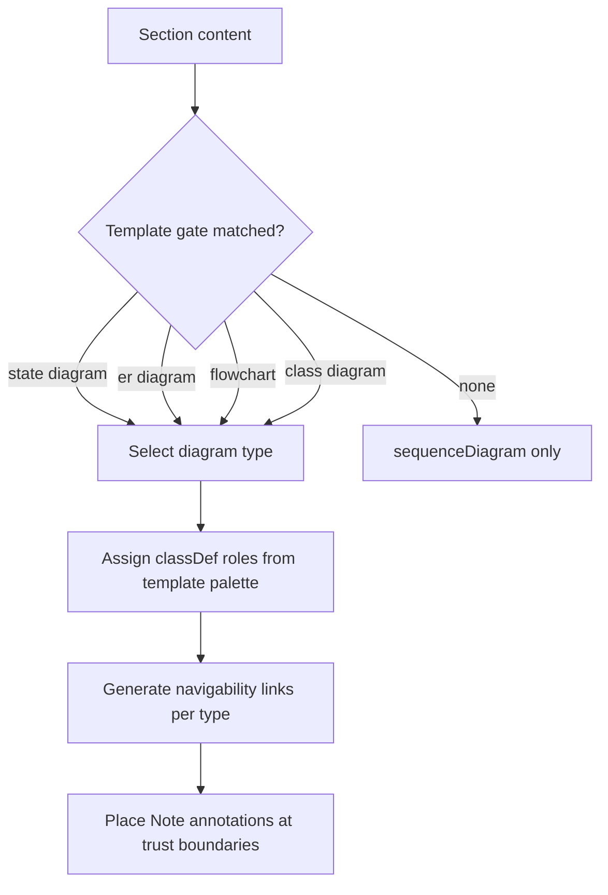
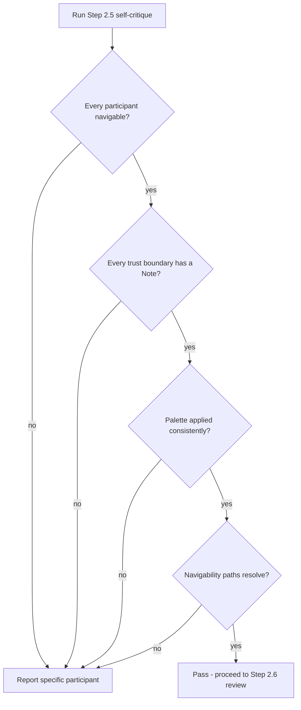
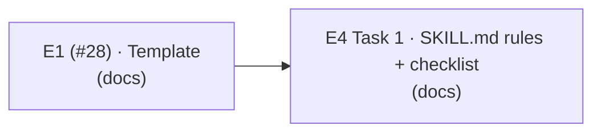

# Low-Level Design: V1 E4 — Skill Instructions & Quality Gates

## Document Control

| Field | Value |
|-------|-------|
| Version | 0.1 |
| Status | Draft |
| Author | LS / Claude |
| Created | 2026-08-09 |
| Parent | [v1-design.md](v1-design.md) |
| Requirements | [v1-requirements.md §Epic 4](../../requirements/v1-requirements.md#epic-4-skill-instructions--quality-gates-priority-medium) |
| Epic issue | [#31](https://github.com/mironyx/engineering-delivery-framework/issues/31) |

---

## Open Questions

1. **Version-bump coupling with E1.** This epic's task bumps the plugin version,
   but E1's Task 1 also bumps it (`0.10.28 → 0.10.29`). Both write the same two
   files — `plugins/edf/.claude-plugin/plugin.json` and `.claude-plugin/marketplace.json` —
   so E1 and E4 must land in sequence, each bumping once from the then-current
   version. If E1's bump has merged first, this epic bumps `0.10.29 → 0.10.30`.
   Flagging rather than assuming a merge order (see B.1 Change group 1 and the
   Execution Order).

2. **Worked-example scope vs Story 4.1 Notes.** Story 4.1 AC6 requires one worked
   example per concern *in the skill*, but the Story 4.1 Notes say the skill must
   not duplicate template content — it references it. The worked examples are
   therefore minimal generation-logic snippets (how to decide / how to apply), not
   re-statements of the template's full diagrams. The palette hex values appear in
   the `classDef` snippet only as syntax demonstration; the template's palette
   table remains the canonical source. Proposed in B.1 Change group 1. Flagging
   rather than deciding silently.

---

# Part A — Human-Reviewable Design

## 4.1 Worked Generation Rules in SKILL.md (Story 4.1)

### Purpose

The `/lld` SKILL.md Step 2 diagram-generation rules must be self-documenting and
mechanically actionable: deterministic diagram-type selection, `classDef` palette
application, per-type navigability-link generation, and `Note` annotation placement —
each backed by at least one worked example (Story 4.1 AC6), and co-versioned with the
template so every template feature has a corresponding generation rule (AC7). The
skill references `lld/template.md` as the single source of truth for the palette hex
values, the diagram-type gates, and the annotation format (Story 4.1 Notes) rather
than duplicating it.

### Behavioural Flows

The generation step is a decision flow evaluated by `/lld` Step 2 — not itself a
user-visible interaction; the diagram shows the rule set:



**When required:** the generation rules apply on every `/lld` run that produces
Part A diagrams. **When optional:** N/A — this is the generation logic itself.

### Structural Overview

The rules live in `plugins/edf/skills/lld/SKILL.md` Step 2 (rules 1–6 plus a new
"Worked examples" block). They reference `plugins/edf/skills/lld/template.md` as the
single source of truth (Story 4.1 Notes). The co-versioning rule (AC7) is a
review-time cross-check between the two files — every template feature has a
corresponding generation rule, and vice versa.

### Invariants

| # | Invariant | Verification |
|---|-----------|-------------|
| 1 | Every generation rule references the template rather than duplicating its content — hex values appear in SKILL.md only inside worked-example `classDef` snippets (syntax demonstration), never in rule prose; the template palette table is the canonical source | grep the four hex values in `SKILL.md` → matches only inside mermaid fenced blocks |
| 2 | Each of the four generation concerns has ≥ 1 worked example | Read the Step 2 "Worked examples" block — type gate, classDef colour, navigability (relative + `#LLD-`), Note mechanism all present |
| 3 | Co-versioning: every template feature (palette, gates, navigability, annotations) has a corresponding generation rule in SKILL.md | Cross-check `template.md` sections vs the SKILL.md Step 2 rules — a template feature with no rule is a gap |

### Acceptance Criteria

- [ ] Step 2 names the four generation concerns and references the template as source of truth
- [ ] Worked example per concern: diagram type selection (with a gate condition), classDef application (with a colour assignment), navigability-link generation (a workspace-relative path and a `#LLD-` path, using `link` on sequence diagrams and `click` on flowchart / classDiagram / stateDiagram), Note annotation placement (with enforcement-mechanism text)
- [ ] Co-versioning rule present: every template feature must have a corresponding generation rule
- [ ] No template prose or hex duplicated outside syntax-demonstration snippets

### BDD Specs

```
describe('lld SKILL.md diagram generation rules', () => {
  it('lists the four generation concerns with the template as source of truth');
  it('diagram type selection example shows a gate condition');
  it('classDef application example shows a colour assignment');
  it('navigability example shows a workspace-relative path and a #LLD- path, using link on sequence and click on flowchart/class/state');
  it('Note annotation example states the enforcement mechanism');
  it('co-versioning rule maps every template feature to a generation rule');
});
```

### HLD coverage assessment

- [C7 — Self-Documenting Generation Rules](v1-design.md#c7-self-documenting-generation-rules) —
  sufficient, referenced only.
- [C2.2 — LLD Generation Skill](v1-design.md#c22-lld-generation-skill) — the
  responsibilities map 1:1 to the four generation concerns.

## 4.2 Self-Critique Navigability Checklist (Story 4.2)

### Purpose

The Step 2.5 "Diagram navigability" checklist item must mechanically catch: diagram
participants with no type-appropriate navigability link (dead labels), trust
boundaries with no `Note` annotation, palette gaps (a participant matching a defined
role using default styling), and navigability paths that do not resolve to a real
file — reporting each failure with the specific participant, interaction, or path
(Story 4.2 AC1–AC5).

### Behavioural Flows

The self-critique runs on the generated LLD and is a mechanical check — not a
user-visible interaction; the diagram shows the check sequence:



**When required:** every `/lld` run. **When optional:** N/A.

### Structural Overview

The checklist item lives in `plugins/edf/skills/lld/SKILL.md` Step 2.5 alongside the
other items (security, error paths, reused helpers) at equal prominence (AC6). It is
executed by the `/lld` authoring agent; failures are reported before the document
reaches human review (ADR-0034). It must match the per-type navigability convention
defined in `lld/template.md` (Story 4.2 Notes).

### Invariants

| # | Invariant | Verification |
|---|-----------|-------------|
| 1 | The checklist item names all four mechanical checks (links, Notes, palette, paths) | Read the Step 2.5 item — all four present |
| 2 | Failures name the specific participant/interaction/path, never a generic message | Read the item — specific-failure phrasing present |
| 3 | The checklist item matches the template's per-type navigability convention (`link` / `click` / none on erDiagram) | Cross-check item text vs `template.md` "Diagram navigability convention — links" |

### Acceptance Criteria

- [ ] Step 2.5 "Diagram navigability" item verifies every participant has a type-appropriate navigability link (`link` on sequence diagrams, `click` on flowchart / classDiagram / stateDiagram; erDiagram participants exempt) — no dead labels
- [ ] Item verifies every trust-boundary-crossing interaction has a `Note` annotation stating the enforcement mechanism
- [ ] Item verifies `classDef` blocks are defined inside the first diagram of each type that uses them and applied consistently — no participant matching a defined role uses default styling
- [ ] Item verifies each workspace-relative navigability path resolves to a real file in the workspace
- [ ] Failures identify the specific participant, interaction, or path that needs fixing

### BDD Specs

```
describe('lld SKILL.md self-critique navigability item', () => {
  it('checks every participant has a type-appropriate link/click (erDiagram exempt)');
  it('checks every trust-boundary interaction has a Note stating the mechanism');
  it('checks classDef is defined in the first diagram of each type and applied consistently');
  it('checks navigability paths resolve to real files');
  it('reports failures with the specific participant, interaction, or path');
});
```

### HLD coverage assessment

- [C2.3 — Self-Critique Module](v1-design.md#c23-self-critique-module) — the four
  checks plus specific-failure reporting map 1:1.
- [Flow 1](v1-design.md#flow-1-lld-generation-primary-generation-path) — the
  "Critique" lifeline in the sequence diagram is this checklist item.

---

# Part B — Agent Implementation Detail

> The implementing agent (`/feature`) reads both parts. This epic touches a single
> artefact — `plugins/edf/skills/lld/SKILL.md` — with markdown-only changes. No
> code, no test suite changes (the plugin's pytest suite does not cover skill
> files). Version bump: a skill-file change requires
> `plugins/edf/.claude-plugin/plugin.json` + `.claude-plugin/marketplace.json`
> bumped one patch in sync (repo convention, see CLAUDE.md). **Coordination with
> E1:** E1's Task 1 bumps `0.10.28 → 0.10.29`; both epics write the same two files,
> so they must land in sequence. If E1's bump has merged first, this epic bumps
> `0.10.29 → 0.10.30`.
>
> Numbering: Part A sections use `## N.k`; Part B task sections use `## B.N`. This
> follows ADR-0026's as-implemented `B.N` precedent — each number appears once, so
> a Part B `B.1` refers unambiguously to the task section (not to §4.1).

## Reused helpers — DO NOT re-implement

`kb/architecture.md` is empty (template placeholders — no catalogued helpers exist
in this plugin monorepo for the template/skill domain). No helper reuse applies to
this epic. This is the expected state for a plugin-self-modification epic; no
`kb/ additions` block is warranted.

<a id="LLD-v1-e4-generation-rules-navigability"></a>

## B.1 — Task T4.1: Worked generation-rule examples + self-critique navigability hardening

### [Layer: None — skill documentation]

See [v1-design.md §C7](v1-design.md#c7-self-documenting-generation-rules),
[§C2.2](v1-design.md#c22-lld-generation-skill), and
[§C2.3](v1-design.md#c23-self-critique-module) for the capabilities; the skill
rules are the mechanism.

#### File structure

```
plugins/edf/skills/lld/SKILL.md        — the only source file modified
plugins/edf/.claude-plugin/plugin.json — version bump (sync with marketplace.json)
.claude-plugin/marketplace.json        — version bump (sync with plugin.json)
```

#### Change

**Group 1 — Worked generation-rule examples (Story 4.1).** In Step 2, after rule 6,
add a `**Worked examples**` block with one minimal snippet per concern. Each snippet
is generation logic — how to decide / how to apply — not a re-statement of template
content (Story 4.1 Notes: the skill references the template, it does not duplicate
it).

1. **Diagram type selection (with a gate condition):**

   - "FE UI-states table with non-trivial transitions (retry / optimistic / polling)" → `stateDiagram-v2`
   - "New tables or FK relationships" → `erDiagram`
   - "Branching business logic" → `flowchart TD`
   - "New modules or changed module boundaries" → `classDiagram`
   - "None of the above" → `sequenceDiagram` only

2. **classDef application (with a colour assignment)** — a minimal classDiagram
   snippet showing the `classDef` + `class` pair, hex values taken verbatim from
   `template.md`'s palette table (the single source of truth):

   ```mermaid
   classDiagram
       classDef new fill:#d4f0d4,stroke:#2d7d2d,color:#1a3a1a
       classDef error fill:#f7d6d6,stroke:#8b1a1a,color:#3b0a0a
       class PaymentService new
       class PaymentError error
   ```

3. **Navigability-link generation** — existing code → workspace-relative path, new
   code → `#LLD-` anchor; `link` on sequence diagrams, `click` on flowchart /
   classDiagram / stateDiagram:

   ```mermaid
   sequenceDiagram
       link API: source @ src/app/api/example/route.ts
       link NewService: spec @ #LLD-<epic-id>-<section-slug>
   ```

   ```mermaid
   flowchart TD
       click A href "src/app/api/example/route.ts" "source"
       click C href "#LLD-<epic-id>-<section-slug>" "spec"
   ```

   (stateDiagram uses the bare `click` form — no `href` keyword.)

4. **Note annotation placement (with enforcement-mechanism text):**

   ```mermaid
   sequenceDiagram
       API->>Service: processRequest(ctx, params)
       Note over API: AuthZ check - RLS policy rejects non-owners
   ```

Add a co-versioning rule at the end of the block (Story 4.1 AC7): "After editing
`lld/template.md`, re-check this section — every template feature (palette, gates,
navigability, annotations) must have a corresponding generation rule here, and vice
versa."

**Group 2 — Self-critique navigability hardening (Story 4.2).** In Step 2.5, the
"Diagram navigability" item already checks: per-type links (no dead labels), `Note`
annotations at trust boundaries, and `classDef`-in-first-diagram + consistent
application. Extend it with:

- **Specific-failure reporting (AC5):** failures must name the offending
  participant, interaction, or path — e.g. "sequenceDiagram participant `DB` has no
  `link` directive", "navigability path `src/lib/example/service.ts` does not
  resolve to a file", "flowchart node `Rate limit` has no `Note` annotation". Never
  a generic "diagram could be improved".
- **Path-existence verb (AC4):** resolve each workspace-relative path against the
  workspace root (Grep/Glob for the file); a path that does not resolve is a fix.
- **erDiagram exemption (AC1):** erDiagram participants are exempt from links (no
  interaction support) — reference entities in prose instead.

Keep the item at the same prominence as the other checklist bullets (AC6) — it is
already a peer bullet; do not demote it.

**No `flowchart.md` update:** these changes alter Step 2 content and a Step 2.5
checklist item, not the pipeline's mode routing, step order, or branching — the
companion flowchart is unchanged. Confirm this at implementation time; if a reviewer
disagrees, update `flowchart.md` in the same PR.

#### Function signatures

None — no code functions. The "signature" of this task is the worked-example
markdown in `SKILL.md`, verified by the invariants in Part A §4.1.

#### Error handling

N/A — documentation change. If a worked example would duplicate template content
beyond a syntax-demonstration snippet, shorten it to reference the template instead.
Do not add a `click` to sequenceDiagram or erDiagram blocks (unsupported — verified
Mermaid reality).

---

## Cross-References

### Internal (within this epic)

- Part A §4.1 (generation rules) → Part A §4.2 (self-critique checks the rules'
  output) — the checklist item verifies what the generation rules produce.
- B.1 Group 1 → B.1 Group 2 — same file, same PR.

### External

- **Epic 1 (#28)** — `lld/template.md` is the source of truth E4's rules reference;
  E1 refines it. No source file shared (E1 touches `template.md`, E4 touches
  `SKILL.md`), but the plugin version bump writes the same two files and must land
  in sequence (E1 Task 1: `0.10.28 → 0.10.29`).
- **Epic 2 (#29)** — consumes the navigability convention E4's rules teach; no file
  shared.
- **ADR-0026** — `#LLD-` anchor format governs navigability links to Part B.
- **ADR-0034** — self-critique feeds the review gate; the checklist item is the
  mechanism.

### Shared types

None — markdown-only epic.

---

## Tasks

### Task 1: Worked generation-rule examples + self-critique navigability hardening

**Issue title:** v1-e4: worked generation rules + self-critique navigability in lld SKILL.md
**Layer:** None (docs)
**Depends on:** E1 (v1-e1) — shared plugin version bump (E1 Task 1: `0.10.28 → 0.10.29`) and worked examples must reference post-E1 template conventions; land after E1's tasks
**Stories:** 4.1, 4.2
**HLD reference:** [v1-design.md §C7](v1-design.md#c7-self-documenting-generation-rules), [§C2.2](v1-design.md#c22-lld-generation-skill), [§C2.3](v1-design.md#c23-self-critique-module)

**What:** Add a "Worked examples" block to SKILL.md Step 2 (one minimal
generation-logic snippet per concern: type selection with a gate, classDef with a
colour, navigability with a relative path + `#LLD-` using `link`/`click`, Note
placement with a mechanism) plus a co-versioning rule. Extend the Step 2.5 "Diagram
navigability" checklist item with specific-failure reporting and a path-existence
verb. Bump the plugin version, coordinating with E1's bump.

**Acceptance criteria:**
- [ ] Step 2 "Worked examples" block has one snippet per concern (type gate, classDef colour, navigability relative + `#LLD-`, Note mechanism)
- [ ] Worked examples reference the template; no template prose/hex duplicated outside syntax-demonstration snippets
- [ ] Co-versioning rule present: every template feature ↔ a generation rule
- [ ] Step 2.5 "Diagram navigability" item reports specific participant/interaction/path failures
- [ ] Step 2.5 item verifies workspace-relative navigability paths resolve to real files
- [ ] `plugin.json` + `marketplace.json` bumped one patch in sync (`0.10.29 → 0.10.30` if E1 has landed; else from the current version)

**BDD specs:**
```
describe('lld SKILL.md generation rules and self-critique', () => {
  it('provides a worked example per generation concern');
  it('references the template as source of truth (no duplication outside snippets)');
  it('co-versions template features with generation rules');
  it('self-critique item reports specific participant/interaction/path failures');
  it('self-critique item verifies navigability paths resolve to files');
});
```

**Files to create/modify:**
- `plugins/edf/skills/lld/SKILL.md` — worked examples + co-versioning + checklist hardening
- `plugins/edf/.claude-plugin/plugin.json` — version bump (in sync with marketplace.json)
- `.claude-plugin/marketplace.json` — version bump (in sync with plugin.json)

---

## Execution Order

### Dependency DAG



### Execution Waves

| Wave | Tasks | Blocked by | Notes |
|------|-------|------------|-------|
| 1 | E1 Task 1 → 3 | — | Template conventions + `0.10.28 → 0.10.29` bump |
| 2 | E4 Task 1 | Wave 1 (E1) | Shared plugin version bump lands first; worked examples reference post-E1 template |
