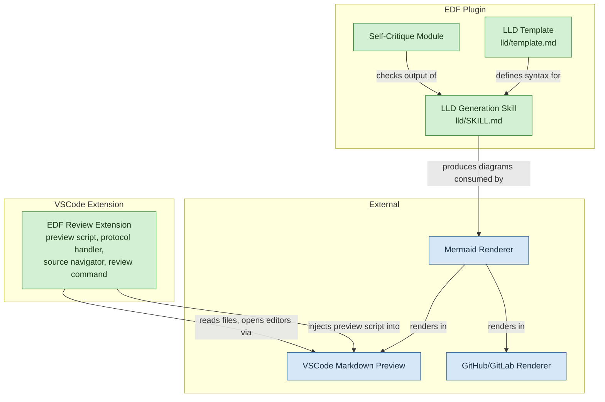
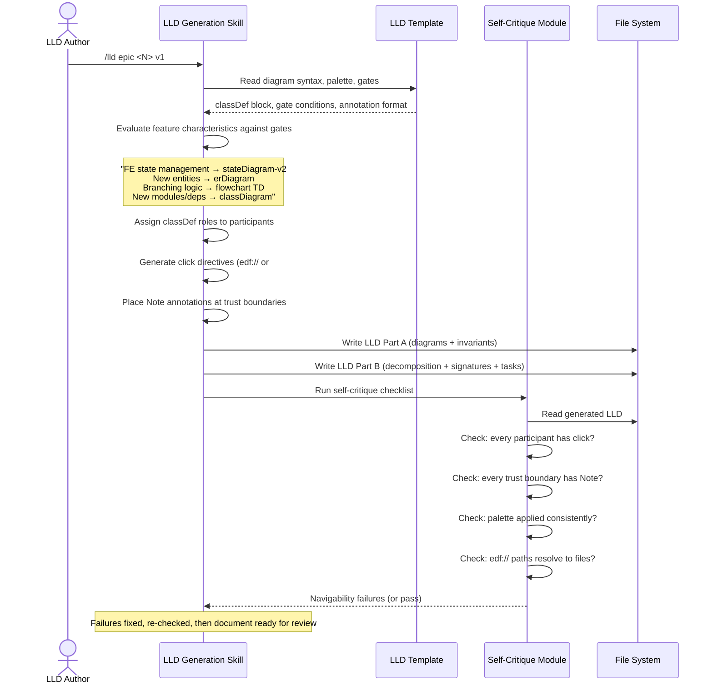
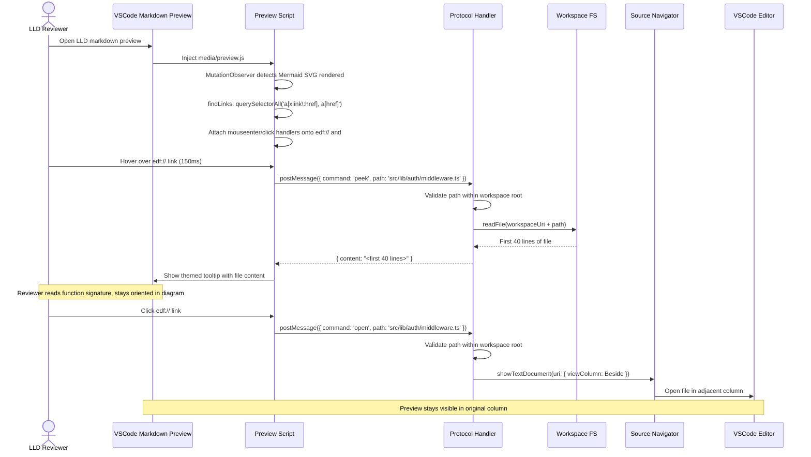
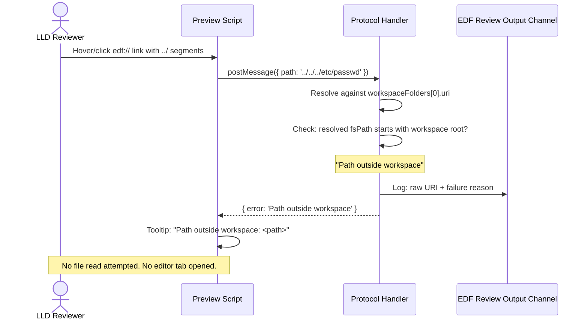
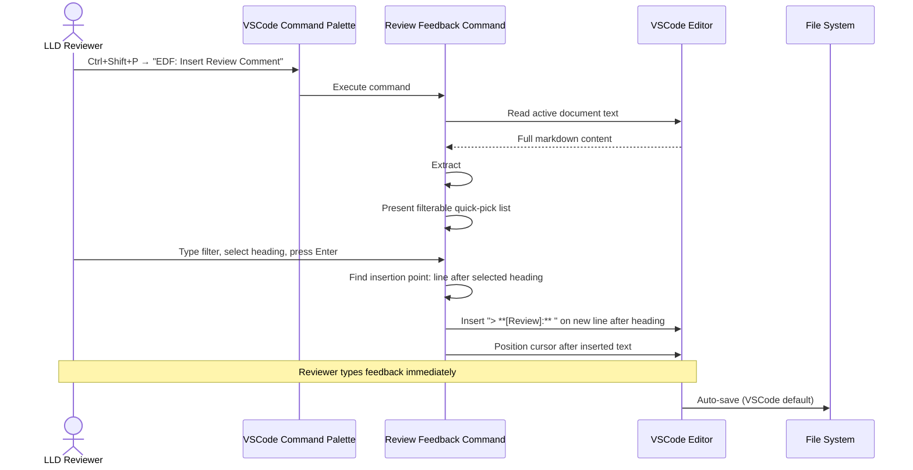
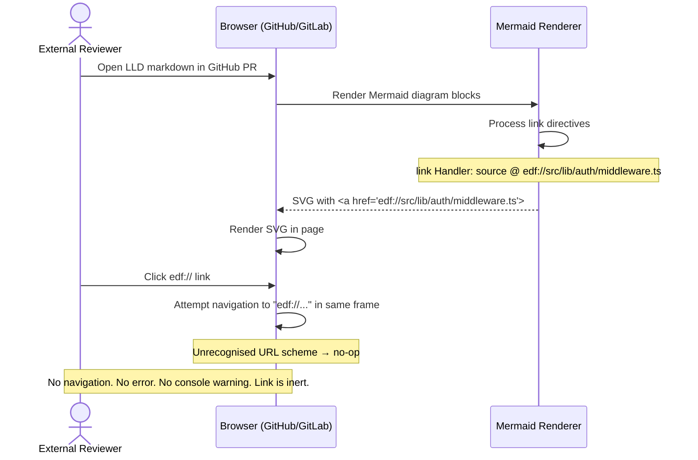
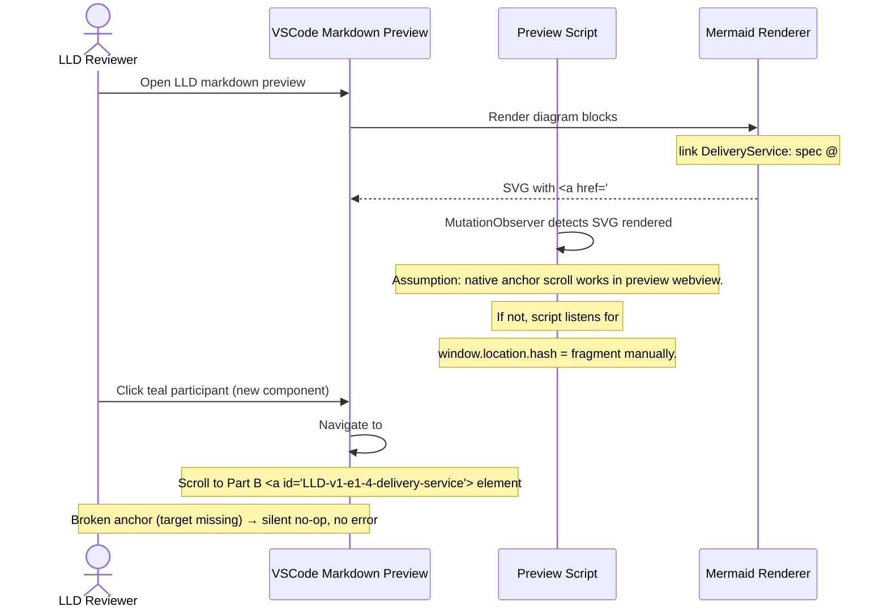

# V1 High-Level Design — Review-Focused LLD Diagram Improvements

## Document Control

| Field | Value |
|-------|-------|
| Version | 0.2 |
| Status | Reviewed |
| Author | LS / Claude |
| Created | 2026-08-01 |
| Reviewed | 2026-08-01 — edf:hld-review (0 blockers, 5 warnings resolved) |
| Requirements | [v1-requirements.md](../../requirements/v1-requirements.md) |
| Mode | Initial bootstrap |

---

## Level 1 — Capabilities

### C1: Enriched Diagram Vocabulary

The LLD template already defines four conditional diagram types beyond the standard
sequence diagram — `stateDiagram-v2`, `erDiagram`, `flowchart TD`, and `classDiagram` —
each with a "When required" gate and example syntax. These are work-in-progress additions
that exist in the template but are not yet fully covered by the skill's generation rules,
the self-critique checklist, or the `click`/palette conventions that apply to sequence
diagrams. This capability completes the vocabulary by ensuring all diagram types receive
consistent `classDef` palette application, `click` directives on every participant (no
dead labels), `Note` annotations at trust boundaries, and deterministic generation rules
in the skill instructions. A feature with none of the triggering characteristics produces
the standard sequence diagram only — no diagram bloat.

> **Scope note:** `classDiagram` was already present in the working-tree template alongside
> the three types named in Story 1.1. It is included in V1 scope as a fourth conditional
> diagram type with the same palette, `click`, and annotation conventions as the other
> three. The requirements doc's omission is acknowledged; the template is the ground truth.

### C2: Standard Visual Palette

Reviewers currently have no visual cue to distinguish error paths from auth boundaries
from external dependencies. Every participant in every diagram uses Mermaid's default
styling. This capability defines a four-role `classDef` palette — error (`#f7d6d6`),
auth (`#f7eed6`), external (`#d6e8f7`), new (`#d4f0d4`) — applied consistently to every
diagram participant that matches a role. A reviewer scanning any Part A diagram can
identify trust boundaries and new surface area at a glance, without reading prose.

### C3: Enforcement-Point Annotations

Security and correctness boundaries (authZ, validation, SSRF safeguards, error
propagation) are currently described in Part B prose — disconnected from the sequence
diagram where the interaction is visible. This capability places `Note` annotations
directly on sequence diagrams at every trust-boundary-crossing interaction, stating the
enforcement mechanism and the rejection behaviour. A reviewer can verify that every
boundary is explicitly designed into the flow without cross-referencing Part B.

### C4: Navigable Diagram Surface

Today, diagram participants are dead labels. A reviewer seeing `AuthHelper` in a sequence
diagram must grep the codebase to find the source file, losing their place in the design
document. This capability ensures every diagram participant carries a `click` directive:
`edf://` URLs for existing code, `#LLD-` anchors for new components. No participant is a
dead label — every node resolves to something actionable.

### C5: Preview-Integrated Source Navigation

Even with clickable diagrams, the reviewer currently switches between the markdown
preview and the source editor by hand — opening files, arranging tabs, re-finding their
place. This capability provides hover-to-peek (first ~40 lines of the referenced file in
a tooltip) and click-to-open (source file in the adjacent VSCode column, preview stays
visible). The reviewer remains oriented in the design document while inspecting
implementation.

### C6: In-Flow Review Feedback

When a reviewer identifies an issue while reading a diagram, they must manually locate
the corresponding section in the markdown source, scroll to it, and type a `[Review]`
marker. This breaks the review flow. This capability provides a command-palette action
that extracts all `##`/`###` headings from the document, presents them as a filterable
quick-pick list, and on selection inserts a `> **[Review]:** ` template at the correct
position in the source editor with focus ready for typing.

### C7: Self-Documenting Generation Rules

Template conventions are only as good as the skill that applies them. If the `/lld` skill
instructions are silent about when to include a state diagram or how to place enforcement
annotations, diagrams will be inconsistent. This capability updates the `/lld` SKILL.md
with concrete, mechanical generation rules for diagram type selection, `classDef`
application, `click` directive generation, and `Note` annotation placement — plus a
self-critique checklist item that catches navigability gaps before the document reaches a
human reviewer.

### C8: Graceful Degradation

`edf://` links are functional only when the EDF Review extension is present. In GitHub PR
reviews, GitLab, and other renderers, they must be harmless — no broken links, no error
states, no console warnings. This capability ensures that `edf://` links render as inert
`<a>` elements — Mermaid emits a standard href and browsers treat the unrecognised URL
scheme as a no-op, so the link is a dead end rather than a broken one.

---

## Level 2 — Components

### Component Diagram

### C2.1: LLD Template

**Purpose:** The single source of truth for the diagram surface — what a conformant LLD
Part A looks like.

**Responsibilities:**
- Define the `classDef` palette table (four roles, hex values, stroke/text colours)
- Define the diagram navigability convention — the per-type mechanism (`link` on
  sequence diagrams, `click <node> href "<url>" "<tooltip>"` on flowchart /
  classDiagram / stateDiagram, none on erDiagram) and the `edf://` vs `#LLD-` link
  types
- Define enforcement-point annotation format (`Note over` / `Note right of` placement,
  required content per boundary type)
- Define conditional diagram type gates as concrete, checkable rules
- Define the `### Diagram styling palette` and `### Diagram navigability convention — links`
  sections that appear in every generated LLD
- Define the navigability-link format for each diagram type. On `sequenceDiagram`, the
  `link <actor>: <label> @ <url>` directive produces `<a>` elements (the `click`
  directive is silently ignored there); on flowchart / classDiagram / stateDiagram,
  `click <node> href "<url>" "<tooltip>"` produces `<a>` elements; `erDiagram` supports
  no interaction. The preview script intercepts these `<a>` elements directly — no
  hidden `<!-- edf-map -->` mapping block or SVG DOM injection is needed

**Non-responsibilities:**
- Does not evaluate which diagram types a feature needs — the skill does that
- Does not resolve `edf://` paths to actual files — the extension does that
- Does not enforce palette application — the self-critique module does that
- Does not define Part B structure or task breakdown conventions
- Does not contain per-feature content — it is a template, not an instance

**Depends on:** None (it is the root artefact)

---

### C2.2: LLD Generation Skill

**Purpose:** The instructions that produce conformant LLD Part A diagrams from feature
characteristics. Reads the template as its spec and applies its conventions.

**Responsibilities:**
- Evaluate feature characteristics against the template's diagram type gates and select
  the appropriate diagram types
- Assign `classDef` roles to every diagram participant based on its nature (existing code,
  new component, external service, error path, auth boundary)
- Generate navigability links on every participant — `link` on sequence diagrams,
  `click` on flowchart / classDiagram / stateDiagram — with `edf://` paths for existing
  code and `#LLD-` anchors for new components
- Place `Note` annotations at every trust-boundary-crossing interaction stating the
  enforcement mechanism and rejection behaviour
- Produce `stateDiagram-v2`, `erDiagram`, `flowchart TD`, and `classDiagram` syntax when
  their gates trigger, using the template's palette and applying navigability links
  appropriate to each diagram type
- Co-version with the template — every template feature has a corresponding generation
  rule

**Non-responsibilities:**
- Does not define the palette hex values — it references the template
- Does not resolve file paths to verify they exist — the self-critique module checks that
- Does not generate Part B content (internal decomposition, function signatures, task
  breakdown)
- Does not handle `edf://` link interactivity — the extension does that
- Does not decide diagram aesthetics beyond the palette — Mermaid handles layout

**Depends on:** LLD Template (reads it as its source of truth for syntax and conventions)

---

### C2.3: Self-Critique Module

**Purpose:** A checklist item in `/lld` Step 2.5 that mechanically verifies diagram
navigability before the document reaches a human reviewer. Catches omissions the
generation step might miss.

**Responsibilities:**
- Verify every diagram participant has a `click` directive (no dead labels)
- Verify every trust-boundary-crossing interaction has a `Note` annotation stating the
  enforcement mechanism
- Verify the `classDef` palette block is present and consistently applied — no participant
  matching a defined role uses default styling
- Verify every `edf://` path references a file that exists in the workspace
- Report specific failures with the participant, interaction, or path that needs fixing

**Non-responsibilities:**
- Does not generate or modify diagrams — it checks existing output
- Does not judge diagram aesthetic quality or layout — mechanical checks only
- Does not verify Part B content or task breakdown
- Does not replace the `edf:lld-review` agent — it is a first-pass self-check, not an
  independent review

**Depends on:** LLD Generation Skill (runs on its output)

---

### C2.4: EDF Review Extension

**Purpose:** The VSCode extension that makes `edf://` links functional in the markdown
preview. Intercepts clicks and hovers, resolves paths, reads files, and provides review
feedback insertion. The bridge between the static diagram surface and the live editor.

**Responsibilities:**
- Inject a preview script (`media/preview.js`) into the VSCode markdown preview via
  `markdown.previewScripts`
- **Single-path link discovery.** Intercept the `<a>` elements Mermaid renders for
  navigability directives: `querySelectorAll('a[xlink\\:href], a[href]')` matches the
  output of the sequence-diagram `link` directive and the `click` directive on flowchart /
  classDiagram / stateDiagram alike — no hidden `<!-- edf-map -->` mapping block or SVG
  DOM injection is required
- Intercept hover events on `edf://` links: resolve the path, read the first 40 lines via
  `vscode.workspace.fs.readFile`, display a themed tooltip within 200ms (excluding 150ms
  debounce)
- Intercept click events on `edf://` links: resolve the path, validate workspace
  containment, open the file in the adjacent column via
  `vscode.window.showTextDocument(uri, { viewColumn: ViewColumn.Beside })` within 100ms
- Validate all resolved paths are within the workspace root — reject paths with `..`
  segments that escape, log failures to the `EDF Review` output channel
- Register the "EDF: Insert Review Comment" command: extract `##`/`###` headings from the
  active document, present a filterable quick-pick, insert `> **[Review]:** ` after the
  selected heading, focus the editor with cursor positioned for typing
- Handle missing files gracefully: tooltip shows "File not found: \<path\>", click shows a
  VSCode information message, no editor tab opens
- Handle malformed or empty paths: tooltip shows "Invalid path: \<raw-value\>", no file
  read attempted
- Catch JavaScript errors in the preview script and relay them to the extension host via
  `postMessage({ command: 'logError', ... })` for logging to the `EDF Review` output
  channel; unhandled errors must not crash the preview webview
- Keep the injected preview script under 5 KB minified; MutationObserver callback must
  complete in under 1ms per invocation so preview render time is not measurably increased
- Use VSCode theme variables for tooltip styling so it matches the user's colour theme
- Declare minimum extension permissions: `workspace.fs` read, `window.showTextDocument`;
  no network access, no filesystem write, no process execution
- Handle `#LLD-` anchor navigation: if native scroll-to-fragment for SVG anchor clicks
  does not work in VSCode's preview webview, the preview script provides a fallback click
  listener that sets `window.location.hash` to the fragment; if the anchor target does
  not exist (broken reference), silently do nothing

**Non-responsibilities:**
- Does not generate diagrams — the LLD Generation Skill does that
- Does not modify the markdown source (except the `[Review]` insertion command)
- Does not analyse code, parse ASTs, or verify implementation against design
- Does not run in non-VSCode renderers — graceful degradation is a property of the link
  format, not the extension
- Does not package for marketplace publishing in V1 — loaded via Extension Development
  Host only

**Depends on:** LLD Template (for the `edf://` link format it intercepts), VSCode
Markdown Preview (its host surface)

---

### C2.5: Diagram Renderer

**Purpose:** External Mermaid renderers that turn the LLD's diagram source blocks into
visible, interactive SVG. Not a component we build, but a dependency we target.

**Responsibilities:**
- Render Mermaid diagram source (sequence, state, ER, flowchart) into SVG in VSCode's
  built-in preview, GitHub, GitLab, and other markdown renderers
- Honour `click` directives by generating `<a>` elements with the specified `href` and
  `target`
- Render `Note` annotations visibly within sequence diagram bounds
- Apply `classDef` styles to matching participants

**Non-responsibilities:**
- Does not resolve `edf://` links — the extension or browser does that
- Does not validate diagram syntax beyond Mermaid's own parser
- Does not guarantee consistent rendering across all platforms — differences in Mermaid
  versions are outside our control

**Depends on:** None (external dependency). We target Mermaid's stable syntax and verify
against the renderers our users use (GitHub, GitLab, VSCode).

---

## Level 3 — Interactions

### Flow 1: LLD Generation (primary generation path)

The `/lld` skill evaluates a feature and produces a conformant Part A diagram surface.

**Walkthrough:** The author triggers LLD generation for an epic. The skill reads the
template to load the current palette, diagram type gates, and annotation format. It
evaluates the feature's characteristics against the deterministic gates — a feature with
UI state management triggers a `stateDiagram-v2`, one with new entities triggers an
`erDiagram`, one with branching logic triggers a `flowchart TD`. For every diagram
participant it assigns a `classDef` role and generates a `click` directive (`edf://` for
existing code, `#LLD-` for new components). It places `Note` annotations at every
trust-boundary-crossing interaction. After writing the document, the self-critique module
runs mechanical checks: no dead labels, no missing enforcement annotations, palette
consistency, path validity. Failures are reported with specific locations and fixed before
the document proceeds to human review.

---

### Flow 2: Preview Navigation (primary happy path)

A reviewer hovers over a diagram participant to peek at source, then clicks to open the
file — all while the markdown preview stays visible.

**Single-path approach.** Mermaid generates `<a>` elements for the `link` directive on
`sequenceDiagram` participants and for the `click` directive on `flowchart`,
`stateDiagram`, and `classDiagram` nodes; `erDiagram` supports no interaction. The preview
script intercepts the resulting `<a>` elements in one path:

- `querySelectorAll('a[xlink\\:href], a[href]')` finds the native `<a>` elements from
  both directive types. Mouseenter → postMessage (peek), click → open file. No hidden
  mapping block and no SVG DOM injection needed.

**Walkthrough:** The reviewer opens the LLD in VSCode's markdown preview. The extension
injects `media/preview.js`, which uses a `MutationObserver` to detect when Mermaid SVGs
render (they may arrive after initial page load). It attaches hover and click listeners to
every `edf://` link in the rendered diagrams. On hover (150ms debounce), the script sends
a `postMessage` to the extension host with the file path. The protocol handler validates
the path is within the workspace root, reads the first 40 lines via
`vscode.workspace.fs.readFile`, and returns the content. The preview script renders a
tooltip styled with VSCode theme variables. On click, the handler validates the path
again, then calls `vscode.window.showTextDocument` with `ViewColumn.Beside` — the source
file opens in the adjacent column while the markdown preview remains visible. The reviewer
never loses orientation in the design document.

---

### Flow 3: Path Validation — Trust Boundary (error path)

An `edf://` link attempts to escape the workspace root. The extension must reject it
without reading or opening the file.

**Walkthrough:** A reviewer hovers or clicks an `edf://` link containing `..` segments
that would resolve outside the workspace root. The preview script sends the raw path to
the extension host via `postMessage`. The protocol handler resolves it against
`vscode.workspace.workspaceFolders[0].uri` and checks whether the resulting `fsPath`
starts with the workspace root `fsPath`. It does not — the path escapes. The handler logs
the raw URI and failure reason to the `EDF Review` output channel, returns an error to the
preview script, and does not call `readFile` or `showTextDocument`. The preview script
displays "Path outside workspace: \<path\>" in the tooltip (hover) or a VSCode information
message (click). No file content is read, no editor tab opens. This is the primary
security boundary in the extension.

---

### Flow 4: Review Feedback Insertion

A reviewer identifies an issue, invokes the quick-pick command, and inserts a `[Review]`
marker without leaving the preview.

**Walkthrough:** The reviewer is reading the LLD preview and spots an issue with a diagram
participant. They invoke "EDF: Insert Review Comment" from the command palette. The
command reads the active document's text and extracts all `##` and `###` headings with
their line numbers via regex. A quick-pick list appears — each entry shows the heading
text and line number. The reviewer types a filter to narrow the list, selects the relevant
section heading, and presses Enter. The command inserts `> **[Review]:** ` on a new line
immediately after the selected heading, then moves the cursor to the character after the
inserted text. The reviewer types their feedback. The source editor has focus; the
markdown preview remains open in its column. If the heading already has `[Review]`
markers, the new template is inserted after the existing ones.

---

### Flow 5: Graceful Degradation in External Renderers

An external reviewer views the LLD in GitHub. `edf://` links must be harmless.

**Walkthrough:** An external reviewer opens the LLD in a GitHub PR. GitHub's Mermaid
renderer processes the diagram blocks, including `link` directives on sequence diagrams.
Mermaid generates `<a>` elements with `href="edf://path/to/file.ts"`. The browser renders
the SVG. When the reviewer clicks an `edf://` link, the browser attempts navigation in the
same frame — but `edf://` is an unrecognised URL scheme. The browser treats it as a no-op:
no navigation, no error page, no console warning. The link is harmless. The path remains
human-readable in the markdown source (`edf://src/lib/auth/middleware.ts`), so a reviewer
reading raw markdown can still identify the referenced file. Graceful degradation is a
property of the link format — zero extension code is involved in this flow.

---

### Flow 6: `#LLD-` Anchor Navigation to Part B Specs

A reviewer clicks a new-component participant (teal outline) and the preview scrolls to its
Part B internal decomposition section.

**Walkthrough:** A reviewer clicks a diagram participant styled with the `new` class (teal
outline) — indicating a component to be built. The navigability link (`link` on sequence
diagrams, `click` on flowchart / classDiagram / stateDiagram) carries a `#LLD-` fragment
target matching the Part B section's stable anchor ID (ADR-0026 format:
`LLD-<epic-id>-<section-slug>`). In VSCode's markdown preview, the click should trigger
native scroll-to-fragment behaviour, moving the preview to the Part B section where the
component's internal decomposition, function signatures, and task breakdown are specified.
In GitHub and other browser-based renderers, standard page-internal anchor navigation
handles this natively. If the anchor target does not exist in the document (broken
reference), the preview silently does nothing — no error, no scroll. **The native-scroll
assumption for SVG anchor clicks in VSCode's preview webview must be validated during
implementation** (mirrors requirements Open Question 2). If native scroll does not work,
the preview script will need a click listener that sets `window.location.hash` to the
fragment.
