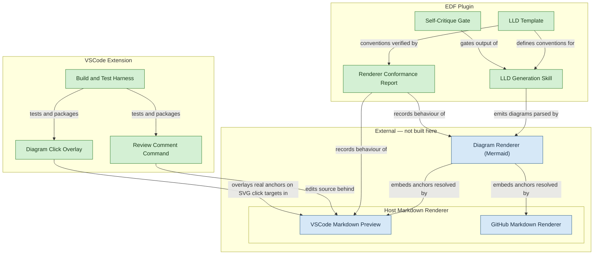
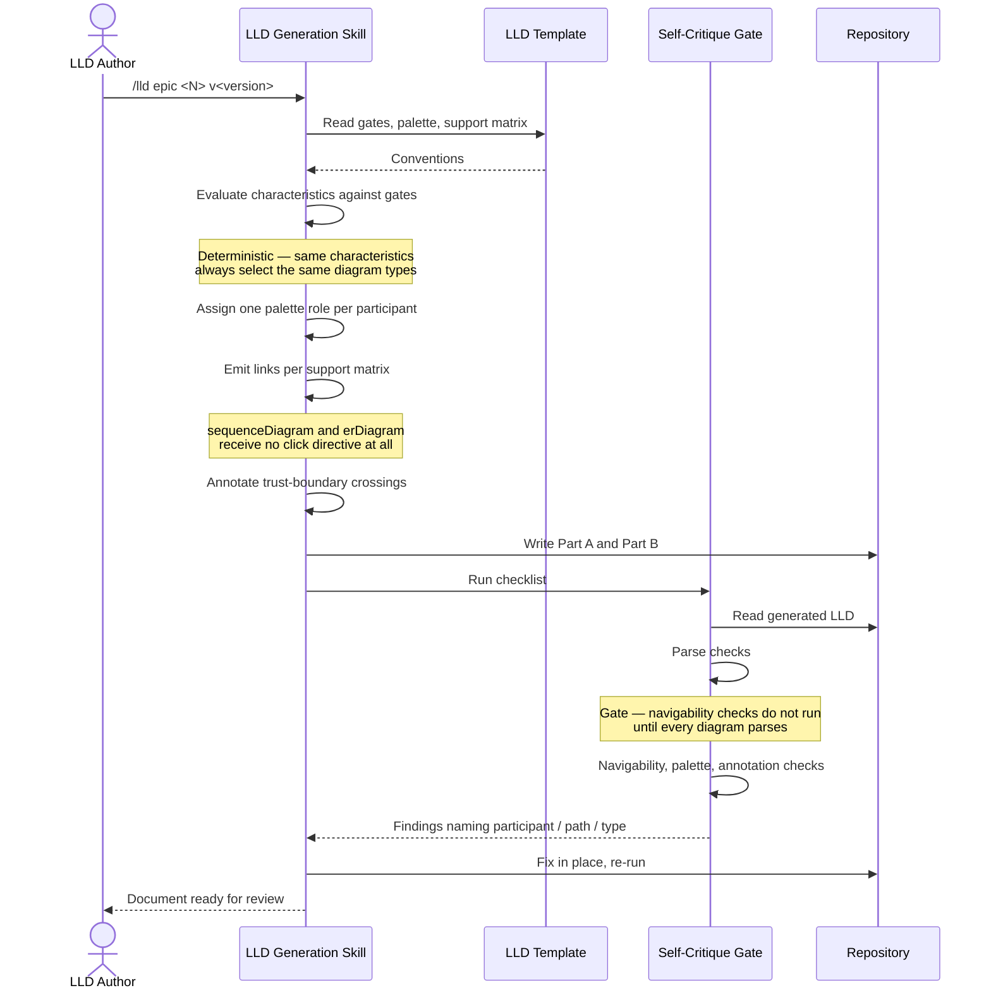
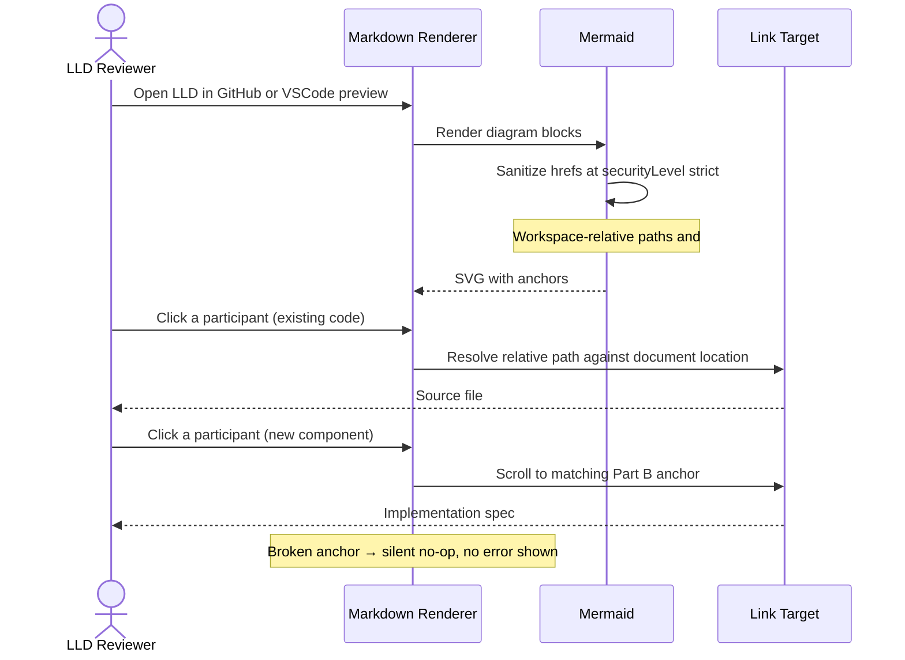
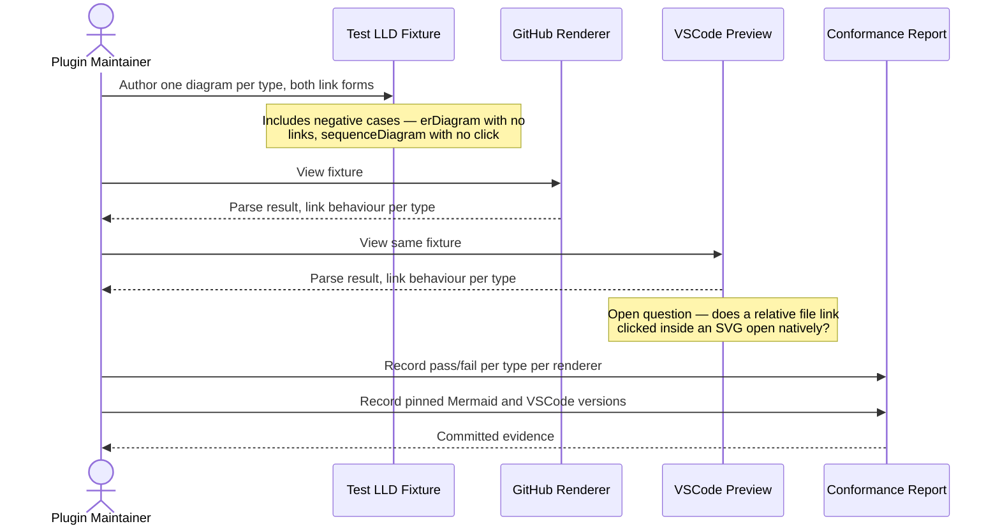
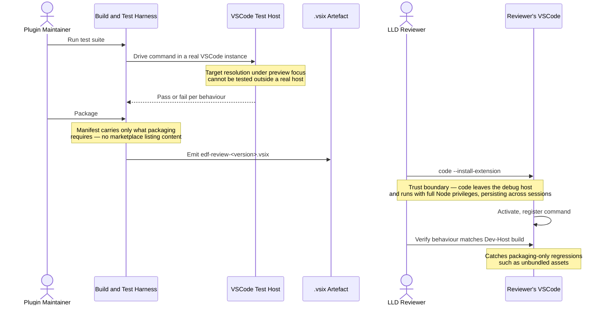

# V1 High-Level Design — Review-Focused LLD Diagram Improvements

## Document Control

| Field | Value |
|-------|-------|
| Version | 1.5 |
| Status | Reviewed — Gate 1 approved 2026-08-13; §C2.1/§C2.3 path-form amended 2026-08-14 (issue #45); §C4 navigation claim corrected 2026-08-16 (issue #47); C9/C2.9 added 2026-08-16 (issues #60, #63 folded into epic #30); §C2.4/§C6/Flow 3 reconciled 2026-08-31 (ADR-0040) |
| Author | LS / Claude |
| Created | 2026-08-01 |
| Last updated | 2026-08-31 |
| Requirements | [v1-requirements.md](../../requirements/v1-requirements.md) (v1.6) |
| Mode | Rewrite — supersedes v0.2 |

## Change Log

| Version | Date | Author | Changes |
|---------|------|--------|---------|
| 1.5 | 2026-08-31 | LS / Claude | **Reconciles the Review Comment Command (C2.4/C6/Flow 3) with the shipped interaction (ADR-0040).** The quick-pick heading selection described since v1.0 was removed during implementation in favour of a line-based insert. §C2.4's responsibilities now describe the line-based flow (resolve via MRU + live visible-editor fallback, no close-and-reopen; insert below cursor-or-top-visible line) and record the **known open defect**: under preview focus the inferred line is unreliable and markers can land at the end of the file, with the robust fix deferred. Flow 3's sequence diagram replaces the quick-pick/no-headings branches with the resolution-fallback and line-inference steps. No component or boundary changed — this corrects what was claimed, not what is built. |
| 1.4 | 2026-08-16 | LS / Claude | **Fulfils the "future epic" the 1.3 entry deferred.** Added capability C9 and component C2.9 (Diagram Click-Through Overlay), covering Story 2.3 — the reopened "click opens source file" story from requirements v1.5. Folded into Epic 2 (#30) rather than a new epic, on the maintainer's instruction that the extension stay a single `.vsix`; issue #63 (the productionisation task) and #60 (the GitHub-iframe finding that made C4's claim narrower) both close against this revision. Corrected two claims C4/C2.4 made under the narrower 1.3 scope: C2.4's "does not resolve or open source files from diagram links — that moved to V2" no longer holds (C2.9 does exactly this, VSCode-only); the component diagram's "no preview script" note no longer holds (C2.9 reintroduces one, narrower in scope and budget than the deleted `edf://` version). See `lld-v1-e1-2-review-feedback.md` §2.5 for the implementation-level design. |
| 1.3 | 2026-08-16 | LS / Claude | **Post-Gate-1 correction (issue #47's measured finding), reviewed against #47's conformance report rather than as a separate gate.** §C4 claimed diagram click navigation worked with no extension in either renderer; measured false in both. GitHub is structurally unfixable (cross-origin sandboxed iframe, confirmed 404). VSCode's native click also fails, but a thin `markdown.previewScripts` extension was confirmed working the same day — see requirements v1.4's "Reopened" entry, which pulls the previously-deferred "click opens source file" story back into scope for a future epic. No component or boundary changed; the corrected claim is narrower than what was asserted, not a redesign. |
| 0.1 | 2026-08-01 | LS / Claude | Initial HLD — Levels 1–3 |
| 0.2 | 2026-08-01 | LS / Claude | `edf:hld-review` fixes (0 blockers, 5 warnings resolved) |
| 1.2 | 2026-08-14 | LS / Claude | **Post-Gate-1 amendment (issue #45), reviewed in that issue's PR diff.** §C2.1's link-form bullet and §C2.3's navigability check both required a path form with "no leading slash and no `..` segments". Measurement established that form cannot resolve from any document below the repository root, which is every LLD; §C2.3's check, implemented as written, would have rejected every valid link. Both now state the document-relative form with `..` permitted plus a `design-root` containment check. See ADR-0039 §Revision R1. No component, boundary, or responsibility changed. |
| 1.1 | 2026-08-13 | LS / Claude | Gate 1 approved. Applied `edf:hld-review` fixes (2 blockers: added C2.7 Extension Build and Test Harness, C2.8 Host Markdown Renderer; 8 warnings) and drift-scan fixes (traceability repair, path-form constraint, per-renderer verification status, Flow 5). Retargeted to requirements v1.2 — GitLab struck from Story 1.3 AC5. Stated the Story 1.4/1.5 emission-vs-navigation seam. Routed the two scaffold open questions to Epic 2's LLD rather than an ADR gate. |
| 1.0 | 2026-08-13 | LS / Claude | **Rewrite against requirements v1.1.** Retired the `edf://` scheme (C4), preview-integrated source navigation (old C5), and graceful degradation (old C8) following ADR-0038's rejection. Added renderer-native navigation (C4), cross-renderer verification evidence (C5), and a verified installable build (C7). Deleted Flows 2, 3 and 6; rewrote Flow 5 as renderer-native resolution. Reduced the extension component to a single command with no preview script. |

---

## Superseded design — what changed and why

The v0.2 HLD described a system V1 is no longer building. A spike recorded in
[ADR-0038's rejection note](../../adr/0038-extension-architecture-security-model.md)
falsified two premises that most of v0.2 rested on. Both findings are empirical, verified
against Mermaid 11.12.2 — the version pinned by VS Code's built-in *Mermaid Markdown
Features* extension.

| v0.2 element | Status | Reason |
|---|---|---|
| C4 — `edf://` URLs for existing code | **Retired** | Mermaid runs its sanitizer at `securityLevel: strict` and strips the `href` for any unrecognised scheme, in every diagram type. `edf://` never reached the DOM. |
| C5 — Preview-Integrated Source Navigation | **Deferred to V2** | `vscode.window.onDidReceivePreviewMessage` does not exist in the public VS Code API. The built-in preview has no confirmed channel back to the extension host. |
| C8 — Graceful Degradation | **Superseded by C4** | With workspace-relative paths, links resolve to real files in GitHub rather than degrading to inert placeholders. Degradation is no longer the goal; native resolution is. |
| C2.1 — hidden `<!-- edf-map -->` mapping block | **Removed** | It existed solely to bridge sequence-diagram `click`, which is a fatal parse error, not the silent no-op v0.2 assumed. |
| Flows 2, 3, 6 | **Removed / rewritten** | Flows 2 and 3 describe the `postMessage` channel and its path-validation boundary; neither exists in V1. Flow 6 is rewritten without a preview script. |

**v0.2 anchors are not preserved.** Component names changed — `C2.4 EDF Review Extension`
is now `C2.4 Review Comment Command` — so inbound links to old anchors do not resolve. The
only such link is from the rejected ADR-0038, updated alongside this rewrite.

The load-bearing decision that survives — *workspace-relative paths over a custom URL
scheme* — is recorded in [ADR-0039](../../adr/0039-workspace-relative-paths-for-diagram-navigability.md),
which also carries the per-diagram-type `click` support matrix this HLD's C2.1 and C2.5 refer
to. It is the only ADR V1 needs: the extension's scope, distribution and test runner are all
already fixed by approved requirements, and an ADR restating them would add a document
without adding a decision.

---

## Level 1 — Capabilities

### C1: Enriched Diagram Vocabulary

The LLD template offers one diagram type — the sequence diagram — as its only first-class
behavioural view. Authors needing to express a state machine, an entity relationship, a
branching decision, or a module boundary fall back to prose, which a reviewer cannot scan.
This capability extends the template with four conditional diagram types (`stateDiagram-v2`,
`erDiagram`, `flowchart TD`, `classDiagram`), each gated by a concrete, checkable "When
required" condition so that the same feature characteristics always produce the same
diagram set. A feature with none of the triggering characteristics produces the sequence
diagram alone — the gates prevent diagram bloat as much as they prevent omission.

*Covers:* Story 1.1.

### C2: Standard Visual Palette

Every participant in every diagram renders in Mermaid's default styling, so a reviewer has
no visual cue distinguishing an error path from an auth boundary from a third-party
dependency. This capability defines a four-role `classDef` palette — error, auth, external,
new — with canonical hex values held in exactly one place, applied uniformly to every
participant matching a role. Participants matching no role keep default styling, and the
roles are mutually exclusive so a participant never carries two. A reviewer scanning any
Part A diagram identifies trust boundaries and new surface area without reading prose.

*Covers:* Story 1.2.

### C3: Enforcement-Point Annotations

Security and correctness boundaries — authZ, input validation, SSRF safeguards, error
propagation — are described in Part B prose, disconnected from the diagram where the
interaction is visible. A reviewer verifying that a boundary was designed in must
cross-reference two halves of the document. This capability places `Note` annotations
directly on sequence diagrams at each trust-boundary-crossing interaction, stating the
mechanism and the rejection behaviour, adjacent to the interaction rather than in a legend.
The absence of an annotation on a boundary-crossing flow becomes detectable by inspection.

*Covers:* Story 1.3.

### C4: Renderer-Native Navigable Diagram Surface

Diagram participants are dead labels: a reviewer seeing `AuthHelper` must grep the codebase
to find it, losing their place in the document. This capability makes every participant that
*can* carry a link resolve to something actionable — a workspace-relative path for existing
code, a `#LLD-` anchor for a component specified in Part B. Both link forms survive Mermaid's
sanitizer and resolve to the correct target string with no extension, in either renderer.

> **Corrected 2026-08-16 (issue #47's measured finding; v1-requirements.md v1.4).** This
> section originally claimed click navigation itself — not just correct link data — worked
> natively with no extension in both renderers. Measured false in both, for different
> reasons: GitHub renders Mermaid in a cross-origin sandboxed iframe, so a click resolves
> against the iframe's origin and 404s — unfixable by this project. VSCode's built-in
> preview click handler requires `tagName === "A"`, which an SVG anchor never satisfies —
> but a thin `markdown.previewScripts` extension overlaying a real HTML anchor over the SVG
> click target makes the *existing* handler pick it up, confirmed working in a live VSCode
> window the same day. See v1-requirements.md's "Reopened 2026-08-16" entry for the newly
> in-scope VSCode extension work this unblocks. GitHub navigability is not reopened by
> anything and is recorded as permanently out of scope.

"Every participant" is bounded by what Mermaid actually supports, and this capability owns
that support matrix as a first-class constraint rather than an implementation detail:
`flowchart`, `classDiagram`, and `stateDiagram-v2` carry links (with per-type caveats);
`erDiagram` parses a `click` but generates no anchor, so none is emitted; `sequenceDiagram`
treats any form of `click` as a fatal parse error that takes down the whole diagram, so
participants there are reached through an accompanying structural diagram instead.

**The two stories split along emission versus navigation.** Their acceptance criteria
overlap in the requirements, so the seam is stated here to keep each independently closable:

| Subset | Story | What it owns |
|---|---|---|
| **Emission** | 1.4 | Which diagram types carry a link and which must not, the two link forms, the path-form constraint, and the no-dead-labels rule within the supported types |
| **Navigation** | 1.5 | What happens when the reader clicks: the scroll to a matching Part B anchor, the silent no-op on a broken one, and the anchor-format match between fragment and target |

Put plainly: 1.4 is satisfied by inspecting the generated diagram source, 1.5 only by
clicking something in a renderer.

*Covers:* Stories 1.4, 1.5.

### C5: Cross-Renderer Verification Evidence

C1–C4 make claims about how four diagram types behave across two renderers. Those claims
are the reason to trust the rest of the epic, and v0.2's equivalent claims turned out to be
false — asserted from recall, never executed. This capability produces durable evidence: a
committed report recording observed behaviour per diagram type per renderer, including the
negative cases (an `erDiagram` with no links, a `sequenceDiagram` with no `click`) that
confirm an omission is harmless. It also answers one open V2 scoping question — whether
VSCode's preview already opens workspace-relative links natively from inside a Mermaid SVG —
which determines whether a deferred V2 story is already delivered for free.

*Covers:* Story 1.6.

### C6: In-Flow Review Feedback

When a reviewer spots an issue while reading the preview, they must locate the corresponding
line in the markdown source by hand, scroll to it, and type a marker. This capability
provides a command that inserts a `> **[Review]:** ` template below the line the reviewer
means — the clicked preview line when the preview holds focus, else the source cursor line —
with the cursor positioned for typing. (The original quick-pick heading selection was
removed during implementation; marker placement under preview focus is a known open defect —
ADR-0040.)

The capability's difficulty is not insertion but *target resolution*: the command is invoked
while the preview holds focus, and VSCode reports no active text editor in that state. The
capability owns resolving which document the reviewer meant, and failing legibly when it
cannot.

*Covers:* Story 2.1.

### C7: Verified, Installable Extension Build

An extension that only runs under a debug host is not usable during real review — asking a
reviewer to launch a second VSCode window in order to leave a comment defeats the premise of
C6. This capability produces an automated test suite covering C6's behaviours and packages
the extension as a local `.vsix` a reviewer installs once into their normal window. It
deliberately stops short of marketplace publishing: no listing content, no publisher
verification, no consumer-facing distribution.

*Covers:* Story 2.2.

### C8: Self-Documenting Generation Rules

Template conventions are only as good as the skill that applies them. If the generation
instructions are silent on when a state diagram is required or which diagram types accept a
link, output will be inconsistent regardless of what the template says. This capability
encodes the conventions as mechanical generation rules with worked examples, and adds a
self-critique gate that runs parse checks before navigability checks — because a diagram
that does not render cannot be assessed for anything else. Failures name the specific
participant, path, or diagram type at fault.

*Covers:* Stories 3.1, 3.2.

### C9: Diagram Click-Through Overlay

VSCode's built-in preview click handler only recognises `tagName === "A"`; a Mermaid SVG's
`<a>` anchor reports lowercase `"a"` and never matches, so a diagram `click` link — real,
document-relative, correctly resolving per C4 — does nothing when a reviewer clicks it in
VSCode. This capability closes that gap for VSCode only, without a custom webview or an
extension-host message channel: a `markdown.previewScripts` script overlays a real HTML
anchor over each SVG click target's bounding box, carrying the same href. The *existing*
built-in click handler picks up the overlay anchor on its own, because its check is
`tagName`-only and does not care which extension created the element.

GitHub is not addressed and is not addressable — Mermaid renders inside a cross-origin
sandboxed iframe there (`viewscreen.githubusercontent.com`), and no client-side mechanism can
reach across that boundary. This is a permanent, structural limit, not a scoping choice for a
later version.

*Covers:* Story 2.3.

### Capability ↔ requirement coverage

| Capability | REQ anchor | Story |
|---|---|---|
| C1 | `REQ-lld-template-diagram-vocabulary-conditional-diagram-types` | 1.1 |
| C2 | `REQ-lld-template-diagram-vocabulary-standard-classdef-palette` | 1.2 |
| C3 | `REQ-lld-template-diagram-vocabulary-note-annotations-enforcement-points` | 1.3 |
| C4 | `REQ-lld-template-diagram-vocabulary-click-directives-diagram-participants` | 1.4 |
| C4 | `REQ-lld-template-diagram-vocabulary-lld-anchor-navigation-part-b` | 1.5 |
| C5 | `REQ-lld-template-diagram-vocabulary-verify-diagram-link-resolution` | 1.6 |
| C6 | `REQ-vscode-extension-review-feedback-quick-pick-insert-review-comment` | 2.1 |
| C7 | `REQ-vscode-extension-review-feedback-test-framework-local-packaging` | 2.2 |
| C8 | `REQ-skill-instructions-quality-gates-diagram-generation-rules-lld-skill` | 3.1 |
| C8 | `REQ-skill-instructions-quality-gates-self-critique-checklist-diagram-navigability` | 3.2 |
| C9 | `REQ-vscode-extension-review-feedback-diagram-click-through-overlay` | 2.3 |

All 11 REQ anchors are covered. No capability exists without a requirement.

---

## Level 2 — Components

### Component Diagram



Note what changed relative to v1.3: C9/Overlay reintroduces a `markdown.previewScripts`
script, which v1.0–v1.3 deliberately dropped as dead code with no V1 consumer. The
reintroduced script is narrower than the one it replaces — single-purpose overlay only, no
`edf://` hover/click machinery, budgeted under 5KB minified — and its consumer is C9, not the
deleted spike. GitHub still has no arrow into the extension: no client-side mechanism reaches
across its cross-origin iframe boundary, so C9 is VSCode-only by construction, not by
scoping choice.

---

### C2.1: LLD Template

**Purpose:** The single source of truth for what a conformant LLD Part A looks like — the
diagram vocabulary, the palette, the annotation format, and the link conventions.

**Responsibilities:**
- Define the four conditional diagram types with concrete, checkable "When required" gates
- Define the `classDef` palette — four roles, canonical hex values, mutual exclusivity rule
- Define the per-diagram-type link support matrix, including the two prohibitions
  (`sequenceDiagram` emits no `click` in any form; `erDiagram` emits none because Mermaid
  generates no anchor) and the `stateDiagram-v2` no-`_self` rule
- Define the two link forms: document-relative path for existing code, `#LLD-` anchor for
  components specified in Part B. A path form carries no leading slash, **may contain `..`
  segments**, and must resolve — against the directory of the document containing it — to an
  existing file inside the project's declared `design-root`. An absolute or escaping path can
  still resolve on the author's own filesystem while breaking for every other reader — the
  same class of failure as `edf://` — and it is the `design-root` containment check, not a
  syntactic rule, that catches it

  > **Amended 2026-08-14 (issue #45).** This bullet previously required "no leading slash and
  > no `..` segments", resolving by `vscode.Uri.joinPath`. Measurement established that form
  > cannot resolve from any document below the repository root, which is every LLD — see
  > [ADR-0039 §Revision](../../adr/0039-workspace-relative-paths-for-diagram-navigability.md#revision--2026-08-14)
  > R1. §C2.3 below is amended to match.
- Define the enforcement-annotation format and its adjacency rule
- Define the `classDiagram` display-label workaround for identifiers containing `/`
- Define the role tie-break precedence when a participant plausibly matches more than one
  role: `new` and `external` outrank `error` and `auth`, because "what is this" outranks
  "how does it fail" for a first-pass reviewer. Exactly one class applies

**Non-responsibilities:**
- Does not evaluate which diagram types a given feature needs — the skill applies the gates
- Does not verify that a workspace-relative path points at a file that exists — the
  self-critique gate does
- Does not verify that its conventions render correctly — the conformance report does
- Does not define Part B structure or task-breakdown conventions
- Does not carry per-feature content — it is a template, not an instance

**Depends on:** None — it is the root artefact.

---

### C2.2: LLD Generation Skill

**Purpose:** The instructions that turn feature characteristics into a conformant Part A
diagram surface. Reads the template as its specification.

**Responsibilities:**
- Evaluate feature characteristics against the template's gates and select diagram types
- Assign a single palette role to each participant that matches one
- Emit links per the support matrix — workspace-relative for existing code, `#LLD-` anchors
  for new components, nothing at all for `sequenceDiagram` and `erDiagram`
- Emit the `classDiagram` display-label workaround whenever an identifier would contain `/`,
  keeping the module path visible without producing a parse error
- Place `Note` annotations at each trust-boundary-crossing interaction
- Carry a worked example for each concern, so the rules are demonstrable rather than merely
  asserted
- Stay co-versioned with the template — every template feature has a generation rule

**Non-responsibilities:**
- Does not define palette values, gate conditions, or the support matrix — it references the
  template as the single source of truth and must not restate it
- Does not decide diagram layout or aesthetics beyond role assignment
- Does not generate Part B content
- Does not verify its own output — that is the self-critique gate's role

**Depends on:** LLD Template.

---

### C2.3: Self-Critique Gate

**Purpose:** A mechanical checklist stage that catches parse errors and navigability gaps
before a document reaches a human reviewer.

**Responsibilities:**
- Run parse checks **first**: no `click` in any `sequenceDiagram`, no `_self` on a
  `stateDiagram-v2` `click`, no `/` in a `classDiagram` identifier
- Then run navigability checks, scoped to the three link-supporting types: every participant
  carries either a workspace-relative path or a `#LLD-` anchor
- Verify each `#LLD-` fragment matches a real Part B anchor; verify each document-relative
  path resolves — against the linking document's own directory — to a file that **exists**
  and that lies **inside `design-root`**. Existence and containment are separate checks: an
  escaping path resolves fine locally, and a path inside `design-root` can still name a file
  that was deleted

  > **Amended 2026-08-14 (issue #45).** This check previously required "no leading slash or
  > `..` segment". Implemented as written it would have rejected every valid link, since a
  > document-relative path from a nested LLD necessarily begins with `..` — see §C2.1 above
  > and ADR-0039 §Revision R1. The leading-slash ban stands; the `..` ban is replaced by the
  > containment check.
- Verify the palette block is present, sits in a `text` fence rather than a bare `mermaid`
  fence — a `classDef` block alone is not a valid diagram — and is applied consistently
- Verify each trust-boundary-crossing interaction carries a `Note`
- Report failures naming the specific participant, path, interaction, or diagram type
- Surface its findings at the same prominence as the existing checklist items (security,
  error paths, reused helpers) rather than as an appended afterthought — a check the author
  scrolls past is a check that did not run

**Non-responsibilities:**
- Does not modify diagrams — it reports; the author fixes
- Does not make aesthetic or judgement calls — mechanical checks only, so an agent can run it
- Does not replace independent review — it is a first-pass self-check

**Depends on:** LLD Generation Skill (runs on its output), LLD Template (for the conventions
it checks against).

**Ordering constraint:** parse checks gate navigability checks. A diagram that fails to
render cannot be meaningfully assessed for dead labels, so reporting navigability findings on
an unparseable diagram wastes the author's attention on the wrong defect.

---

### C2.4: Review Comment Command

**Purpose:** The entire VSCode extension in V1 — one command that inserts a `[Review]` marker
below the line the reviewer means. The original quick-pick heading selection was removed
during implementation (ADR-0040).

**Responsibilities:**
- Resolve the target document when invoked from a focused preview, where VSCode reports no
  active text editor: resolve the preview title through the bounded MRU stack of tracked
  markdown editors, falling back to the live visible-editor set (an editor opened without
  focus is still found — no close-and-reopen), and show an explicit message when neither
  resolves — resolution never guesses
- Insert `> **[Review]:** ` below the inferred line — the source cursor line when the source
  editor is focused, else the top-visible line of the resolved editor — after any existing
  markers already beneath it, preserving their order
- Focus the source editor with the cursor positioned after the inserted text
- Log resolution failures to an `EDF Review` output channel
- Work on any markdown document, not only LLDs

**Known open defect (ADR-0040):** under preview focus the inferred line is unreliable — a
single preview click does not scroll the source editor in this build, so the marker can land
at the end of the file. The robust fix (overlay `data-line` capture bridged to the extension
host) is deferred until a confirmed preview→host channel exists.

**Non-responsibilities:**
- Does not read any file other than the open document — this is the security boundary, and it
  is enforced by code review, not by the manifest (see Cross-Cutting Concerns)
- Does not make network calls or execute processes
- Does not inject a script into the markdown preview, and does not participate in diagram
  navigation in any way — that is C2.9's boundary, a separate manifest contribution point
- Does not present a heading quick-pick — the interaction is line-based (ADR-0040)
- Does not resolve or open source files from diagram links — C2.9 does, and only in VSCode

**Depends on:** VSCode extension API (`window.showTextDocument`,
`window.onDidChangeActiveTextEditor`, `TextEditor.edit`). Notably it does **not** depend on
C2.1's link format — it is line-based, so Epics 1 and 2 are independent.

---

### C2.5: Diagram Renderer

**Purpose:** External Mermaid renderers that turn diagram source into interactive SVG. Not
built here, but its behaviour is a hard constraint on C2.1 and C2.2.

**Responsibilities (as depended upon):**
- Parse the four conditional diagram types plus `sequenceDiagram`
- Apply `classDef` styles to matching participants
- Render `Note` annotations visibly within diagram bounds
- Generate anchors from `click` directives — for the three supporting types only

**Non-responsibilities:**
- Does not honour custom URL schemes. Its sanitizer runs at `securityLevel: strict` and
  strips the `href` for any unrecognised scheme in every diagram type. This is not a bug to
  work around; it is the constraint that makes workspace-relative paths the only viable form
- Does not treat unsupported `click` usage uniformly — `erDiagram` ignores it silently while
  `sequenceDiagram` fails the entire diagram. The asymmetry is why the support matrix is a
  first-class design artefact
- Does not guarantee identical behaviour across renderer versions

**Depends on:** None — external. Version behaviour is pinned by evidence in C2.6, not
assumed.

---

### C2.6: Renderer Conformance Report

**Purpose:** A committed document recording observed renderer behaviour per diagram type per
renderer — the evidence base for C4's claims.

**Responsibilities:**
- Record pass/fail per diagram type per renderer for both link forms, including the negative
  cases that confirm an omission is harmless
- Record whether the four palette colours render distinctly from one another in each
  renderer. This is the design's only perceptual claim, so it needs observed evidence in the
  same place as the mechanical ones
- Record the pinned Mermaid and VSCode versions the observations were made against, and state
  the re-verification trigger: a change to either pinned version invalidates the report and
  requires a re-run. Without a stated trigger the evidence silently becomes a claim from
  recall again, which is the failure this report exists to prevent
- Record the finding on whether VSCode's preview natively opens workspace-relative links
  clicked inside a Mermaid SVG — the input to a deferred V2 scoping decision

**Non-responsibilities:**
- Does not define the conventions it verifies — it tests C2.1's output
- Does not gate generation at runtime; it is design-time evidence, not a check in the pipeline
- Does not cover GitLab, which V1 assumes behaves like GitHub without testing it

**Depends on:** LLD Template (supplies the conventions under test), Diagram Renderer and Host
Markdown Renderer (the subjects).

---

### C2.7: Extension Build and Test Harness

**Purpose:** Turns C2.4's source into a verified artefact a reviewer can install — the test
suite that proves its behaviour and the packaging that makes it usable outside a debug host.

**Responsibilities:**
- Provide an integration-test suite driving C2.4's behaviours in a real VSCode instance:
  quick-pick presentation, filtering, insertion position, and target resolution when a preview
  holds focus. Target resolution is the case that cannot be tested outside a real host, and it
  is the one most likely to regress
- Carry the manifest fields packaging strictly requires — `publisher`, `name`, `version`,
  `engines.vscode` — and no more
- Produce a `.vsix` with no packaging errors, installable via `code --install-extension`
- Verify the installed extension activates in a normal window and behaves identically to the
  Dev-Host-tested build, catching packaging-only regressions such as unbundled assets

**Non-responsibilities:**
- Does not author marketplace listing content — no icon, gallery banner, or categories. V1
  produces a build artefact, not a published product
- Does not publish, sign, or distribute beyond emitting the local file
- Does not test C2.1–C2.3, which are markdown and skill instructions with no runtime
- Does not define C2.4's behaviour — it verifies it

**Depends on:** Review Comment Command (its subject), VSCode extension test tooling.

**Note on test strategy.** This is the repo's only runtime-tested surface that is not Python,
so `CLAUDE.md`'s pytest convention does not apply. Story 2.2 AC1 already fixes the runner as
`@vscode/test-electron` driving Mocha specs, and that approved acceptance criterion is
binding — the LLD implements it rather than reopening it. It warrants no ADR of its own: an
ADR free to contradict an approved AC would put design and requirements into a race, and one
that merely restates the AC adds a document without adding a decision.

---

### C2.8: Host Markdown Renderer

**Purpose:** The renderer surrounding the diagram — GitHub's rendered markdown and VSCode's
built-in preview. External, but it performs the single most load-bearing behaviour in C4:
resolving a link once the reader clicks it.

**Responsibilities (as depended upon), with per-renderer status.** The two renderers are one
component but not one contract — V1 relies on GitHub's behaviour and has not yet measured
VSCode's. Collapsing that difference is what produced v0.2's central error, so it is tracked
per cell rather than per component:

| Behaviour | GitHub | VSCode preview |
|---|---|---|
| Resolve a workspace-relative link against the document's location | Relied upon | **Unverified** — measured by C2.6 |
| Scroll to a page-internal `#` fragment | Relied upon | Relied upon |
| Silent no-op on a fragment with no matching target | Relied upon | Relied upon |

No V1 capability depends on the unverified cell: C4's guarantee is that the link resolves for
*some* reader without an extension, which GitHub already satisfies. The cell's value is that
it decides a V2 story's scope.

**Non-responsibilities:**
- Does not parse or style diagram content — that is the Diagram Renderer's boundary
- Does not offer a documented channel back to an extension host. The absence of one is what
  deferred the hover and click-to-open stories, and it is a property of this component rather
  than a gap in ours
- Does not guarantee that the unverified cell above resolves favourably. C4 is designed so
  that the answer changes a V2 scoping decision, never a V1 guarantee

**Depends on:** None — external. Its behaviour is pinned by evidence in C2.6, not assumed.

---

### C2.9: Diagram Click-Through Overlay

**Purpose:** Makes a diagram `click` link actually navigate when clicked inside VSCode's
preview — C4/C2.8 established that the link resolves correctly but the built-in click
handler never fires on an SVG anchor. Closes that gap without a custom webview or an
extension-host message channel.

**Responsibilities:**
- Inject a `markdown.previewScripts` script that, for each rendered Mermaid SVG, overlays a
  real HTML `<a>` positioned over each `click`-target's bounding box, carrying the same
  resolved href
- Keep overlays in sync across scroll, resize, and preview content updates, and remove stale
  overlays when the SVG they cover is replaced on re-render
- Validate a resolved href stays inside `design-root` before setting it as an overlay anchor's
  href — the same containment rule ADR-0039 fixes for C4's own links, enforced a second time
  here because the overlay is what a click actually resolves against
- Relay script errors to the extension host for logging to the `EDF Review` output channel;
  never let an unhandled script error crash the preview webview
- Stay under a 5KB-minified, sub-1ms-per-mutation performance budget — the deleted `edf://`
  script's unthrottled `MutationObserver` is the failure mode this budget exists to prevent

**Non-responsibilities:**
- Does not run in, or attempt to reach, GitHub's rendering surface — no client-side mechanism
  crosses its cross-origin sandboxed iframe boundary (C2.5's constraint). This is permanent,
  not deferred
- Does not open a custom webview or establish an extension-host↔preview message channel — the
  entire point is that the *existing* built-in click handler already does the opening, once a
  real anchor exists for it to find
- Does not read file content or evaluate anything — it only sets an `href` attribute; the
  built-in handler performs the actual file open
- Does not duplicate C2.4's command or its target-resolution logic — unrelated surfaces that
  happen to ship in the same `.vsix`

**Depends on:** VSCode's built-in markdown preview click handler (tagName-only check, C2.8),
Mermaid's rendered SVG structure and `click`-generated anchors (C2.5), `design-root`
containment (ADR-0039).

---

## Level 3 — Interactions

### Flow 1: LLD generation with a navigability gate (primary happy path)



**Walkthrough.** The author triggers generation. The skill loads conventions from the
template rather than restating them, evaluates the feature against the gates, and emits
diagrams. Link emission is driven by the support matrix, so the two prohibited cases produce
no directive rather than a broken one. The self-critique gate then reads back what was
written. Parse checks run first and block: a diagram that does not render cannot be assessed
for dead labels, so navigability findings on an unparseable diagram would point the author at
the wrong defect. Findings name the specific offender. The contracts to pin at Level 4 are
the gate conditions, the palette role assignment rule, and the support matrix — all owned by
the template.

---

### Flow 2: Renderer-native navigation (primary happy path, no extension)



**Walkthrough.** Both link forms survive sanitisation, which is the whole reason the design
uses them. Each renderer then applies its own native behaviour — GitHub resolves relative
links against the document's repository location and handles page-internal fragments;
VSCode's preview scrolls to fragments. No extension participates. This is the design
principle made concrete: external contributors reviewing in a GitHub PR get a working link,
not a harmless dead one. VSCode's behaviour for *file* links clicked inside an SVG is the one
unverified square in this flow, which is precisely what C2.6 measures rather than assumes.

---

### Flow 3: Review comment insertion with target resolution (trust boundary)

```mermaid
sequenceDiagram
    actor Reviewer as LLD Reviewer
    participant Palette as Command Palette
    participant Cmd as Review Comment Command
    participant Tracker as Editor Tracker
    participant Editor as Source Editor
    participant Log as EDF Review Channel

    Note over Tracker: Bounded MRU stack of markdown editors (dedup, cap 5)<br/>seeded from visibleTextEditors at activation;<br/>prunes closed documents
    Reviewer->>Palette: "EDF: Insert Review Comment"
    Palette->>Cmd: Execute
    Cmd->>Cmd: Read activeTextEditor
    Note over Cmd: undefined — a webview holds focus.<br/>This is the normal case, not an error
    Cmd->>Tracker: Resolve target document (preview title → MRU)
    alt Exactly one tracked editor matches
        Tracker-->>Cmd: Resolved editor
    else Zero tracked — check the live visible set
        Cmd->>Editor: Visible editor with matching basename
        alt Exactly one visible editor
            Cmd->>Editor: Resolved (no close-and-reopen)
        else Zero or multiple
            Cmd->>Log: Reason no document resolved
            Cmd-->>Reviewer: "Open the original markdown file in VS Code, then retry"
        end
    else Multiple tracked editors share the basename
        Cmd-->>Reviewer: Warning — close the wrong one, then retry
    end
    Cmd->>Cmd: Infer insertion line (insertionLineFor)
    Note over Cmd: Source editor focused → cursor line.<br/>Preview focused → top-visible line.
    Cmd->>Editor: Insert `> **[Review]:** `, focus, position cursor
    Note over Editor: Known open defect (ADR-0040): under preview focus the<br/>inferred line is unreliable — markers can land at EOF
    Note over Reviewer,Editor: Preview stays open in its column
```

**Walkthrough.** This is the only V1 flow where the system writes to a user's file, making it
the trust boundary worth diagramming. The interesting property is that the obvious
implementation — read `activeTextEditor` — returns `undefined` in exactly the situation the
feature exists to serve, because a webview holds focus. Resolution therefore resolves the
preview tab title through the bounded MRU stack, falling back to the live visible-editor set
so an editor opened without focus is still found — no close-and-reopen — with an explicit,
logged failure rather than a silent no-op. The insertion line is inferred by
`insertionLineFor`: the cursor line when the source editor is focused, else the top-visible
line of the resolved editor. That inference is **unreliable under preview focus** (the
marker can land at the end of the file) — a recorded open defect, not an assumption
(ADR-0040). The contracts to pin at Level 4 are the tracker's update trigger and the
insertion-point rule relative to existing markers; there is no heading-extraction pattern —
the quick-pick and its heading scan are gone.

---

### Flow 4: Conformance verification (evidence generation)



**Walkthrough.** The fixture deliberately includes the negative cases, because "we emitted
nothing and nothing broke" is a claim requiring the same evidence as a positive one. Pinning
the observed versions matters: v0.2's failure was asserting renderer behaviour from recall,
and a report without versions would repeat that mistake in slower motion. The VSCode
native-open finding feeds a V2 scoping decision — if the preview already opens relative links
from an SVG, a deferred story may already be delivered with no extension code.

---

### Flow 5: Build, package and install (distribution boundary)



**Walkthrough.** This is the flow that changes who is exposed to the extension. Under
Dev-Host loading the code ran only on the maintainer's machine during debugging; a `.vsix`
installs into a reviewer's everyday editor and persists. Nothing in the manifest constrains
what it may then do, which is why the security guarantee below is a review obligation
attached to each packaged release rather than a one-off. The verification step after install
exists because Dev-Host and packaged builds differ in exactly one way that matters — what
files were included — so behaviour parity has to be observed, not inferred. The contract to
pin at Level 4 is the manifest's required-field set and the test-host invocation.

---

### Flow 6: Diagram click-through in VSCode preview (overlay resolution)

```mermaid
sequenceDiagram
    actor Reviewer as LLD Reviewer
    participant Preview as VSCode Markdown Preview
    participant Mermaid as Mermaid Renderer
    participant Script as C2.9 Preview Script
    participant Handler as Built-in Click Handler

    Reviewer->>Preview: Open an LLD with a diagram
    Preview->>Mermaid: Render diagram source
    Mermaid-->>Preview: SVG with click-generated <a> anchors
    Preview->>Script: Injected via markdown.previewScripts
    Script->>Script: Locate each SVG click target, read its href
    Note over Script: Enforcement — reject any href resolving<br/>outside design-root before creating an overlay
    Script->>Preview: Overlay a real HTML <a> over each target's bounding box
    Note over Script: Re-runs on scroll, resize, and content update;<br/>removes overlays for SVGs no longer present
    Reviewer->>Preview: Click a diagram participant
    Preview->>Handler: Click event bubbles to built-in handler
    Note over Handler: Enforcement — handler only checks<br/>tagName === "A"; overlay satisfies it
    Handler-->>Reviewer: Opens the resolved file, preview stays open
```

**Walkthrough.** No new channel exists here — the mechanism the diagram found is that
VSCode's built-in click handler was always willing to act on any real anchor, and Mermaid's
generated `<a>` simply never qualified as one. The overlay is a second anchor occupying the
same screen position, not a replacement renderer or a message bridge. The containment check
runs before the overlay is created, not after a click — by the time a click happens the only
hrefs present are ones already validated.

---

## Cross-Cutting Concerns

### Security

**The extension's boundary is enforced by review, not by manifest.** VSCode extensions run
with full Node privileges. There is no manifest permission system — `activationEvents`,
`extensionKind`, and an empty `scripts` entry do not restrict runtime filesystem or network
access. v0.2 claimed "minimum permissions" as an architectural control; that claim was
unfounded. The V1 guarantee is that C2.4's code performs only heading extraction, quick-pick
display, and insertion into the resolved editor, and it holds only because the surface is
small enough to verify by reading it. **This is an argument for keeping that surface small**,
and it is the strongest reason to resolve Open Question 1 by deletion.

**`.vsix` installation moves that boundary.** v0.2 assumed Dev-Host-only loading, where the
code ran on the maintainer's machine during debugging. C7 installs it into a reviewer's
everyday editor, where it activates on every markdown preview and persists across sessions.
The code-review guarantee is therefore not a one-off sign-off but an obligation attached to
each packaged release: whatever ships in the `.vsix` is what runs, and the manifest constrains
none of it. Keeping C2.4 to one command is what keeps that obligation affordable.

**Path traversal is a C9 concern, not a C2.4 one.** C2.4 resolves no paths from document
content. C2.9 does — it reads an SVG anchor's href and sets it on an overlay element — so it
carries the containment requirement directly: a resolved href must stay inside `design-root`,
checked before the overlay is created, matching ADR-0039's rule for C4's own links.

### Performance

C2.4 has no performance requirement. C2.9 does, precisely because its predecessor violated
one: the deleted v0.2 preview script's `MutationObserver` ran an unthrottled full-document
`querySelectorAll` on every mutation. C2.9's script is budgeted under 5KB minified with its
mutation callback completing in under 1ms per invocation — the fix is part of the design, not
inherited from the spike.

### Observability

A single `EDF Review` output channel. The only V1 event worth recording is a failure to
resolve the target document, which is otherwise invisible to the reviewer.

---

## Open Questions

Both concern the existing `extensions/edf-review/` scaffold, which was written for the two
V2-deferred stories. Neither blocks Gate 1, and neither warrants an ADR: the extension's
scope is already fixed by Design Principle 5, its distribution by Design Principle 7 and
Story 2.2, and its test runner by Story 2.2 AC1. What remains is the disposition of dead
code, which is a task-level call. **Both are resolved in Epic 2's LLD by `/architect`**, and
the answer belongs in that LLD's first task.

### OQ1: Delete or quarantine the spike scaffold?

**Context.** `src/extension.ts` implements `peek` and `open` handlers against
`vscode.window.onDidReceivePreviewMessage`. ADR-0038 established that this API does not exist
in the public VS Code API, so the file cannot compile and the extension cannot activate. No
V1 story needs any of it.

| Option | Consequence |
|---|---|
| **Delete now** | C2.4 starts from a clean `activate()`. The security guarantee above becomes checkable by reading a small file. The spike's findings already survive in ADR-0038's rejection note, which is the durable record — the code adds little the note does not. |
| **Quarantine** — keep, exclude from `tsconfig` and packaging | Preserves a concrete starting point for whoever reopens the V2 stories, at the cost of dead code in the tree and a larger surface for the security review to reason about. |

**Impact if wrong.** Low and reversible either way — the code is recoverable from git history
after deletion, which weakens the main argument for quarantining.

**Leaning:** delete. The rejection note preserves the knowledge; the file preserves only an
implementation against an API that does not exist.

### OQ2: Does V1 ship a markdown preview script at all?

**Context.** `package.json` contributes `markdown.previewScripts: ["./media/preview.js"]`,
injecting 170 lines into every markdown preview the user opens — not only LLDs. Its entire
job is `edf://` hover and click. With C4 handled natively by the renderers, no V1 capability
has any use for it.

| Option | Consequence |
|---|---|
| **Drop the contribution and the script** | The extension contributes one command and nothing else. Nothing is injected into any preview. C2.4's non-responsibilities become verifiable. |
| **Retain** | Ships script injection with no consumer, inherits the documented performance violation, and widens what the Story 2.1 security review must cover. |

**Impact if wrong.** Dropping is safe for V1 by construction, since no V1 story consumes it.
The cost lands only in V2, and only if the hover story is rebuilt on the built-in preview —
which ADR-0038 suggests it cannot be, since it is the missing channel that blocked it.

**Leaning:** drop. Note this is narrower than OQ1 — one could quarantine the script file
while still removing the manifest contribution, which decouples "keep the reference" from
"inject it into previews".

> **Superseded 2026-08-16 for C2.9 only.** The leaning above still applies to the *spike*
> script — `media/preview.js`'s `edf://` hover/click content is still dead code and Epic 2's
> Task 1 still deletes it. What changed is that a later, unrelated task (Task 5, C2.9) adds a
> new, narrower preview script afterward — the manifest contribution point is removed by Task
> 1 and reintroduced by Task 5, not left dropped. This does not reopen OQ2's answer for the
> spike; it adds a second, independent decision the spike's absence doesn't affect. See
> `lld-v1-e1-2-review-feedback.md` §2.5.

---

## Traceability

| Capability | Components | Flows | Visual reference |
|---|---|---|---|
| C1 Enriched Diagram Vocabulary | C2.1, C2.2, C2.5, C2.6 | 1 | — |
| C2 Standard Visual Palette | C2.1, C2.2, C2.5, C2.6, C2.3† | 1 | — |
| C3 Enforcement-Point Annotations | C2.1, C2.2, C2.5, C2.3† | 1 | — |
| C4 Renderer-Native Navigable Surface | C2.1, C2.2, C2.3, C2.5, C2.8 | 1, 2 | [vis-markdown-preview-navigation.html](vis-markdown-preview-navigation.html) |
| C5 Cross-Renderer Verification Evidence | C2.6, C2.5, C2.8 | 4 | — |
| C6 In-Flow Review Feedback | C2.4 | 3 | [vis-review-comment-insertion.html](vis-review-comment-insertion.html) |
| C7 Verified, Installable Build | C2.7, C2.4 | 5 | — |
| C8 Self-Documenting Generation Rules | C2.1, C2.2, C2.3 | 1 | — |
| C9 Diagram Click-Through Overlay | C2.9, C2.5, C2.8, C2.7 | 6 | — |

† C2.3 *checks* this capability's output but its work is funded by Story 3.2 under C8, not by
Stories 1.2/1.3. Marked so the plan does not count the same checklist three times.

Every component traces to at least one capability. `C2.5 Diagram Renderer` and `C2.8 Host
Markdown Renderer` are external and built by no epic; they appear because their constraints
are load-bearing on C2.1, C2.2 and C4 — the sanitiser's scheme-stripping is why the link
format is what it is, and relative-path resolution is what makes the format work without an
extension.

**Visual specifications (ADR-0035).** Two wireframes exist in this folder and are the visual
contract for the capabilities above: the anchor-navigation state for C4's `#LLD-` scroll
behaviour, and the quick-pick open and inserted states for C6. LLDs produced by `/architect`
propagate these into their Part A Visual Specifications tables with per-state screenshots.

---

## References

- [v1-requirements.md](../../requirements/v1-requirements.md) — v1.2, the authority for scope
- [ADR-0039](../../adr/0039-workspace-relative-paths-for-diagram-navigability.md) — workspace-relative paths and the per-diagram-type `click` support matrix
- [ADR-0026](../../adr/0026-stable-ids-requirements-lld.md) — `LLD-<epic-id>-<section-slug>` anchor format
- [ADR-0034](../../adr/0034-design-review-gates.md) — design artefacts are review-gated
- [ADR-0038](../../adr/0038-extension-architecture-security-model.md) — **Rejected.** Its rejection note is the empirical record of Mermaid sanitiser and `click` support behaviour
- [ADR-0036](../../adr/0036-document-organisation-convention.md) — version-scoped design folders
