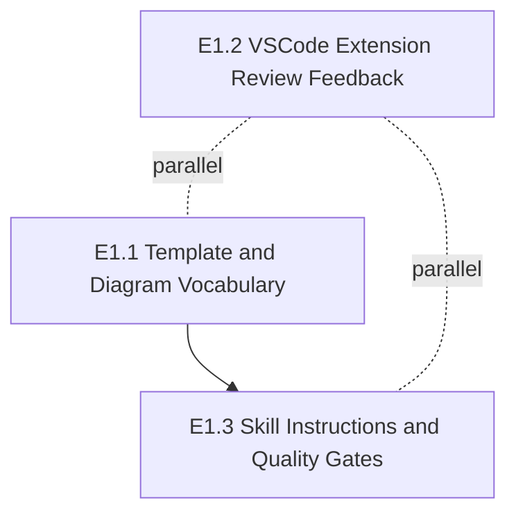

# V1 Implementation Plan

**Date:** 2026-08-13
**Version:** v1
**HLD:** [v1-design.md](../design/v1/v1-design.md) (v1.0)
**Requirements:** [v1-requirements.md](../requirements/v1-requirements.md) (v1.2)
**Related ADRs:** ADR-0039 (workspace-relative paths), ADR-0026 (stable anchors), ADR-0034 (design review gates), ADR-0036 (document organisation)

## Overview

V1 turns the LLD diagram surface into a navigable review cockpit. The template gains four
conditional diagram types, a colour palette, enforcement annotations, and links that resolve
natively in GitHub and VSCode with no extension. The `/lld` skill learns to apply those
conventions and to check its own output. A thin VSCode extension closes the review-comment
loop. The through-line is that a reviewer builds theory from Part A and can reach anything it
names without leaving the document.

Why now: the conventions are already half-present in `template.md` and `SKILL.md` in a form
built on the retired `edf://` scheme, so the framework currently generates LLDs with links
that cannot work. V1 replaces that with a measured design.

## Out of Scope

Pulled from the requirements' "What We Are NOT Building" and "Deferred from V1":

- Hover tooltip showing source file preview, and click-to-open in an adjacent column — both
  spike-blocked; the VS Code API they assumed does not exist
- Additional diagram types beyond the four conditional ones
- Per-project or per-team palette customisation
- Automated annotation generation from code analysis
- Bidirectional navigation (code → diagram), live drift detection, auto-generated diagrams
- Extension marketplace publishing — V1 emits a local `.vsix` only
- Contextual "run tests for this section" from the preview
- GitLab verification — V1 claims only what Story 1.6 measures

## Story closure seam — read before assigning work

Stories 1.1–1.4 are written with acceptance criteria phrased as *generation* outcomes:
"when `/lld` Step 2 evaluates the feature's characteristics, then a `stateDiagram-v2` is
included in Part A". That is the skill's behaviour, not the template's content — and the
skill belongs to E1.3 while the stories belong to E1.1.

This is not a numbering accident. The HLD states it as a boundary: C2.1's
non-responsibilities read "Does not evaluate which diagram types a given feature needs — the
skill applies the gates". The requirements encode the same split, which is why Story 3.1
("Diagram generation rules in `/lld` SKILL.md") restates each concern from the generation
side.

**Therefore Stories 1.1–1.4 close in two halves, and neither epic closes them alone:**

| Half | Epic | Artefact | Satisfied by |
|---|---|---|---|
| **Definition** — the convention exists and is stated as a checkable rule | E1.1 | `lld/template.md` | Reading the template |
| **Application** — the convention is applied to every generated LLD | E1.3 | `lld/SKILL.md` | Running `/lld` and inspecting output |

A story is closed only when both halves are done. `/architect` should mark the coverage
manifest entries for Stories 1.1–1.4 against both epics' LLD sections, and neither epic's
exit criteria should be read as closing them. This mirrors the emission-versus-navigation
seam the HLD already states for Stories 1.4 and 1.5.

Stories 1.5 and 1.6 do not split this way — 1.5's anchor format is template-defined and
renderer-verified, and 1.6 is verification work with no skill component. Stories 2.1, 2.2,
3.1 and 3.2 each close within a single epic.

## Epics

### Epic E1.1 — LLD Template & Diagram Vocabulary

- **HLD anchor:** [C1](../design/v1/v1-design.md#c1-enriched-diagram-vocabulary), [C2](../design/v1/v1-design.md#c2-standard-visual-palette), [C3](../design/v1/v1-design.md#c3-enforcement-point-annotations), [C4](../design/v1/v1-design.md#c4-renderer-native-navigable-diagram-surface), [C5](../design/v1/v1-design.md#c5-cross-renderer-verification-evidence)
- **Scope:** Extend `lld/template.md` with the four conditional diagram types, the `classDef`
  palette, enforcement annotations, and the ADR-0039 link forms — then verify the result
  actually renders and navigates in both target renderers.
- **Requirements covered:**
  - `REQ-lld-template-diagram-vocabulary-conditional-diagram-types` — Story 1.1
  - `REQ-lld-template-diagram-vocabulary-standard-classdef-palette` — Story 1.2
  - `REQ-lld-template-diagram-vocabulary-note-annotations-enforcement-points` — Story 1.3
  - `REQ-lld-template-diagram-vocabulary-click-directives-diagram-participants` — Story 1.4
  - `REQ-lld-template-diagram-vocabulary-lld-anchor-navigation-part-b` — Story 1.5
  - `REQ-lld-template-diagram-vocabulary-verify-diagram-link-resolution` — Story 1.6
- **Owns (components):** C2.1 LLD Template, C2.6 Renderer Conformance Report
- **Touches (components):** C2.5 Diagram Renderer, C2.8 Host Markdown Renderer (both
  external — depended upon and measured, not modified)
- **Depends on:** none
- **Parallelisable with:** E1.2
- **Rough task shape:**
  - Harden the four conditional diagram-type gates so each states a concrete, checkable rule
  - Migrate every link in the template from `edf://` to document-relative form, and encode
    the **full** ADR-0039 support matrix — **two** parse-error cases (`sequenceDiagram`
    fatal on `click`; `stateDiagram-v2` on `_self`) plus one no-anchor case (`erDiagram`
    parses `click` and generates no link, so emit nothing), the path-form constraint
    (document-relative, `..` permitted, no leading slash, resolves inside `design-root` to an
    existing file), and the `classDiagram` display-label workaround for identifiers
    containing `/`

    > **Corrected 2026-08-14 (issue #45).** This line previously said "all three parse-error
    > cases", counting the sequence-diagram `link` directive as one. Measured on mermaid
    > 11.12.2, `link A: source @ <path>` **parses**; ADR-0039 never claimed otherwise — it
    > recorded the omission of `link` as a design choice, which this plan hardened into a
    > parse fact. The omission stands as a convention with its rationale. The path-form
    > constraint is likewise revised per ADR-0039 §Revision R1. Epic E1.1's exit criterion
    > "no sequence-diagram `link` directive remains" stands as a convention check, not a
    > parse fix; epic E1.3's Step 2.5 parse checks already omit `link` and need no change.
  - Define the `#LLD-` anchor form for Story 1.5: the fragment must match the Part B
    `<a id="…">` exactly, in the ADR-0026 `LLD-<epic-id>-<section-slug>` format including the
    epic ID, and a fragment with no target is a silent no-op
  - Apply the `classDef` palette to the template's diagram examples, with the role tie-break rule
  - Add enforcement `Note` annotations and the adjacency rule
  - Author the conformance fixture and record the report: per type, per renderer, both link
    forms, the negative cases, the palette-distinguishability observation, and **the finding
    on whether VSCode's preview natively opens a workspace-relative link clicked inside a
    Mermaid SVG** — the one output with a consumer outside V1, since it decides whether a
    deferred V2 story is already delivered
  - Propagate [vis-markdown-preview-navigation.html](../design/v1/vis-markdown-preview-navigation.html)
    into the LLD's Part A Visual Specifications table per ADR-0035
- **Exit criteria:** Every diagram example in `template.md` parses in both GitHub and VSCode;
  no `edf://` and no sequence-diagram `link` directive remains anywhere in the file; the
  support matrix and the path-form constraint are stated normatively; the conformance report
  is committed with pinned Mermaid and VS Code versions, a stated re-verification trigger, and
  the VSCode native-open finding recorded either way. **Does not close Stories 1.1–1.4 —
  see the closure seam above.**

### Epic E1.2 — VSCode Extension: Review Feedback

- **HLD anchor:** [C6](../design/v1/v1-design.md#c6-in-flow-review-feedback), [C7](../design/v1/v1-design.md#c7-verified-installable-extension-build)
- **Scope:** Build the "EDF: Insert Review Comment" command — heading extraction, filterable
  quick-pick, marker insertion, and target resolution when a preview holds focus — then test
  it in a real VSCode host and package it as an installable `.vsix`.
- **Requirements covered:**
  - `REQ-vscode-extension-review-feedback-quick-pick-insert-review-comment` — Story 2.1
  - `REQ-vscode-extension-review-feedback-test-framework-local-packaging` — Story 2.2
- **Owns (components):** C2.4 Review Comment Command, C2.7 Extension Build and Test Harness
- **Touches (components):** none
- **Depends on:** none. Per the requirements, this epic depends on Epic 1 only for the
  document structure (`##`/`###` headings) it scans — not for any link format — and heading
  structure already exists.
- **Parallelisable with:** E1.1, E1.3
- **Rough task shape:**
  - Resolve the scaffold question: `src/extension.ts` is written against a non-existent API
    and cannot compile, and `media/preview.js` serves no V1 story. The LLD's first task
    settles deletion versus quarantine, and whether the `markdown.previewScripts`
    contribution is dropped (HLD Open Questions 1 and 2)
  - Stand up the test harness — `@vscode/test-electron` driving Mocha, per Story 2.2 AC1
  - Heading extraction as a pure, unit-testable module
  - Insertion-point resolution as a pure module, including placement after existing markers
  - Command wiring: quick-pick, the three-way target resolution, focus and cursor placement,
    the empty-headings message, and the Escape no-op
  - The `EDF Review` output channel, logging why no document could be resolved — V1's only
    observability requirement, and invisible to the reviewer without it
  - Packaging: minimal manifest fields, `vsce package`, install verification in a normal window
  - Propagate [vis-review-comment-insertion.html](../design/v1/vis-review-comment-insertion.html)
    into the LLD's Part A Visual Specifications table per ADR-0035
- **Exit criteria:** The command works from a focused preview; all Story 2.1 ACs have a
  passing test; resolution failures reach the output channel; `vsce package` emits a `.vsix`
  with no errors; the installed extension activates in a normal VSCode window and behaves
  identically to the Dev-Host build; **the security review is recorded** — a reading of the
  shipped code confirming it performs only heading extraction, quick-pick display and text
  insertion, with no file reads beyond the open document, no network calls and no process
  execution. This epic is where the trust boundary moves from a debug host to a reviewer's
  everyday editor, so the review obligation belongs to its exit, not to a later gate.

### Epic E1.3 — Skill Instructions & Quality Gates

- **HLD anchor:** [C8](../design/v1/v1-design.md#c8-self-documenting-generation-rules)
- **Scope:** Update `lld/SKILL.md` so the template's conventions are applied mechanically —
  generation rules with worked examples in Step 2, and parse-then-navigability checks in the
  Step 2.5 self-critique.
- **Requirements covered:**
  - `REQ-skill-instructions-quality-gates-diagram-generation-rules-lld-skill` — Story 3.1
  - `REQ-skill-instructions-quality-gates-self-critique-checklist-diagram-navigability` — Story 3.2
- **Owns (components):** C2.2 LLD Generation Skill, C2.3 Self-Critique Gate
- **Touches (components):** C2.1 LLD Template (reads it as the single source of truth; must
  not restate its content)
- **Depends on:** E1.1 — the skill references the template's palette, gates, and support
  matrix, and Design Principle 6 requires the two stay co-versioned. Writing the rules before
  the template settles would encode conventions that then change.
- **Parallelisable with:** E1.2
- **Rough task shape:**
  - Step 2 generation rules: diagram-type selection, palette application with the tie-break,
    link emission per the full ADR-0039 matrix (including the `link`-directive exclusion, not
    only `click`), display-label workaround, `Note` placement — each with a worked example
  - Step 2.5 self-critique: parse checks gating navigability checks; path-form and
    file-existence as separate checks; palette fence-type check (`text` fence, not a bare
    `mermaid` fence); **verification that every trust-boundary-crossing interaction carries a
    `Note`**; specific failure messages naming the offender
  - Place the new checks at the same prominence as the existing checklist items (security,
    error paths, reused helpers) rather than appending them — a placement decision that is
    cheap now and awkward to retrofit
- **Exit criteria:** No `edf://` and no sequence-diagram `link` directive remains in
  `SKILL.md`; every template feature has a corresponding generation rule; every concern has at
  least one worked example; the self-critique reports name the specific participant, path, or
  diagram type at fault. **Together with E1.1, closes Stories 1.1–1.4 — see the closure seam
  above.**

## Parallelisation Map

**Parallel-safe groups.** E1.2 is disjoint from both others: it owns only
`extensions/edf-review/`, while E1.1 and E1.3 own only `plugins/edf/skills/lld/`. It can run
concurrently with either, start to finish.

E1.1 and E1.3 are **serialised by dependency**, not merely by convention — E1.3 references
conventions E1.1 defines, and Design Principle 6 makes co-versioning a requirement rather
than a preference.

**Caveat for `/architect`.** Component ownership makes E1.1 and E1.3 look like two clean,
separately-ownable units, and at file level they mostly are (`template.md` versus
`SKILL.md`). But every task in both epics must bump the version in
`plugins/edf/.claude-plugin/plugin.json` and `.claude-plugin/marketplace.json` per the
repo's version-bump convention. Those two files are shared across the entire E1.1 + E1.3
chain, so file-level analysis will likely serialise tasks *within* that chain more tightly
than epic-level ownership suggests. E1.2 is unaffected — it touches neither file.

## Sequencing recommendation

1. **Start E1.1 and E1.2 together.** They share no files and neither blocks the other.
2. **E1.3 follows E1.1.** Begin once the template's link format and support matrix are
   settled, since that is what the skill's rules must match.

E1.2 is the only epic with runtime code and the only one needing a test harness, so it
carries the most implementation risk despite being the smallest in story count. Starting it
early leaves room for that risk to surface.
