# /architect — Process flowchart

Visual overview of the batch design artefact generator. Reads a plan, analyses epics, produces ADRs/LLDs/issues/manifests, and commits each artefact. Agent spawns are purple, decisions are orange, human gates are red.

```mermaid
flowchart TD
    START(["fa:fa-play /architect invoked"]) --> S1

    S1["S1: Read plan, parse epic filter<br/>Check existing issues, design docs,<br/>issue structure (epic vs task labels)"]
    S1 --> S2

    S2["S2: Analyse & present overview<br/>Artefact type, input sources,<br/>output paths, decomposition"] --> S2B

    S2B["S2b: Decomposition assessment<br/>Split if >200 lines AND<br/>natural seam exists"] --> S2_GATE(["fa:fa-hand-o-right Wait for user confirmation"])

    S2_GATE --> S3["S3: Read all input sources<br/>Issues, design docs, ADRs,<br/>source files, requirements"]

    S3 --> S4

    subgraph ARTEFACTS["Artefact Production (per epic)"]
        S4_1["1. ADR — cross-cutting<br/>decisions first"] --> S4_2
        S4_2(("2. /lld — delegate LLD<br/>epic N vX --non-interactive")) --> S4_3
        S4_3(("3. edf:gh-issue-manager<br/>Create task issues,<br/>update epic body")) --> S4_4
        S4_4["4. Coverage manifest backfill<br/>Patch issue: null → real numbers"] --> S4_5
        S4_5["5. Design doc update<br/>Only if decision logic<br/>flagged it"]
    end

    S4 --> S4_1

    S4_5 --> S5["S5: Commit each artefact<br/>One commit per item"]

    S5 --> S6["S6: Write session log"]

    S6 --> S7["S7: Report<br/>Scope, artefacts, waves,<br/>parallelism refinements, next step"]

    S7 --> DONE(["fa:fa-check Architect complete"])

    %% ── Styles ──
    classDef startend fill:#d4f0d4,stroke:#2d7d2d,color:#1a3a1a
    classDef process fill:#d6e8f7,stroke:#2d5f8a,color:#1a2f44
    classDef agent fill:#e8d6f7,stroke:#6b2d8a,color:#2d1a3a
    classDef decision fill:#f7eed6,stroke:#8a6d2d,color:#443a1a
    classDef human fill:#f7d6d6,stroke:#8a2d2d,color:#441a1a

    class START,DONE startend
    class S1,S2,S2B,S3,S4_1,S4_4,S4_5,S5,S6,S7 process
    class S4_2,S4_3 agent
    class S2_GATE human
```

