# /backlog — Process flowchart

Visual overview of the backlog grooming pipeline. Gathers data from board, issues, requirements, sessions, reports, and design docs; assesses health, identifies gaps, proposes creative ideas, and recommends ≥10 next items. Propose-only — never mutates state.

```mermaid
flowchart TD
    START(["fa:fa-play /backlog invoked"]) --> S1

    subgraph GATHER["1. Gather Data"]
        S1_BOARD["Board + issues<br/>Open & closed, full bodies"]
        S1_REQS["ALL requirements<br/>Current + future + proposed"]
        S1_ACTIVITY["Recent activity<br/>Session logs, git history"]
        S1_REPORTS["Reports<br/>Previous backlog, drift,<br/>retro, baseline"]
        S1_DESIGN["Design / decisions<br/>ADRs, LLDs/HLDs, plans"]
    end

    S1 --> S1_BOARD
    S1_BOARD --> S1_REQS
    S1_REQS --> S1_ACTIVITY
    S1_ACTIVITY --> S1_REPORTS
    S1_REPORTS --> S1_DESIGN

    S1_DESIGN --> S2

    S2["2. Sanity-check declared phase<br/>CLAUDE.md vs actual shipments,<br/>plan completion, session activity"] --> S2_MISMATCH{"Mismatch?"}
    S2_MISMATCH -->|"Yes"| S2_FLAG["Flag in Phase accuracy section"]
    S2_MISMATCH -->|"No"| S3
    S2_FLAG --> S3

    S3["3. Assess backlog health<br/>Epic link, ACs, size, staleness,<br/>blocked path, duplicates, orphans,<br/>label hygiene"]

    S3 --> S4["4. Identify coverage gaps<br/>Requirements → issues,<br/>future versions → parked ideas,<br/>drift findings, retro actions,<br/>ADR follow-ups"]

    S4 --> S5["5. Creative proposals<br/>Vision alignment, UX rough edges,<br/>adjacent capabilities,<br/>light web research 1-3 queries"]

    S5 --> S6["6. Recommend next — ≥10 items<br/>Score: 0.4×value + 0.3×unblocks<br/>+ 0.2×risk_of_drift + 0.1×(1-effort)"]

    S6 --> S6_GROUPS

    subgraph RANKING["Ranked Recommendations"]
        S6_GROUPS["Top priority (≥0.6)<br/>Worth doing soon (0.45-0.59)<br/>Lower priority (<0.45)"]
    end

    S6_GROUPS --> S7

    S7["7. Write report<br/>docs/reports/backlog/<br/>YYYY-MM-DD-backlog-grooming.md"]

    S7 --> S8["8. Summarise<br/>Board summary, phase verdict,<br/>top 5 recommendations,<br/>proposed new issues count,<br/>report path"]

    S8 --> DONE(["fa:fa-check Backlog grooming complete"])

    %% ── Styles ──
    classDef startend fill:#d4f0d4,stroke:#2d7d2d,color:#1a3a1a
    classDef process fill:#d6e8f7,stroke:#2d5f8a,color:#1a2f44
    classDef decision fill:#f7eed6,stroke:#8a6d2d,color:#443a1a

    class START,DONE startend
    class S1_BOARD,S1_REQS,S1_ACTIVITY,S1_REPORTS,S1_DESIGN,S2,S2_FLAG,S3,S4,S5,S6,S6_GROUPS,S7,S8 process
    class S2_MISMATCH decision
```

