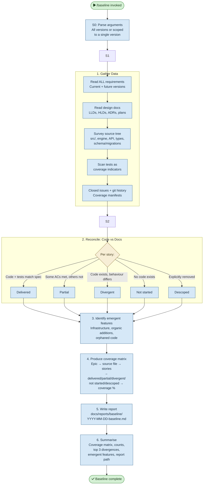

# /baseline — Process flowchart

Visual overview of the requirements reconciliation pipeline. Gathers data across the full stack, reconciles code vs docs at AC level, identifies emergent features, and produces a coverage matrix. Propose-only — never mutates state.

