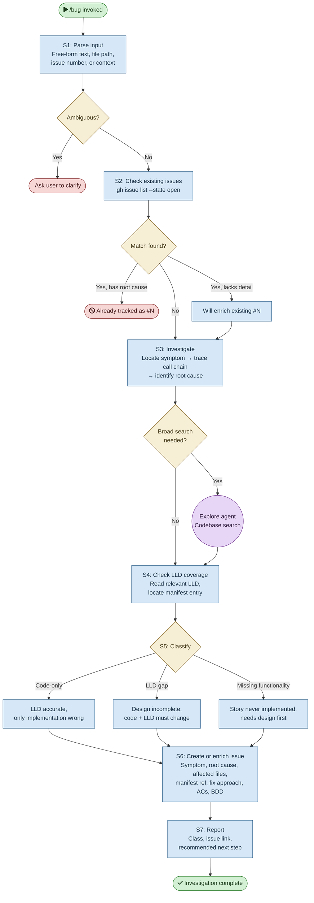

# /bug — Process flowchart

Visual overview of the bug investigation pipeline. From vague symptom through root cause analysis, LLD coverage check, classification, and issue creation. Agent spawns are purple, decisions are orange, blocking gates are red.

