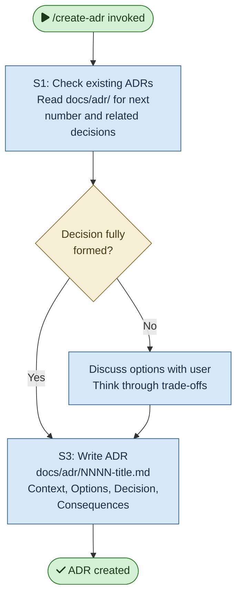

# /create-adr — Process flowchart

Visual overview of the Architecture Decision Record creation process. Simple linear flow: check existing ADRs, discuss if needed, write the ADR.

```mermaid
flowchart TD
    START(["fa:fa-play /create-adr invoked"]) --> S1

    S1["S1: Check existing ADRs<br/>Read docs/adr/ for next<br/>number and related decisions"] --> S2

    S2{"Decision fully<br/>formed?"} -->|"No"| S2_DISCUSS["Discuss options with user<br/>Think through trade-offs"]
    S2 -->|"Yes"| S3
    S2_DISCUSS --> S3

    S3["S3: Write ADR<br/>docs/adr/NNNN-title.md<br/>Context, Options, Decision,<br/>Consequences"]

    S3 --> DONE(["fa:fa-check ADR created"])

    %% ── Styles ──
    classDef startend fill:#d4f0d4,stroke:#2d7d2d,color:#1a3a1a
    classDef process fill:#d6e8f7,stroke:#2d5f8a,color:#1a2f44
    classDef decision fill:#f7eed6,stroke:#8a6d2d,color:#443a1a

    class START,DONE startend
    class S1,S2_DISCUSS,S3 process
    class S2 decision
```
