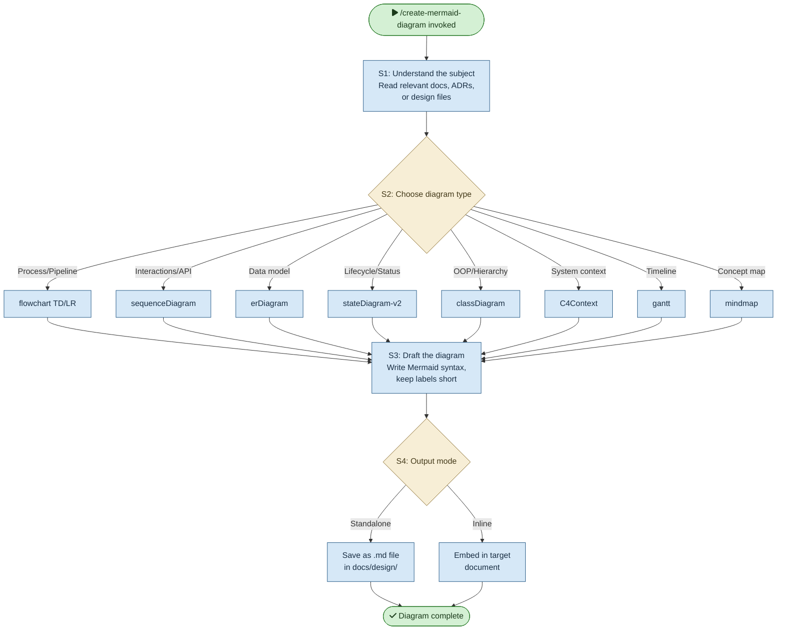

# /create-mermaid-diagram — Process flowchart

Visual overview of the diagram creation process. Understand the subject, choose the right diagram type, draft, and embed or save.

```mermaid
flowchart TD
    START(["fa:fa-play /create-mermaid-diagram invoked"]) --> S1

    S1["S1: Understand the subject<br/>Read relevant docs, ADRs,<br/>or design files"] --> S2

    S2{"S2: Choose diagram type"} -->|"Process/Pipeline"| S2_FLOW["flowchart TD/LR"]
    S2 -->|"Interactions/API"| S2_SEQ["sequenceDiagram"]
    S2 -->|"Data model"| S2_ER["erDiagram"]
    S2 -->|"Lifecycle/Status"| S2_STATE["stateDiagram-v2"]
    S2 -->|"OOP/Hierarchy"| S2_CLASS["classDiagram"]
    S2 -->|"System context"| S2_C4["C4Context"]
    S2 -->|"Timeline"| S2_GANTT["gantt"]
    S2 -->|"Concept map"| S2_MIND["mindmap"]

    S2_FLOW --> S3
    S2_SEQ --> S3
    S2_ER --> S3
    S2_STATE --> S3
    S2_CLASS --> S3
    S2_C4 --> S3
    S2_GANTT --> S3
    S2_MIND --> S3

    S3["S3: Draft the diagram<br/>Write Mermaid syntax,<br/>keep labels short"] --> S4

    S4{"S4: Output mode"} -->|"Standalone"| S4_FILE["Save as .md file<br/>in docs/design/"]
    S4 -->|"Inline"| S4_EMBED["Embed in target<br/>document"]

    S4_FILE --> DONE
    S4_EMBED --> DONE(["fa:fa-check Diagram complete"])

    %% ── Styles ──
    classDef startend fill:#d4f0d4,stroke:#2d7d2d,color:#1a3a1a
    classDef process fill:#d6e8f7,stroke:#2d5f8a,color:#1a2f44
    classDef decision fill:#f7eed6,stroke:#8a6d2d,color:#443a1a

    class START,DONE startend
    class S1,S2_FLOW,S2_SEQ,S2_ER,S2_STATE,S2_CLASS,S2_C4,S2_GANTT,S2_MIND,S3,S4_FILE,S4_EMBED process
    class S2,S4 decision
```
