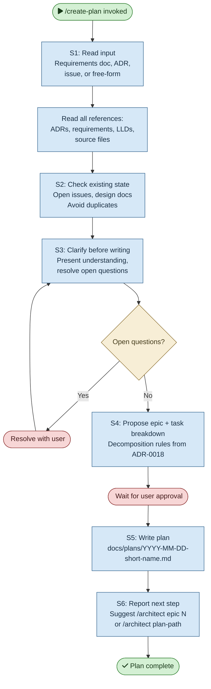

# /create-plan — Process flowchart

Visual overview of the implementation plan creation process. Reads inputs, checks existing state, clarifies open questions, proposes breakdown, and writes the plan. Human gates are red.

