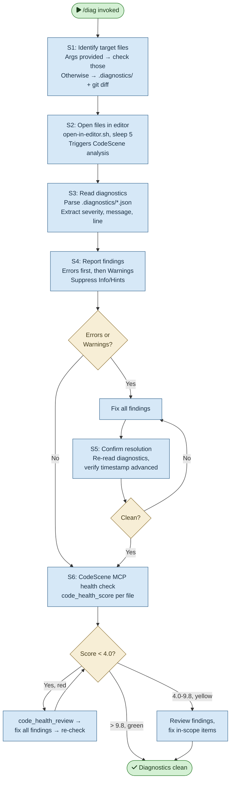

# /diag — Process flowchart

Visual overview of the on-demand diagnostics check. Identifies target files, opens them in the editor, reads diagnostics exports, fixes findings, and runs CodeScene MCP health checks. Decisions are orange, blocking gates are red.

