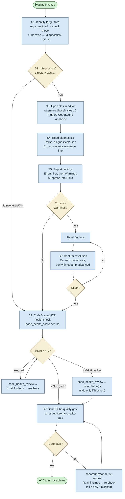

# /diag — Process flowchart

Visual overview of the on-demand diagnostics check. Identifies target files, opens them in the editor, reads diagnostics exports, fixes findings, runs CodeScene MCP health checks, and enforces the SonarQube quality gate. Decisions are orange, blocking gates are red.

