# /discovery — Process flowchart

Visual overview of the problem space exploration pipeline. Adapted Lean Inception activities: vision, boundaries, personas, journeys, features, and MVP sequencing with two human gates. Human gates are red.

```mermaid
flowchart TD
    START(["fa:fa-play /discovery invoked"]) --> S1

    S1["S1: Read idea and orient<br/>Find idea file, extract core concept,<br/>check for existing discovery doc"] --> S1_RV{"[Review]<br/>markers?"}
    S1_RV -->|"Yes"| RV["Review cycle:<br/>address markers,<br/>remove, commit"]
    S1_RV -->|"No"| S2
    RV --> S2

    S2["S2: Domain research<br/>WebSearch 3-5 queries<br/>Existing solutions, domain concepts,<br/>target audience, market signals"]

    S2 --> S3

    subgraph PROBLEM_SPACE["Problem Space (Activities 1-3)"]
        S3_VISION["Activity 1: Vision statement<br/>For whom, whose need,<br/>what value, unlike alternatives"]
        S3_BOUND["Activity 2: Boundaries<br/>Is / Is Not table<br/>Product + Scope (V1)"]
        S3_PERSONAS["Activity 3: Personas<br/>2-4 user types<br/>Goals, pain points, context"]
    end

    S3 --> S3_VISION
    S3_VISION --> S3_BOUND
    S3_BOUND --> S3_PERSONAS

    S3_PERSONAS --> GATE1(["fa:fa-hand-o-right Gate 1: Problem space<br/>Right problem? Right personas?"])

    GATE1 --> S4

    subgraph SOLUTION_SPACE["Solution Space (Activities 4-6)"]
        S4_JOURNEYS["Activity 4: User journeys<br/>Per persona, narrative flows<br/>Trigger → Steps → Outcome"]
        S4_FEATURES["Activity 5: Feature catalogue<br/>By journey, effort/value signals"]
        S4_SEQUENCER["Activity 6: MVP sequencer<br/>Wave 1 Core → Wave 2 Enhanced<br/>→ Wave 3+ Future"]
    end

    S4 --> S4_JOURNEYS
    S4_JOURNEYS --> S4_FEATURES
    S4_FEATURES --> S4_SEQUENCER

    S4_SEQUENCER --> GATE2(["fa:fa-hand-o-right Gate 2: Complete discovery<br/>Right shape for /requirements?"])

    GATE2 --> S5["S5: Finalise<br/>Status → Final,<br/>add Next steps, commit"]

    S5 --> DONE(["fa:fa-check Discovery complete"])

    %% ── Styles ──
    classDef startend fill:#d4f0d4,stroke:#2d7d2d,color:#1a3a1a
    classDef process fill:#d6e8f7,stroke:#2d5f8a,color:#1a2f44
    classDef decision fill:#f7eed6,stroke:#8a6d2d,color:#443a1a
    classDef human fill:#f7d6d6,stroke:#8a2d2d,color:#441a1a

    class START,DONE startend
    class S1,RV,S2,S3_VISION,S3_BOUND,S3_PERSONAS,S4_JOURNEYS,S4_FEATURES,S4_SEQUENCER,S5 process
    class S1_RV decision
    class GATE1,GATE2 human
```

