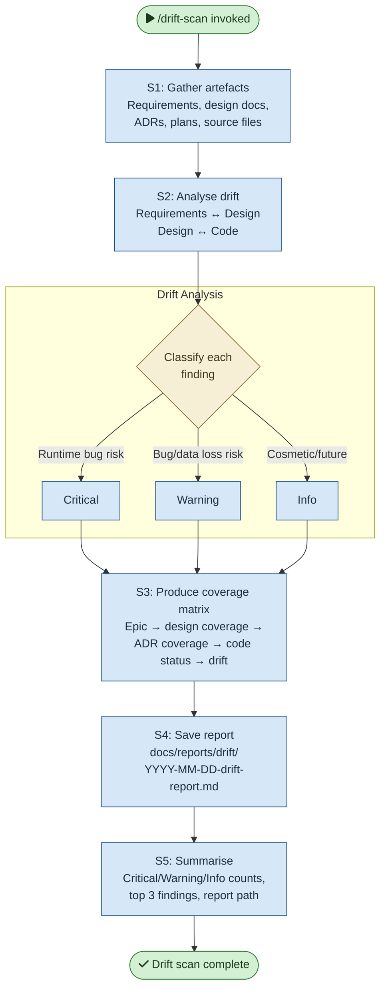

# /drift-scan — Process flowchart

Visual overview of the drift detection pipeline. Gathers artefacts across the full delivery stack, analyses drift at two levels, classifies findings, and produces a coverage matrix.

