# /feature-core — Process flowchart

Visual overview of the implementation pipeline. The pressure tier decision at Step 3c routes
into one of two parallel tracks, which converge at Step 5. Agent spawns are purple, decisions
are orange, blocking gates are red.

```mermaid
flowchart TD
    START(["fa:fa-play /feature-core invoked"]) --> S3

    %% ── Shared preamble ──
    subgraph PREAMBLE["Shared Preamble"]
        S3["S3: Read issue body<br/>gh issue view"] --> S3_EPIC{"Epic label?"}
        S3_EPIC -->|"Yes"| STOP_EPIC(["fa:fa-ban Stop: use /feature epic"])
        S3_EPIC -->|"No"| S3_READ["Read referenced docs,<br/>LLDs, source files"]
        S3_READ --> S3B["S3b: List 2-3 approaches,<br/>pick simplest"]
        S3B --> S3B_LLD{"LLD still best?"}
        S3B_LLD -->|"No — deviate"| S3B_DEV["Note deviation for<br/>PR Design deviations"]
        S3B_DEV --> S3C
        S3B_LLD -->|"Yes"| S3C["S3c: Classify pressure<br/>Estimate src lines"]
        S3C --> F3DF["3dF: Create session log<br/>Approach rationale +<br/>cost checkpoint table"]
    end

    F3DF --> S3C_TIER{"Tier?"}

    %% ── Light track ──
    subgraph LIGHT["Light Track (<30 lines)"]
        L1["4L: Write fix directly"] --> L2["4L: Write 2-5 regression<br/>tests inline"]
        L2 --> L3["4L: Run target test file<br/>bash run-tests.sh ts &lt;test-file&gt;"]
    end

    %% ── Full track ──
    subgraph FULL["Full Track (>=30 lines)"]
        F2(("4bF: Write stubs + test-author agent")) --> F2_CHK{"3+ observable<br/>properties?"}
        F2_CHK -->|"No"| STOP_SPEC(["fa:fa-ban Escalate to user"])
        F2_CHK -->|"Yes"| F2_CP["Append cost checkpoint<br/>step 4bF: test-author"]
        F2_CP --> F3["4cF: Implement against tests"]
        F3 --> F3_CHK{"Tests pass?"}
        F3_CHK -->|"No"| F3_FIX["Fix implementation"]
        F3_FIX --> F3
        F3_CHK -->|"Yes"| F4["4dF: Self-check coverage"]
        F4 --> F4_CP["Append cost checkpoint<br/>step 4dF: implementation"]
    end

    S3C_TIER -->|"Light"| L1
    S3C_TIER -->|"Standard / Heavy"| F2

    L3 --> S5
    F4_CP --> S5

    %% ── Verification & diagnostics ──
    subgraph VERIFY["Verification & Diagnostics"]
        S5(("S5: edf:test skill<br/>tests + typecheck + lint")) --> S5_CHK{"All pass?"}
        S5_CHK -->|"No"| S5_FIX["Fix, max 3 attempts"]
        S5_FIX --> S5
        S5_CHK -->|"Yes"| S5_E2E{"E2E tests?"}
        S5_E2E -->|"Yes"| S5_E2E_RUN(("edf:test e2e<br/>build + e2e"))
        S5_E2E -->|"No"| S5_CP["Append cost checkpoint<br/>step 5: green on attempt N"]
        S5_E2E_RUN --> S5_CP
        S5_CP --> S6
        S6["S6: edf:diag<br/>Light: src/ only<br/>Full: all files"] --> S6_CHK{"Zero findings?"}
        S6_CHK -->|"No"| S6_FIX["Fix -> re-run edf:diag -> re-run S5"]
        S6_FIX --> S6
        S6_CHK -->|"Yes"| S6_CP["Append cost checkpoint<br/>step 6: diag pass"]
        S6_CP --> S6B_GATE{"Track?"}
    end

    S6B_GATE -->|"Light"| S7
    S6B_GATE -->|"Full"| S6B(("S6b: edf:feature-evaluator"))
    S6B --> S6B_CP["Append cost checkpoint<br/>step 6b: evaluator"]
    S6B_CP --> S6B_V{"Verdict?"}
    S6B_V -->|"PASS"| S7
    S6B_V -->|"WARNINGS"| S6B_W["Fix quick wins,<br/>note rest in PR"]
    S6B_W --> S7
    S6B_V -->|"FAIL"| S6B_F["Fix -> re-run S5 + S6"]
    S6B_F --> S7

    %% ── Shared delivery ──
    subgraph DELIVER["Shared Delivery"]
        S7["S7: git add & commit"] --> S8["S8: git push + create PR"]
        S8 --> S8_DEV{"Design<br/>deviations?"}
        S8_DEV -->|"Yes"| S8_PATCH["Patch PR body"]
        S8_DEV -->|"No"| S8_CP["Append cost checkpoint<br/>step 8: PR link"]
        S8_PATCH --> S8_CP
        S8_CP --> S8B(("S8b: edf:ci-probe<br/>background"))
        S8B --> S9["S9: edf:pr-review"]
        S9 --> S9_T["Triage findings"]
        S9_T --> S9_B{"Blocker?"}
        S9_B -->|"Yes"| S9_FIX["Fix -> re-run S5 -> push"]
        S9_FIX --> S9
        S9_B -->|"No"| S9_D["Fix or defer"]
        S9_D --> S9_CP["Append cost checkpoint<br/>step 9: review clean"]
        S9_CP --> S10["S10: Reconcile CI<br/>gh pr checks"]
        S10 --> S10_CI{"CI?"}
        S10_CI -->|"pass"| S10_OK["Summarize report"]
        S10_CI -->|"fail"| S10_F["Fix -> push"]
        S10_F --> S10
        S10_CI -->|"pending"| S10_W["gh pr checks --watch"]
        S10_W --> S10_CI
    end

    S10_OK --> S10_CP["Append cost checkpoint<br/>step 10: report done"]
    S10_CP --> DONE(["fa:fa-check Complete"])

    %% ── Styles ──
    classDef startend fill:#d4f0d4,stroke:#2d7d2d,color:#1a3a1a
    classDef process fill:#d6e8f7,stroke:#2d5f8a,color:#1a2f44
    classDef agent fill:#e8d6f7,stroke:#6b2d8a,color:#2d1a3a
    classDef decision fill:#f7eed6,stroke:#8a6d2d,color:#443a1a
    classDef stop fill:#f7d6d6,stroke:#8a2d2d,color:#441a1a

    class START,DONE startend
    class S3,S3_READ,S3B,S3B_DEV,S3C,F3DF,L1,L2,L3,F2_CP,F3,F3_FIX,F4,F4_CP,S5_CP,S6,S6_FIX,S6_CP,S6B_CP,S6B_W,S6B_F,S7,S8,S8_CP,S8_PATCH,S9,S9_T,S9_D,S9_CP,S9_FIX,S10,S10_F,S10_OK,S10_CP,S10_W process
    class F2,S5,S5_E2E_RUN,S6B,S8B agent
    class S3_EPIC,S3B_LLD,S3C_TIER,F2_CHK,F3_CHK,S5_CHK,S5_E2E,S6_CHK,S6B_GATE,S6B_V,S8_DEV,S9_B,S10_CI decision
    class STOP_EPIC,STOP_SPEC stop
```

