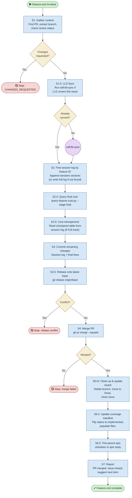

# /feature-end — Process flowchart

Visual overview of the post-review wrap-up pipeline. Handles session log (find by feature ID per ADR-0037), cost tracking, rebase, merge, cleanup, manifest updates, and epic checklist ticking. Decisions are orange, blocking gates are red.

