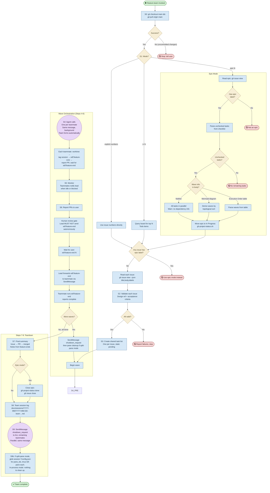

# /feature-team — Process flowchart

Visual overview of the parallel implementation pipeline. The lead parses arguments, spawns
teammate agents in waves, monitors progress, gates on human review, and tears down. Agent
spawns are purple, decisions are orange, blocking gates are red.

