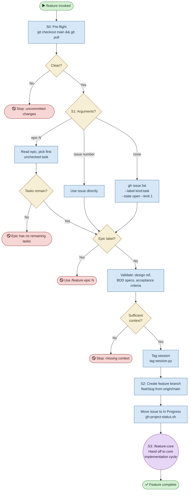

# /feature — Process flowchart

Visual overview of the autonomous implementation cycle. The skill handles pre-flight, issue selection, branch creation, and hands off to /feature-core. Agent spawns are purple, decisions are orange, blocking gates are red.

