# /frontend-architect — Process flowchart

Visual overview of the frontend design system establishment. Surveys existing UI, commits to an aesthetic direction, defines design tokens, layout shell, and component patterns, then produces the spec and bootstrap issues.

```mermaid
flowchart TD
    START(["fa:fa-play /frontend-architect invoked"]) --> S1

    S1["S1: Survey existing frontend<br/>Layout, pages, components,<br/>package.json, CSS, Tailwind config,<br/>existing design docs/ADRs"]

    S1 --> S2["S2: Commit to aesthetic direction<br/>Audience-aware, specific character,<br/>avoid generic AI aesthetics"]

    S2 --> S3["S3: Choose CSS/component approach<br/>Framework, primitives, icons, fonts<br/>Default: Tailwind + shadcn/ui"]

    S3 --> S4["S4: Define design tokens<br/>Colour palette, typography,<br/>spacing, border radius, shadows"]

    S4 --> S5["S5: Define layout shell<br/>Authenticated layout structure,<br/>NavBar, main content area"]

    S5 --> S6["S6: Define component patterns<br/>PageHeader, Card, Button, Badge,<br/>EmptyState, LoadingState, FormField"]

    S6 --> S7["S7: Produce spec<br/>docs/design/frontend-system.md<br/>All decisions + Bootstrap Tasks"]

    S7 --> S8["S8: Create bootstrap issues<br/>gh-create-issue.sh per task<br/>Install deps, globals.css,<br/>tailwind.config, layout updates"]

    S8 --> S9["S9: Commit spec"]
    S9 --> S10["S10: Report and stop"]

    S10 --> DONE(["fa:fa-check Frontend system ready"])

    %% ── Styles ──
    classDef startend fill:#d4f0d4,stroke:#2d7d2d,color:#1a3a1a
    classDef process fill:#d6e8f7,stroke:#2d5f8a,color:#1a2f44

    class START,DONE startend
    class S1,S2,S3,S4,S5,S6,S7,S8,S9,S10 process
```

