# /kickoff — Process flowchart

Visual overview of the version bootstrap pipeline. Detects mode (initial vs delta), produces HLD, ADRs, epic-shaped plan, and epic issues with three human gates. Agent spawns are purple, decisions are orange, human gates are red.

```mermaid
flowchart TD
    START(["fa:fa-play /kickoff invoked"]) --> S1

    S1["S1: Read inputs and orient<br/>Resolve requirements file,<br/>derive version, detect mode"] --> S1_GATE(["fa:fa-hand-o-right Gate 0: Orientation —<br/>confirm mode, version, scope"])

    S1_GATE --> S2

    S2["S2: Draft HLD<br/>Initial: full Levels 1-3<br/>Delta: thin delta referencing<br/>prior HLD by anchor"] --> S3

    S3(("S3: edf:hld-review agent<br/>Capability-to-component trace,<br/>boundary completeness, ADR triggers"))

    S3 --> S3_TRIAGE{"Findings?"}
    S3_TRIAGE -->|"block"| S3_FIX["Fix HLD"]
    S3_FIX --> S3
    S3_TRIAGE -->|"warn/clean"| S4

    S4(("S4: Gate 1 — drift scan<br/>edf:requirements-design-drift<br/>Coverage matrix")) --> S4_GATE(["fa:fa-hand-o-right Gate 1: Review matrix,<br/>flag uncovered/over-covered"])

    S4_GATE --> S5

    subgraph ADR_LOOP["ADR Loop (one at a time)"]
        S5_PROPOSE["Propose ADR list<br/>with one-line rationales"] --> S5_CONFIRM(["fa:fa-hand-o-right Confirm list"])
        S5_CONFIRM --> S5_DRAFT["Draft ADR via /create-adr"]
        S5_DRAFT --> S5_COMMIT["Commit"]
        S5_COMMIT --> S5_APPROVE(["fa:fa-hand-o-right Approve ADR"])
        S5_APPROVE --> S5_MORE{"More ADRs?"}
        S5_MORE -->|"Yes"| S5_DRAFT
    end

    S5 --> S5_PROPOSE
    S5_MORE -->|"No"| S6

    S6["S6: Draft epic-shaped plan<br/>3-6 epics, dependency order,<br/>parallelisation map"] --> S6_COMMIT["Commit plan"]

    S6_COMMIT --> S7(("S7: Gate 2 — second drift scan<br/>Check plan covers HLD")) --> S7_GATE(["fa:fa-hand-o-right Gate 2: Review matrix,<br/>patch as needed"])

    S7_GATE --> S8["S8: Create epic issues<br/>gh-create-issue.sh per epic<br/>with REQ- anchors"]

    S8 --> S9["S9: Update CLAUDE.md<br/>Initial mode only — fill<br/>template blocks"]

    S9 --> S10["S10: Session log"]

    S10 --> S11["S11: Report and stop<br/>HLD, ADRs, plan, epics,<br/>drift verdicts, next step"]

    S11 --> DONE(["fa:fa-check Kickoff complete"])

    %% ── Styles ──
    classDef startend fill:#d4f0d4,stroke:#2d7d2d,color:#1a3a1a
    classDef process fill:#d6e8f7,stroke:#2d5f8a,color:#1a2f44
    classDef agent fill:#e8d6f7,stroke:#6b2d8a,color:#2d1a3a
    classDef decision fill:#f7eed6,stroke:#8a6d2d,color:#443a1a
    classDef human fill:#f7d6d6,stroke:#8a2d2d,color:#441a1a

    class START,DONE startend
    class S1,S2,S3_FIX,S5_PROPOSE,S5_DRAFT,S5_COMMIT,S6,S6_COMMIT,S8,S9,S10,S11 process
    class S3,S4,S7 agent
    class S3_TRIAGE,S5_MORE decision
    class S1_GATE,S4_GATE,S5_CONFIRM,S5_APPROVE,S7_GATE human
```

