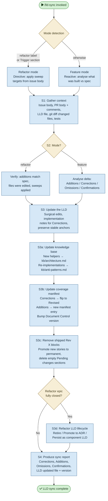

# /lld-sync — Process flowchart

Visual overview of the post-implementation LLD feedback loop. Detects mode (refactor vs feature), gathers context, analyses the delta, updates the LLD/kb/manifest, and produces a sync report. Decisions are orange.

