# /lld — Process flowchart

Visual overview of the LLD generation pipeline. Mode selection at the top determines context
gathering; the self-critique + review loop is the central quality gate. Agent spawns are purple,
decisions are orange, human gates are red.

```mermaid
flowchart TD
    START(["fa:fa-play /lld invoked"]) --> S0

    %% ── Step 0: Resolve version ──
    S0["S0: Resolve version vN<br/>from args or ask user"] --> S0_PATHS{"Requirements,<br/>HLD, plan exist?"}
    S0_PATHS -->|"No"| STOP_PATHS(["fa:fa-ban Stop: missing docs"])
    S0_PATHS -->|"Yes"| S0_MODE

    %% ── Step 0b: Read context (varies by mode) ──
    S0_MODE{"S0b: Mode?"} -->|"epic N"| S0B_EPIC
    S0_MODE -->|"phase N"| S0B_PHASE
    S0_MODE -->|"section X.Y"| S0B_SECTION
    S0_MODE -->|"no args"| S0_ASK(["fa:fa-hand-o-right Ask user which target"])

    subgraph CONTEXT["Context Gathering"]
        S0B_EPIC["Read epic + each task issue<br/>HLD + existing LLDs + ADRs<br/>requirements + src/"]
        S0B_PHASE["Read implementation plan<br/>HLD + existing LLDs + ADRs<br/>requirements + src/"]
        S0B_SECTION["Same as phase,<br/>targeting single section"]
    end

    S0_ASK --> S0_MODE

    S0B_EPIC --> S0C_GATE
    S0B_PHASE --> S0_KB
    S0B_SECTION --> S0_KB

    %% ── Step 0c: Optional code-explorer ──
    S0C_GATE{"Large epic?<br/>(>=4 tasks or<br/>>=3 layers)"}
    S0C_GATE -->|"Yes"| S0C(("S0c: feature-dev:code-explorer<br/>Structured context brief"))
    S0C_GATE -->|"No"| S0_KB
    S0C --> S0_KB

    S0_KB["Always read: kb/architecture.md<br/>Reusable helpers catalogue"]

    %% ── Step 1: Overview ──
    S0_KB --> S1_GATE{"--non-interactive?"}
    S1_GATE -->|"Yes"| S2
    S1_GATE -->|"No"| S1_OVERVIEW["S1: Produce overview<br/>Layers · cross-cutting ·<br/>dependencies · LLD vs HLD scope"]
    S1_OVERVIEW --> S1_CONFIRM(["fa:fa-hand-o-right Wait for user confirmation"])
    S1_CONFIRM --> S2

    %% ── Step 2: Generate LLD ──
    S2["S2: Generate LLD<br/>Epic: one file per epic<br/>Phase: one file per phase<br/>Section: update existing section"]
    S2 --> S2_FE_GATE{"FE sections?"}
    S2_FE_GATE -->|"Yes"| S2_VIS["Check for wireframes<br/>Capture screenshots if found<br/>Flag gap if missing"]
    S2_FE_GATE -->|"No"| S2_5
    S2_VIS --> S2_5

    %% ── Steps 2.5-2.6: Quality loop ──
    subgraph QUALITY["Quality Gates (Steps 2.5-2.6)"]
        S2_5["S2.5: Self-critique pass<br/>Adversarial checklist review<br/>Acceptance ↔ BDD ↔ Invariants<br/>External contracts vs docs<br/>Task sizing · Error paths · Reuse"]
        S2_5 --> S2_5_PARSE{"All diagrams parse?"}
        S2_5_PARSE -->|"No"| S2_5_PARSE_FAIL["Report offending block<br/>by type and line<br/>Skip that diagram's<br/>remaining checks"]
        S2_5_PARSE -->|"Yes"| S2_5_NAV["Navigability · path form<br/>file existence · fragments<br/>palette · annotations<br/>Findings name the offender"]
        S2_5_PARSE_FAIL --> S2_5_CHK
        S2_5_NAV --> S2_5_CHK
        S2_5_CHK{"Issues found?"}
        S2_5_CHK -->|"Yes"| S2_5_FIX["Fix LLD in place"]
        S2_5_FIX --> S2_5
        S2_5_CHK -->|"No, clean"| S2_6(("S2.6: edf:lld-review agent"))
        S2_6 --> S2_6_TRIAGE{"Findings?"}
        S2_6_TRIAGE -->|"block"| S2_6_FIX["Fix blocker<br/>Re-run self-critique"]
        S2_6_FIX --> S2_5
        S2_6_TRIAGE -->|"warn"| S2_6_WARN["Fix quick wins<br/>Note rest"]
        S2_6_WARN --> S3
        S2_6_TRIAGE -->|"clean"| S3
    end

    %% ── Step 3: Task breakdown ──
    S3["S3: Task breakdown<br/>One task per section<br/>Issue title · Layer · Depends on<br/>Acceptance criteria · BDD specs<br/>Files to create/modify"]
    S3 --> S3B["S3b: Execution Order<br/>Dependency DAG (mermaid)<br/>Execution Waves table"]
    S3B --> S3C_GATE{"Pilot epic?"}
    S3C_GATE -->|"Yes"| S3C["S3c: Coverage manifest<br/>docs/design/v{N}/coverage-<epic-id>.yaml<br/>REQ → LLD anchor → issue → status"]
    S3C_GATE -->|"No"| S4
    S3C --> S4

    %% ── Step 4: Cross-references ──
    S4["S4: Cross-references<br/>Internal dependencies (anchors)<br/>External dependencies (file links)<br/>Shared types/interfaces"]
    S4 --> DONE(["fa:fa-check LLD complete"])

    %% ── Styles ──
    classDef startend fill:#d4f0d4,stroke:#2d7d2d,color:#1a3a1a
    classDef process fill:#d6e8f7,stroke:#2d5f8a,color:#1a2f44
    classDef agent fill:#e8d6f7,stroke:#6b2d8a,color:#2d1a3a
    classDef decision fill:#f7eed6,stroke:#8a6d2d,color:#443a1a
    classDef stop fill:#f7d6d6,stroke:#8a2d2d,color:#441a1a
    classDef human fill:#f7d6d6,stroke:#8a2d2d,color:#441a1a

    class START,DONE startend
    class S0,S0B_EPIC,S0B_PHASE,S0B_SECTION,S0_KB,S1_OVERVIEW,S2,S2_VIS,S2_5,S2_5_NAV,S2_5_PARSE_FAIL,S2_5_FIX,S2_6_FIX,S2_6_WARN,S3,S3B,S3C,S4 process
    class S0C,S2_6 agent
    class S0_PATHS,S0_MODE,S0C_GATE,S1_GATE,S2_FE_GATE,S2_5_PARSE,S2_5_CHK,S2_6_TRIAGE,S3C_GATE decision
    class STOP_PATHS human
    class S0_ASK,S1_CONFIRM human
```

