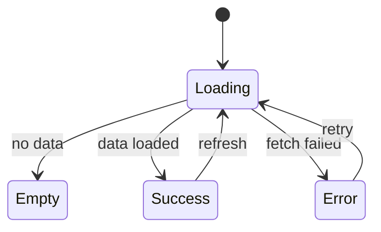
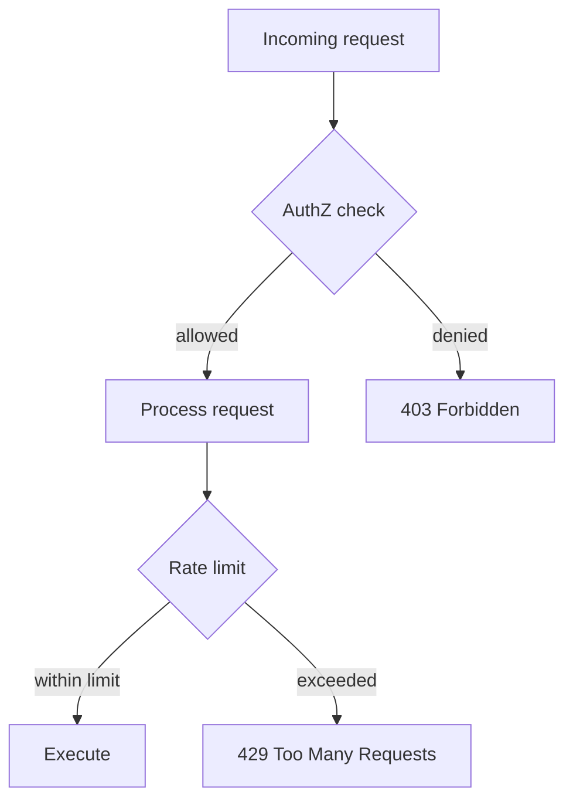

# LLD Template

The LLD is structured in two parts. **Part A** is for human review — a reviewer can read
Part A alone and build sufficient theory about the feature. **Part B** is for the implementing
agent — detailed enough for `/feature` to produce correct code autonomously.

One file per phase (phase mode) or one file per task (epic mode). Each implementation plan
section becomes a top-level heading.

```markdown
# Low-Level Design: Phase N — [Phase Name]

## Document Control

| Field | Value |
|-------|-------|
| Version | 0.1 |
| Status | Draft |
| Author | LS / Claude |
| Created | [today's date] |
| Parent | [v<N>-design.md](v<N>-design.md) |
| Implementation plan | [Phase N](../plans/<resolved-plan-filename>.md) |

---

**Layout rule — two contiguous passes, never interleaved.** Every section number N.k in
this document appears exactly twice: a Part A block (`## N.k [Section Name]`, under the
`# Part A` heading) and a Part B block (`## N.k [Section Name] — Implementation`, under the
`# Part B` heading). Emit **all** Part A blocks for every section first, then **all** Part B
blocks. Do not emit a section's Part A + Part B content in one place, and do not move a
Part B block above the `# Part B` heading.

# Part A — Human-Reviewable Design

> Both the human reviewer and the implementing agent read this part.
> For the reviewer, it builds theory about the feature. For the agent, it provides
> the conceptual foundation that Part B's details depend on.
> It answers: what does the feature do, how do the parts interact,
> what must always be true, and how do we know it works.

### Diagram styling palette

All diagrams in this document use a standard set of styles. Define the `classDef`
blocks inside the first diagram of each type that uses them, then reference by class
name in subsequent diagrams — a standalone `classDef` block (no diagram-type keyword)
is invalid Mermaid. The palette matches the EDF pipeline flowcharts for visual
consistency.

| Class | Use for |
|-------|---------|
| `error` | Error paths, failure states, exception flows |
| `auth` | AuthZ enforcement points, trust boundaries, permission checks |
| `external` | External service calls, third-party APIs, webhooks |
| `new` | New code introduced by this LLD (modules, services, components created from scratch) |

Apply with `class` assignments on nodes, or `Note` blocks on sequence diagrams for
enforcement-point annotations (see Behavioural Flows below).

### Diagram navigability convention — links

Every diagram participant must be navigable so the reviewer can reach the relevant
code or spec without leaving the preview. The mechanism depends on the diagram type —
`click` is not supported on every type:

- **sequenceDiagram** — `click` is unsupported. Link each participant with the
  sequence-diagram `link` directive:
  `link API: source @ edf://src/app/api/example/route.ts`.
- **flowchart / classDiagram / stateDiagram** — use Mermaid's `click` directive.
  The third argument is the tooltip string, not a target keyword:
  `click Service href "edf://src/lib/example/service.ts" "source"`.
- **erDiagram** — no interaction support documented; omit links (refer to entities
  in prose or via the classDiagram instead).

- **Existing source file** → `edf://` protocol with the repo-relative path.
  The `edf-review` VSCode extension intercepts these: hover shows code, click opens
  the file in the next column. Without the extension, the link is harmless (cursor
  changes but no navigation — the same as any unrecognised URL scheme in an SVG).
- **New-to-be-created code** → `#LLD-` anchor to the Part B section where its
  internal decomposition and signatures are specified:
  `click NewService href "#LLD-v12-e3-new-service" "spec"`
  Click scrolls the preview to the implementation spec. These anchors work in any
  markdown renderer including GitHub — they are standard page-internal links.

## N.1 [Section Name]

**Stories:** [story numbers]
**Layers:** DB | BE | FE

### Purpose
[1-3 sentences: what this section delivers and why]

### Behavioural Flows

Pick the right diagram type for the flow. Each type has a "When required" gate —
use it when the condition matches, skip it when optional.

#### Sequence diagram (primary)

For every interaction involving >2 components: API routes, service calls, webhook
chains, multi-step UI interactions with server round-trips.

Every diagram participant must be navigable. sequenceDiagram does not support
`click` — use its `link <actor>: <label> @ <url>` directive. Existing code links to
the source file via `edf://`; new code links to its Part B spec via `#LLD-`.
Enforcement points (authZ, validation, external boundaries) are annotated with `Note`
blocks so the security and validation story is visible in the diagram itself.

`` ```mermaid
sequenceDiagram
    link API: source @ edf://src/app/api/example/route.ts
    link Service: source @ edf://src/lib/example/service.ts
    link DB: source @ edf://src/lib/db/client.ts
    %% New-to-be-created — scrolls to Part B spec:
    link NewService: spec @ #LLD-<epic-id>-<section-slug>

    Client->>API: POST /api/example
    Note over API: AuthZ check (RLS policy)
    API->>Service: processRequest(ctx, params)
    Note over Service: Input validation + rate limit
    Service->>DB: query(...)
    DB-->>Service: rows
    Service->>NewService: delegateSideEffect(data)
    Note over NewService: External API call — SSRF risk,<br/>timeout + retry budget
    NewService-->>Service: result
    Service-->>API: Result
    API-->>Client: 200 OK
`` ```

**When required:** Any flow involving >2 components or services. API routes with
auth + service + DB. Webhook handling chains. Multi-step UI interactions with server
calls.

**When optional:** Single-component CRUD. Pure utility functions. Schema-only changes.

**Enforcement point annotations.** Annotate these crossing points with `Note` blocks:
- AuthZ enforcement (RLS, ownership checks, permission gates)
- Input validation boundaries (where untrusted data enters the system)
- External service calls (SSRF risk, timeout budgets)
- Error propagation points (where errors cross component boundaries)

**Decomposition heuristic.** If a sequence diagram exceeds ~12 interactions, split it:
a top-level flow showing the main path, plus separate detail diagrams for the error
path and any async/webhook side paths. Link between them with prose references.

#### State diagram



**When required:** Any FE section with a UI states table (Loading, Error, Empty,
Success) where the transitions between states are non-trivial — e.g. retry from
error, optimistic updates from success, polling loops. A state machine makes the
transition rules explicit where a table only lists the states.

**When optional:** Simple read-only pages with only two states (Loading → Content).
Pure backend sections with no UI surface.

#### Decision flowchart



**When required:** Decision-heavy logic where the flow branches on multiple
conditions — auth rules, feature flags, routing decisions, business rule evaluation.
A flowchart shows the branching structure at a glance where nested prose or bullet
lists would be hard to audit.

**When optional:** Linear flows with a single branch point. Simple guard clauses.

### Structural Overview

Module/class dependency diagram showing how the pieces fit together. Use mermaid
`classDiagram` syntax for code structure, or `erDiagram` for data structure. Every
module, class, and interface must have a `click` directive — existing code links to
source, new code links to its Part B spec. (`erDiagram` supports no interaction;
refer to entities in prose instead.)

#### Code structure (`classDiagram`)

Works for both class-based and module-based codebases:

- **Classes** — show with methods and relationships (inheritance, composition)
- **Modules** — use `<<module>>` stereotype, show exported functions
- **Interfaces/Ports** — use `<<interface>>`, show who implements them
- **Direction** — arrows show dependency direction (who depends on whom)

A class name containing `/` is a parse error. Use an identifier-safe name with a display
label — `class EngineScoring["engine/scoring"]` — to keep the module path visible.

`` ```mermaid
classDiagram
    click EngineScoring href "edf://src/lib/engine/scoring.ts" "source"
    click PortsGitHub href "edf://src/lib/ports/github.ts" "source"
    click AdaptersGitHub href "edf://src/lib/adapters/github.ts" "source"

    class EngineScoring {
        <<module>>
        +calculateScore(responses) Score
        +buildDimensions(config) Dimension[]
    }
    class PortsGitHub {
        <<interface>>
        +fetchPRs(org, repo) PR[]
    }
    class AdaptersGitHub {
        <<module>>
        +createGitHubClient(token) GitHubPort
    }
    EngineScoring --> PortsGitHub : depends on
    AdaptersGitHub ..|> PortsGitHub : implements
`` ```

**When required:** Any task that introduces new modules/classes, modifies module boundaries,
or adds new dependencies between existing modules. Changes touching the ports/adapters layer.

**When optional:** Changes within a single existing module that do not alter its public
surface or dependencies.

#### Data structure (`erDiagram`)

`` ```mermaid
erDiagram
    users {
        uuid id PK
        string email
        timestamp created_at
    }
    sessions {
        uuid id PK
        uuid user_id FK
        string token
        timestamp expires_at
    }
    users ||--o{ sessions : "has many"
`` ```

**When required:** Any DB section that introduces new tables, adds FK relationships
between existing tables, or modifies the schema in a way that changes the
entity-relationship graph. The diagram is the schema — prose descriptions are
supplementary, not primary.

**When optional:** Sections that only modify column types, add indexes, or change
constraints without altering the entity graph. Sections with no DB layer.

### Visual Specifications

> **When required:** Any section that includes a Frontend layer. The visual spec
> shows what the user sees — layout, spatial hierarchy, and all relevant UI states.
> It is the third view alongside behavioural flows (how it works) and structural
> overview (how pieces connect).

Screenshots of the wireframes/mockups for each screen this section touches.
Generated during `/requirements` via `frontend-design` and propagated here.
If the LLD refines visual details, the HTML wireframe is updated and new
screenshots are taken.

| Screen | Visual reference | States shown | REQ anchors | HLD component |
|--------|-----------------|--------------|-------------|---------------|
| [Page/Screen name] | [docs/design/v{N}/vis-name.html](vis-name.html) | Loading, Error, Empty, Success | [REQ-xxx-xxx](#req-xxx-xxx) | [Component name](v<N>-design.md#anchor) |

[Screenshot embedded — one per screen, showing the primary state. Additional
screenshots for error, empty, and edge-case states as needed.]


> **Constraint:** Every state declared in the UI states table (Part B) must have a
> corresponding visual representation shown here. A state declared in text but not
> shown visually is a review blocker — the implementing agent has no reference for
> what to build.

**When optional:** Pure backend sections, CLI-only changes, API-only changes,
schema migrations — anything with no UI surface.

### Invariants

Hard constraints that the implementation must satisfy. Collected in one place so the
reviewer can sign off on them and automated tools (`/pr-review`, `/feature-evaluator`)
can verify them.

Each invariant should be testable — either by a unit test, a type check, or a lint rule.

| # | Invariant | Verification |
|---|-----------|-------------|
| 1 | [e.g. Service never calls createClient() directly] | [e.g. grep for import; unit test with mock ApiContext] |
| 2 | [e.g. Webhook replay is idempotent — no duplicate rows] | [e.g. test calls handler twice, asserts row count unchanged] |
| 3 | [e.g. Engine module has zero framework imports] | [e.g. grep engine-dir for framework imports] |

### Acceptance Criteria

- [ ] [Concrete, testable criterion]
- [ ] [Another criterion]

### BDD Specs

` ` `ts
describe('[context]', () => {
  it('[behaviour — given/when/then]');
  it('[another behaviour]');
});
` ` `

### HLD coverage assessment
- [Section X.Y] — sufficient, referenced only
- [Section X.Z] — needs extension, detailed below

## N.2 [Next Section Name]

[Repeat the Part A subsections from N.1: Purpose, Behavioural Flows, Structural Overview,
Visual Specifications, Invariants, Acceptance Criteria, BDD Specs, HLD coverage assessment.
Emit a `## N.k` block for every remaining section here — these all belong under the
`# Part A` heading. Do NOT include any Part B content (file paths, function signatures,
internal decomposition) in this part.]

---

# Part B — Agent Implementation Detail

> The implementing agent (`/feature`) reads both parts — Part A for the conceptual
> model, Part B for precise file paths, types, function signatures, and decomposition
> rules. A human reviewer may scan Part B for completeness but does not need to
> review it line-by-line.

## External Surfaces

Every external surface this phase codes against, with its pinned version. An **external
surface** is anything whose contract is defined outside this repo: a package or SDK, a
protocol or wire-format specification, a cloud provider or IaC provider, or a third-party
HTTP API. A surface with no entry in any dependency manifest — a protocol spec such as MCP,
OAuth, or a webhook payload format — still belongs in this table. Those are the ones with no
version to grep for, which is exactly why they must be pinned here.

| Surface | Version / revision | Doc URL | Verified | New to repo |
|---------|--------------------|---------|----------|-------------|
| [`@azure/storage-blob`] | [`12.18.0`] | [https://…] | [Yes / Unverified] | [Yes / No] |
| [MCP protocol] | [`2025-06-18`] | [https://…] | [Yes / Unverified] | [Yes / No] |

Column rules:

- **Version / revision** — an exact version, a constraint (`hashicorp/azurerm ~> 3.108`), or a
  dated spec revision (`MCP 2025-06-18`, `OpenAI API 2024-11`). If the surface is genuinely
  version-agnostic (e.g. a generic HTTP client), write `version-agnostic` and say why. Never
  leave it blank and never write just the product name.
- **Doc URL** — the specific page whose contract this design relies on, not a docs homepage.
- **Verified** — `Yes` only if the contract claims in this LLD were checked against that URL
  with `WebFetch`/`WebSearch` during authoring. Otherwise `Unverified`, and mark the
  dependent claims inline with `> **Unverified — recall-based:**`.
- **New to repo** — `Yes` if this phase is the first use of the surface anywhere in the
  repo. Determine it by grep, not by memory. `Yes` means there is no in-repo precedent for
  the implementing agent to imitate, so it must read the doc before writing code and the
  PR review will research the surface. This column is the trigger for both.

**Why this table is normative.** For a surface marked `New to repo`, the implementing agent
has nothing to copy and will otherwise write it from training recall — which for a
fast-moving spec is confidently wrong at a revision the model never saw. A version stated
here is a contract that survives into implementation and review. A version stated only in
conversation does not.

**Stable anchors (ADR-0026).** Every Part B section heading must be preceded by an HTML
anchor so that Part A diagrams can link directly to the implementation spec. Format:
`LLD-<epic-id>-<section-slug>` where `<section-slug>` is a lower-kebab-case phrase
matching the section's domain (e.g. `token-validation`, `schema`, `access-resolver`).

<a id="LLD-<epic-id>-<section-slug>"></a>

## N.1 [Section Name] — Implementation

### [Layer: Database] (if applicable)

See [v<N>-design.md §N.N](v<N>-design.md#section-anchor) for [schema/functions].

[Only what the HLD doesn't cover: migration file strategy, seed data, test isolation, etc.]

### [Layer: Backend] (if applicable)

See [v<N>-design.md §N.N](v<N>-design.md#section-anchor) for [contracts].

#### File structure
` ` `
src/lib/module/
  file.ts          — [purpose]
  file.test.ts     — [what it tests]
` ` `

#### Internal types
[Types not in the public L4 contract but needed for implementation]

> **Constraint:** For any type referencing a DB column, grep the project's canonical DB-types file (generated or hand-authored) to confirm the type matches the actual column/enum definition. Mismatches cause casts and workarounds at the call site — fix the type here in the LLD, not downstream in the implementation.

> **Constraint:** For any third-party surface used here that was not read from this repo — SDK/library config shape, function or hook signature, cloud-provider argument, query-language or IaC semantic — verify it against the official docs with `WebFetch`/`WebSearch` and cite the doc URL + library version. If it cannot be verified, mark the claim `> **Unverified — recall-based:**` so the risk is explicit. Recall of an exact API surface can be wrong while reading internally consistent, so neither authoring nor review catches it without a doc check.
>
> **Pin the version in the [External Surfaces](#external-surfaces) table.** Every third-party tool, SDK, cloud provider, Terraform provider, protocol specification, or external API used in this design must appear there with an exact version, constraint, or dated spec revision. This makes drift trackable: when a version changes, the pinned version is the anchor for impact analysis. Do not re-state versions inline here — one table, one source of truth.

#### Function signatures
[Key internal functions with their signatures and behaviour]

#### Internal decomposition — [route or component]

For every non-trivial API route or component, add an explicit internal decomposition section
**before implementation begins**. Name every function, class, or interface that will exist
internally and state what is forbidden.

```
Controller (stays in route.ts, ≤ 5 lines):
- const ctx = await createApiContext(request)   // per-request composition root: assembles all clients
- return json(await service.fn(ctx, params))    // injects context into service

Service ([endpoint]/service.ts):
- Exported: `serviceFn(ctx: ApiContext, params: ParamType): Promise<ResponseType>` — [one-line purpose]
- Receives ApiContext (DI) — never calls createClient() or any infrastructure factory

  Private helpers (≤ 20 lines each):
  - `helperName(params): ReturnType` — [purpose and error behaviour]

Extracted to helpers.ts (if applicable):
- `pureFunction(...)` — [why extracted: testability, reuse]
```

Use `> **Constraint:**` for notes written **before** implementation (hard limits for the implementing
agent). Use `> **Implementation note (issue #N):**` only to document decisions made **after**
implementation — these are historical records, not pre-implementation guidance.

#### Error handling
[Error cases, codes, and recovery strategies]

### [Layer: Frontend] (if applicable)

See [v<N>-design.md §N.N](v<N>-design.md#section-anchor) for [contracts].

#### Component tree
` ` `
PageComponent
  ├── SubComponent
  │   └── ChildComponent
  └── AnotherComponent
` ` `

> **Constraint (server components):** Use module-level render helper functions rather than JSX sub-components inside server component files. Sub-components defined in the same file are opaque to test traversal — `render()` returns a serialised tree, so `screen.getByRole` cannot cross a sub-component boundary. Module-level helpers keep assertions traversable without extra wrapper renders.

#### Page routes
| Route | Component | Data fetching | Auth |
|-------|-----------|--------------|------|

#### UI states
| State | Trigger | Display |
|-------|---------|---------|
| Loading | Initial fetch | Skeleton |
| Error | API failure | Error message + retry |
| Empty | No data | Empty state message |
| Success | Data loaded | Content |

#### Client state
[What state lives on the client, how it's managed]

<a id="LLD-<epic-id>-<section-slug>"></a>

## N.2 [Next Section Name] — Implementation

[Repeat the Part B subsections from N.1: Database, Backend, and Frontend layers with their
File structure / Internal types / Function signatures / Internal decomposition / Error
handling subsections. Emit a `## N.k — Implementation` block for every remaining section
here — these all belong under the `# Part B` heading. Do NOT include Part A content here.]

---

## Cross-References

### Internal (within this phase)
- §N.1 depends on: —
- §N.2 depends on: [§N.1](#n1-section-name)
- ...

### External
- Depends on: [lld-artefact-pipeline.md](lld-artefact-pipeline.md) (if applicable)
- Depended on by: Phase M LLD (if applicable)

### Shared types
[Types used across multiple sections in this phase]

---

## Tasks

[Task entries per the format in SKILL.md Step 3, covering ALL sections in the phase]

---

## Execution Order

### Dependency DAG

` ` `mermaid
graph LR
  T1[Task 1: ...] --> T3[Task 3: ...]
  T2[Task 2: ...] --> T3
` ` `

### Execution Waves

| Wave | Tasks | Blocked by | Notes |
|------|-------|------------|-------|
| 1 | Task 1, Task 2 | — | Parallelisable |
| 2 | Task 3 | Wave 1 | |
```
