# /migrate — Process flowchart

Visual overview of the EDF plugin adoption pipeline. Five phases: detect project state, backup conflicts, scaffold artefacts (CLAUDE.md, kb/, scripts, .env, ADRs, CI), verify everything, and report. Human gates are red.

```mermaid
flowchart TD
    START(["fa:fa-play /migrate invoked"]) --> P1

    subgraph PHASE1["Phase 1: Detect"]
        P1_DETECT["Detect language, CLAUDE.md sections,<br/>scripts, kb files, .env, .gitignore,<br/>existing skills/agents/hooks"]
        P1_DETECT --> P1_PLAN["Present migration plan<br/>Conflicts to back up,<br/>what will be created"]
    end

    P1 --> P1_DETECT
    P1_PLAN --> P1_GATE(["fa:fa-hand-o-right Confirm migration plan"])

    P1_GATE --> P2

    subgraph PHASE2["Phase 2: Backup"]
        P2_SCRIPTS["Backup conflicting scripts<br/>→ scripts.backup.timestamp/"]
        P2_SKILLS["Backup conflicting skills<br/>→ skills.backup.timestamp/"]
        P2_AGENTS["Backup conflicting agents<br/>→ agents.backup.timestamp/"]
        P2_HOOKS["Backup settings.json<br/>→ settings.json.backup.timestamp/"]
    end

    P2 --> P2_SCRIPTS
    P2_SCRIPTS --> P2_SKILLS
    P2_SKILLS --> P2_AGENTS
    P2_AGENTS --> P2_HOOKS

    P2_HOOKS --> P3

    subgraph PHASE3["Phase 3: Scaffold"]
        P3A["3a: CLAUDE.md<br/>New: copy template, customise<br/>Existing: append missing sections"]
        P3B["3b: kb/ directory<br/>file-map, conventions,<br/>architecture, anti-patterns"]
        P3C["3c: Scripts<br/>5 verification scripts<br/>by detected language"]
        P3D["3d: .env + .gitignore<br/>EDF_SCRIPTS, EDF_FEATURE_PREFIX,<br/>EDF_FEATURE_PROM_DIR"]
        P3E["3e: docs/adr/<br/>Create directory + README"]
        P3F["3f: CI workflows (optional)<br/>Starter workflow for<br/>TypeScript or Python"]
    end

    P3 --> P3A
    P3A --> P3B
    P3B --> P3C
    P3C --> P3D
    P3D --> P3E
    P3E --> P3F

    P3F --> P4

    subgraph PHASE4["Phase 4: Verify"]
        P4_CHECK["Check: scripts executable,<br/>kb files present, CLAUDE.md sections,<br/>.env variables, .gitignore patterns"]
    end

    P4 --> P4_CHECK

    P4_CHECK --> P5["Phase 5: Report<br/>What was backed up, created,<br/>verification results,<br/>team knowledge transfer"]

    P5 --> DONE(["fa:fa-check Migration complete"])

    %% ── Styles ──
    classDef startend fill:#d4f0d4,stroke:#2d7d2d,color:#1a3a1a
    classDef process fill:#d6e8f7,stroke:#2d5f8a,color:#1a2f44
    classDef human fill:#f7d6d6,stroke:#8a2d2d,color:#441a1a

    class START,DONE startend
    class P1_DETECT,P1_PLAN,P2_SCRIPTS,P2_SKILLS,P2_AGENTS,P2_HOOKS,P3A,P3B,P3C,P3D,P3E,P3F,P4_CHECK,P5 process
    class P1_GATE human
```

