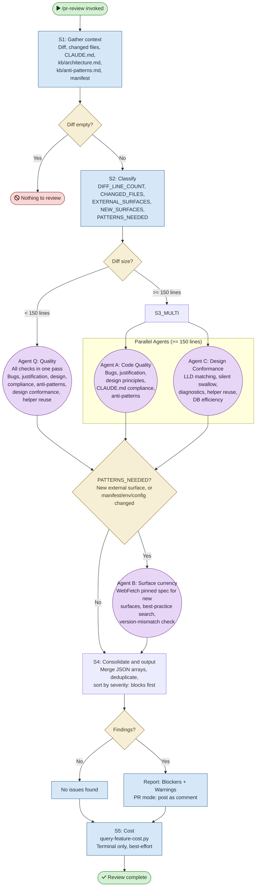

# /pr-review — Process flowchart

Visual overview of the adaptive code review pipeline. Cost-adaptive: diff size sets the number of quality agents (1 for small diffs, 2 for large); `PATTERNS_NEEDED` independently adds Agent B on either path when the diff makes first contact with an external surface. Agent spawns are purple, decisions are orange.

