# /qa — Process flowchart

Visual overview of the quality assurance pipeline. Three modes (pre/post/exploratory), scenario extraction from LLD, agent-based execution, contract validation, coverage audit, and quality report. Agent spawns are purple, decisions are orange.

```mermaid
flowchart TD
    START(["fa:fa-play /qa invoked"]) --> S0

    S0["S0: Orient<br/>Resolve version, load QA config,<br/>read requirements, HLD, LLD"] --> S0_MODE{"Mode?"}
    S0_MODE -->|"pre"| S0B_SKIP["Skip auth"]
    S0_MODE -->|"post / exploratory"| S0B

    S0B["S0b: Authenticate<br/>Restore saved cookies or<br/>GitHub OAuth flow"] --> S0B_SAVE["Save auth state<br/>kb/qa-auth-state.json"]

    S0B_SAVE --> S1
    S0B_SKIP --> S1

    S1{"S1: Scope?"} -->|"Version mode"| S1_VERSION(("Parallel Explore agents<br/>One per epic LLD"))
    S1 -->|"Epic mode"| S1_EPIC["Extract scenarios in-memory<br/>BDD specs, invariants,<br/>ACs, visual specs, API contracts"]

    S1_VERSION --> S1_SUMMARY["Print scenario summary"]
    S1_EPIC --> S1_SUMMARY

    S1_SUMMARY --> S1_MODE_GATE{"Mode?"}
    S1_MODE_GATE -->|"pre"| S3
    S1_MODE_GATE -->|"post"| S2
    S1_MODE_GATE -->|"exploratory"| S2

    S2(("S2: edf:qa-executor agents<br/>Sequential, one per E2E scenario")) --> S2_CHK{"3 consecutive<br/>failures?"}
    S2_CHK -->|"Yes"| S2_PAUSE(["fa:fa-hand-o-right Pause: app broken?"])
    S2_CHK -->|"No"| S2_MODE{"Exploratory?"}
    S2_PAUSE --> S2_MODE
    S2_MODE -->|"Yes"| S2B(("S2b: edf:qa-explorer agent<br/>One per epic, self-managed<br/>time budget"))
    S2_MODE -->|"No"| S3
    S2B --> S3

    S3(("S3: edf:qa-contracts agent<br/>API contract validation"))
    S3 --> S4["S4: Invariant verification<br/>grep / typecheck / lint / test"]

    S4 --> S5(("S5: edf:qa-coverage agent<br/>Cross-story coverage audit"))

    S5 --> S6["S6: Quality report<br/>docs/reports/qa/YYYY-MM-DD-<br/>vN-qa-report-epic-id.md"]

    S6 --> S7(["fa:fa-hand-o-right S7: Human gate<br/>Review report, decide actions"])

    S7 --> S8["S8: Session log<br/>QA execution summary,<br/>LLD testability feedback,<br/>skill self-reflection"]

    S8 --> DONE(["fa:fa-check QA complete"])

    %% ── Styles ──
    classDef startend fill:#d4f0d4,stroke:#2d7d2d,color:#1a3a1a
    classDef process fill:#d6e8f7,stroke:#2d5f8a,color:#1a2f44
    classDef agent fill:#e8d6f7,stroke:#6b2d8a,color:#2d1a3a
    classDef decision fill:#f7eed6,stroke:#8a6d2d,color:#443a1a
    classDef human fill:#f7d6d6,stroke:#8a2d2d,color:#441a1a

    class START,DONE startend
    class S0,S0B,S0B_SAVE,S0B_SKIP,S1_EPIC,S1_SUMMARY,S4,S6,S8 process
    class S1_VERSION,S2,S2B,S3,S5 agent
    class S0_MODE,S1,S1_MODE_GATE,S2_CHK,S2_MODE decision
    class S2_PAUSE,S7 human
```

