# /refactor-architect — Process flowchart

Visual overview of the refactor decomposition pipeline. Takes a smell description, discovers affected files and LLDs, decides decomposition, and creates well-formed GitHub issues. Reuses /architect's templates and machinery. Decisions are orange, human gates are red.

```mermaid
flowchart TD
    START(["fa:fa-play /refactor-architect invoked"]) --> S1

    S1["S1: Parse input and orient<br/>File paths, free-form description,<br/>audit finding, or issue number"] --> S1_AMBIG{"Ambiguous?"}
    S1_AMBIG -->|"Yes"| S1_ASK(["fa:fa-hand-o-right Ask before continuing"])
    S1_AMBIG -->|"No"| S2

    S1_ASK --> S2

    S2["S2: Identify affected source files<br/>Grep for symbols, call sites,<br/>patterns; ask about siblings"]

    S2 --> S3["S3: Discover affected LLD sections<br/>Grep docs/design/lld-*.md for<br/>file paths and exported symbols"] --> S3_FILTER

    subgraph FILTER["Must-change vs Reconcile-after"]
        S3_FILTER{"Would reader be<br/>misled if unchanged?"}
        S3_FILTER -->|"Yes"| S3_OUTA["Output A: Design references<br/>Must change in PR"]
        S3_FILTER -->|"No"| S3_OUTB["Output B: Reconciled by<br/>/lld-sync after merge"]
    end

    S3_OUTA --> S4
    S3_OUTB --> S4

    S4{"S4: Decomposition"} -->|"Default: one issue"| S4_SINGLE["Single task issue<br/>kind:task"]
    S4 -->|"Large + seam"| S4_EPIC["Epic + N task issues<br/>kind:lld-sweep"]

    S4_SINGLE --> S4_GATE
    S4_EPIC --> S4_GATE(["fa:fa-hand-o-right Confirm decomposition"])

    S4_GATE --> S5

    S5{"S5: Case?"} -->|"A: New shared component"| S5A["Author BCA table,<br/>TypeScript interface, DTOs,<br/>mock helper, step order"]
    S5 -->|"B: Pure consolidation"| S5B["Note: no new abstraction"]

    S5A --> S6
    S5B --> S6

    S6["S6: Author bodies + create issues<br/>Reuse /architect templates<br/>with refactor-specific deltas"] --> S6_CREATE{"Batch?"}
    S6_CREATE -->|"Single"| S6_SINGLE["gh-create-issue.sh"]
    S6_CREATE -->|"Epic+tasks"| S6_AGENT(("edf:gh-issue-manager"))

    S6_SINGLE --> S7
    S6_AGENT --> S7

    S7["S7: Stop<br/>Report created issues,<br/>recommend next step"]

    S7 --> DONE(["fa:fa-check Refactor issues created"])

    %% ── Styles ──
    classDef startend fill:#d4f0d4,stroke:#2d7d2d,color:#1a3a1a
    classDef process fill:#d6e8f7,stroke:#2d5f8a,color:#1a2f44
    classDef agent fill:#e8d6f7,stroke:#6b2d8a,color:#2d1a3a
    classDef decision fill:#f7eed6,stroke:#8a6d2d,color:#443a1a
    classDef human fill:#f7d6d6,stroke:#8a2d2d,color:#441a1a

    class START,DONE startend
    class S1,S2,S3,S3_OUTA,S3_OUTB,S4_SINGLE,S4_EPIC,S5A,S5B,S6,S6_SINGLE,S7 process
    class S6_AGENT agent
    class S1_AMBIG,S3_FILTER,S4,S5,S6_CREATE decision
    class S1_ASK,S4_GATE human
```

