# /requirements — Process flowchart

Visual overview of the structured requirements generation pipeline. Transforms discovery output or a freeform brief into a structured requirements document with two human gates. Agent spawns are purple, decisions are orange, human gates are red.

```mermaid
flowchart TD
    START(["fa:fa-play /requirements invoked"]) --> S1

    S1["S1: Read inputs and orient<br/>Discovery doc, freeform brief,<br/>or GitHub issues"] --> S1A

    S1A["S1a: Isolate work in a docs worktree<br/>git worktree add ../&lt;repo&gt;-docs-v&lt;N&gt;-requirements<br/>-b docs/v&lt;N&gt;-requirements main, verify CWD"] --> S1_RV{"[Review]<br/>markers?"}
    S1_RV -->|"Yes"| RV["Review cycle:<br/>address markers,<br/>remove, commit"]
    S1_RV -->|"No"| S1_MODE{"Input type?"}
    RV --> S1_MODE

    S1_MODE -->|"Freeform brief"| S2
    S1_MODE -->|"Discovery doc"| S3

    S2["S2: Domain clarification<br/>WebSearch 2-3 queries,<br/>identify roles and workflows"] --> S2_CONFIRM(["fa:fa-hand-o-right Confirm scope"])

    S2_CONFIRM --> S3

    S3["S3: Draft document structure<br/>Header, Context, Glossary,<br/>Design Principles, Roles,<br/>Epics & Stories (titles only)"]

    S3 --> S3A["S3a: Generate visual specs<br/>Identify UI-impacting stories,<br/>full or lite wireframes"]

    S3A --> S3B(("S3b: edf:requirements-review<br/>mode: structure"))

    S3B --> S3B_TRIAGE{"Findings?"}
    S3B_TRIAGE -->|"block"| S3B_FIX["Fix"]
    S3B_FIX --> S3B
    S3B_TRIAGE -->|"warn/clean"| S3C

    S3C["S3c: Cross-reference validation<br/>Discovery features → stories,<br/>implicit requirements, tensions"]

    S3C --> GATE1(["fa:fa-hand-o-right Gate 1: Structure review<br/>Right epics? Right priority?"])

    GATE1 --> S4["S4: Write acceptance criteria<br/>Given/When/Then format,<br/>INVEST check per story"]

    S4 --> S5["S5: Testability validation<br/>Specific outcome, precondition,<br/>no vague qualifiers, completeness"]

    S5 --> S5B(("S5b: edf:requirements-review<br/>mode: complete"))

    S5B --> S5B_TRIAGE{"Findings?"}
    S5B_TRIAGE -->|"block"| S5B_FIX["Fix"]
    S5B_FIX --> S5B
    S5B_TRIAGE -->|"warn/clean"| GATE2

    GATE2(["fa:fa-hand-o-right Gate 2: Full document review<br/>ACs testable and complete?"])

    GATE2 --> S6["S6: Finalise<br/>Status → Final, bump version,<br/>add Next steps, commit, session log"]

    S6 --> S6A["S6a: Push + create PR<br/>git push -u origin docs/v&lt;N&gt;-requirements,<br/>gh pr create (docs-only body)"]

    S6A --> S6B_GATE(["fa:fa-hand-o-right Confirm merge"])

    S6B_GATE -->|approved| S6C["S6c: Clean up<br/>gh pr merge --squash,<br/>worktree remove, cd back"]

    S6B_GATE -->|declined| S6C_NOTE["PR left open for later merge"]

    S6C --> S7["S7: Report<br/>What was produced, PR status,<br/>suggested next step"]
    S6C_NOTE --> S7

    S7 --> DONE(["fa:fa-check Requirements complete"])

    %% ── Styles ──
    classDef startend fill:#d4f0d4,stroke:#2d7d2d,color:#1a3a1a
    classDef process fill:#d6e8f7,stroke:#2d5f8a,color:#1a2f44
    classDef agent fill:#e8d6f7,stroke:#6b2d8a,color:#2d1a3a
    classDef decision fill:#f7eed6,stroke:#8a6d2d,color:#443a1a
    classDef human fill:#f7d6d6,stroke:#8a2d2d,color:#441a1a

    class START,DONE startend
    class S1,S1A,RV,S2,S3,S3A,S3B_FIX,S3C,S4,S5,S5B_FIX,S6,S6A,S6C,S6C_NOTE,S7 process
    class S3B,S5B agent
    class S1_RV,S1_MODE,S3B_TRIAGE,S5B_TRIAGE decision
    class S2_CONFIRM,GATE1,GATE2,S6B_GATE human
```

