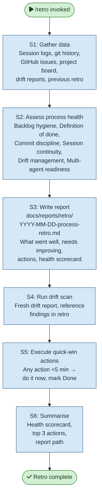

# /retro — Process flowchart

Visual overview of the process retrospective. Gathers data from sessions, git history, issues, board, drift reports, and previous retros; assesses health across six dimensions; writes report with scorecard and actions.

