# /setup — Process flowchart

Visual overview of the EDF project bootstrap pipeline. Four phases: detect project
state, scaffold artefacts (CLAUDE.md, kb/, .env, ADRs, .mcp.json, CI), verify
everything, and report. Human gates are red.

```mermaid
flowchart TD
    START(["fa:fa-play /setup invoked"]) --> P1

    subgraph PHASE1["Phase 1: Detect"]
        P1_DETECT["Detect language, CLAUDE.md sections,<br/>kb files, .env, .gitignore, .mcp.json,<br/>docs/adr/ directory"]
        P1_DETECT --> P1_PLAN["Present setup plan<br/>What exists vs what will be created"]
    end

    P1 --> P1_DETECT
    P1_PLAN --> P1_GATE(["fa:fa-hand-o-right Confirm setup plan"])

    P1_GATE --> P2

    subgraph PHASE2["Phase 2: Scaffold"]
        P2A["2a: CLAUDE.md<br/>New: copy template, customise<br/>Existing: append missing sections"]
        P2B["2b: kb/ directory<br/>file-map, conventions,<br/>architecture, anti-patterns"]
        P2C["2c: .env + .gitignore<br/>EDF_SCRIPTS, EDF_FEATURE_PREFIX,<br/>EDF_FEATURE_PROM_DIR"]
        P2D["2d: docs/adr/<br/>Create directory + README"]
        P2E["2e: .mcp.json<br/>Playwright MCP server config"]
        P2F["2f: CI workflows (optional)<br/>Starter workflow for<br/>TypeScript or Python"]
    end

    P2 --> P2A
    P2A --> P2B
    P2B --> P2C
    P2C --> P2D
    P2D --> P2E
    P2E --> P2F

    P2F --> P3

    subgraph PHASE3["Phase 3: Verify"]
        P3_CHECK["Check: scripts reachable, kb files present,<br/>CLAUDE.md sections, .env variables,<br/>.gitignore patterns, .mcp.json"]
    end

    P3 --> P3_CHECK

    P3_CHECK --> P4["Phase 4: Report<br/>What was created, verification results,<br/>team knowledge transfer"]

    P4 --> DONE(["fa:fa-check Setup complete"])

    %% ── Styles ──
    classDef startend fill:#d4f0d4,stroke:#2d7d2d,color:#1a3a1a
    classDef process fill:#d6e8f7,stroke:#2d5f8a,color:#1a2f44
    classDef human fill:#f7d6d6,stroke:#8a2d2d,color:#441a1a

    class START,DONE startend
    class P1_DETECT,P1_PLAN,P2A,P2B,P2C,P2D,P2E,P2F,P3_CHECK,P4 process
    class P1_GATE human
```

