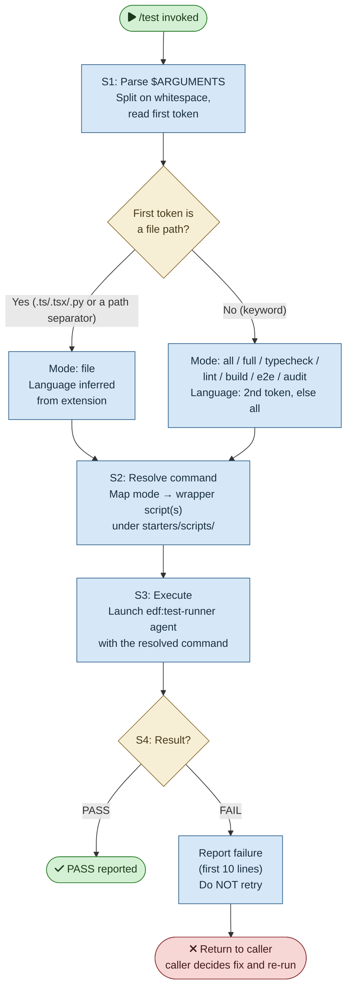

# /test — Process flowchart

Visual overview of the verification runner. Parses the mode or file path, infers the language, resolves a wrapper-script command, and delegates execution to the `edf:test-runner` agent so verbose output never reaches the caller's context. Decisions are orange.

